---
tags:
  - Flask
  - WebDev
---

> [!important] This project, while functional, is not structured in an ideal manner. Would require redesign to deliver again.


# Flask Structure Overview

This video gives you an overview of a sample Flask project.

It shows the folder structure, a brief overview on the HTML files, the static folder, app.py and how to use the database.


# Project Configuration

## Create Project

Open Pycharm, and you’re greeted with the Project Browser. Click New Project in the top of the window.


Choose the Flask option on the lefthand side, and then set the location of the project to be stored on the local drive.

Click Ok.

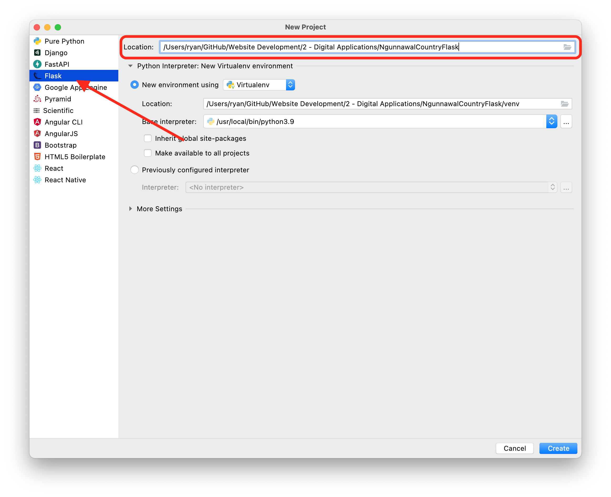

The configured project opens and you’re presented with a barebones Flask project.

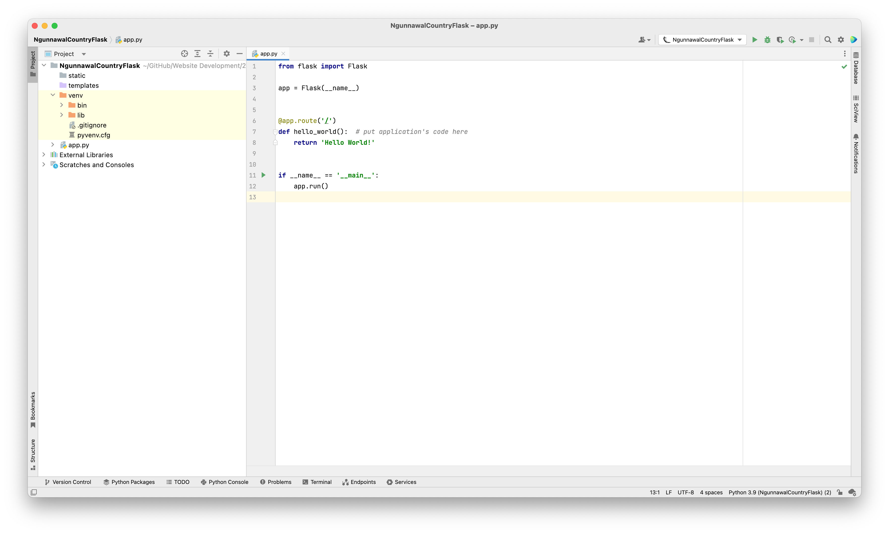

You can test the project by clicking the Run button in the top toolbar, and then clicking the link in the Console at the bottom.

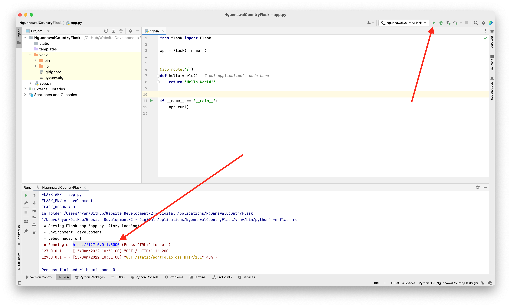

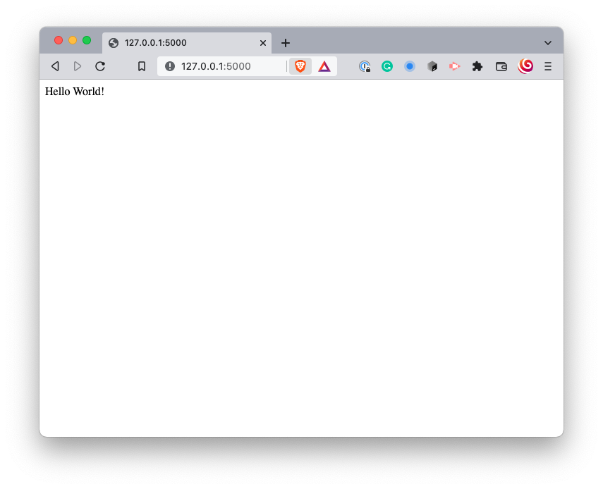

## Configure Python Environment (Requirements.txt)

Right click on your project name, choose New→ File.

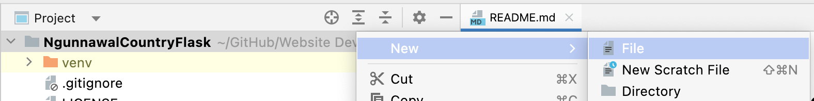

Enter `Requirements.txt` as the file name. The spelling is important - if you’re not sure, copy and paste the name.

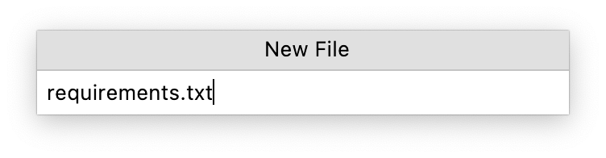

If Pycharm asks you to add the file to Git, then click Ok.

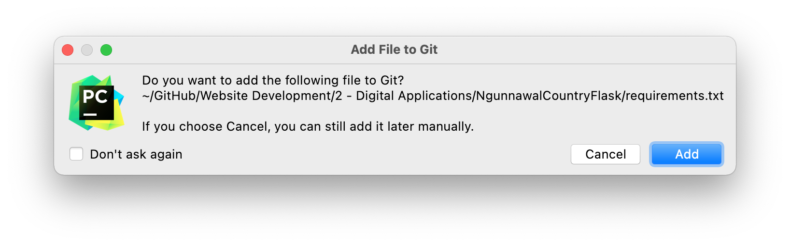

Enter the following text into the file and Save the file.

```
alembic>=1.0.10
altgraph>=0.16.1
click>=7.0
ecdsa>=0.13.2
esptool>=2.6
Flask>=1.0.3
Flask-Login>=0.4.1
Flask-Migrate>=2.5.2
Flask-SQLAlchemy>=2.4.0
Flask-WTF>=0.14.2
future>=0.17.1
itsdangerous>=1.1.0
Jinja2>=2.10.1
macholib>=1.11
Mako>=1.0.10
MarkupSafe>=1.1.1
pefile>=2019.4.18
pur>=5.2.2
pyaes>=1.6.1
PyInstaller>=3.4
pyserial>=3.4
python-dateutil>=2.8.0
python-editor>=1.0.4
six>=1.12.0
SQLAlchemy>=1.3.4
Werkzeug>=0.15.4
WTForms>=2.2.1
email-validator>=1.2.1
```

After a moment, a yellow banner should appear saying that “Package Requirements” aren’t set. 

Click Install Requirements on this popup.

This may take a while to install.


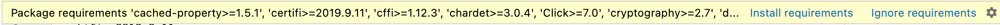

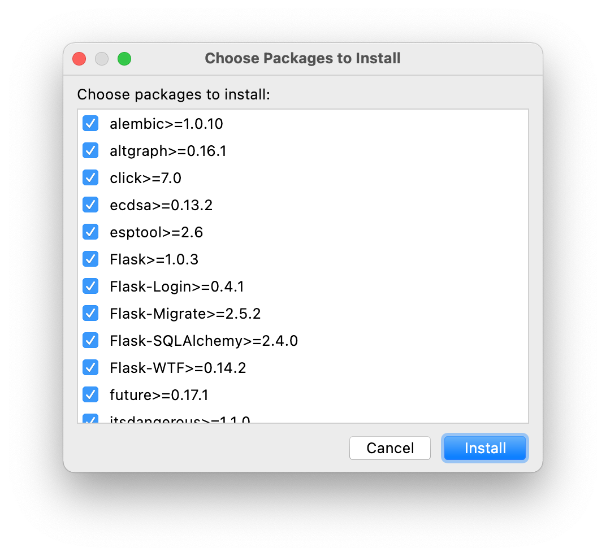

Eventually, it will show a popup indicating that all the packages were installed successfully.

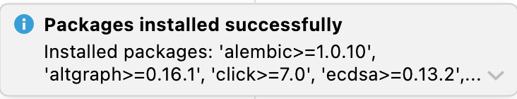

<aside>
‼️ At this stage, the project is only stored locally. As you would be aware this is not ideal, so the next step involves publishing the project to Github.

</aside>

## Share the project to Github

In Pycharm, choose “Enable Version Control Integration” under the VCS menu

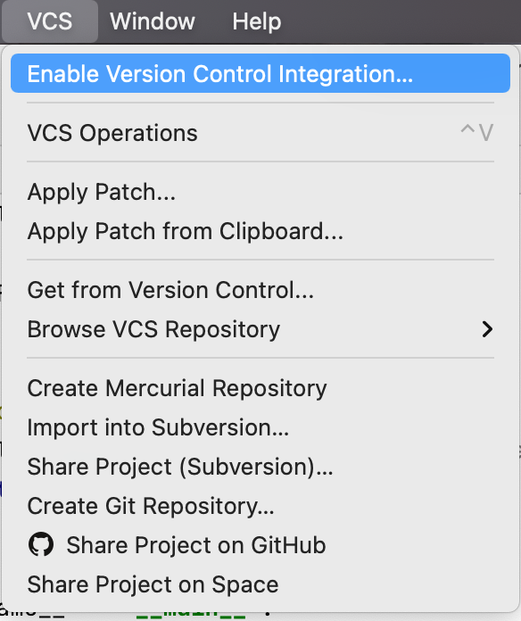

Leave the system as Git and click Ok.

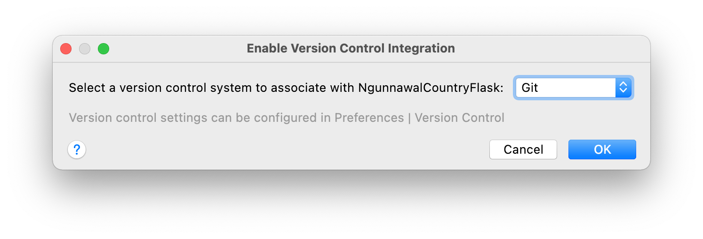

After a moment, Pycharm will create a popup along the bottom indicating that the repository has been created. 

<aside>
‼️ This repository is still only saved on the local computer!

</aside>

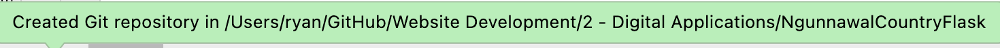

Add the `app.py` and requirements.txt files to the repository. Right click on the files and choose Git→ Add.

Do the same for the static and templates folders.

<aside>
‼️ DO NOT add the venv folder to Git.

</aside>

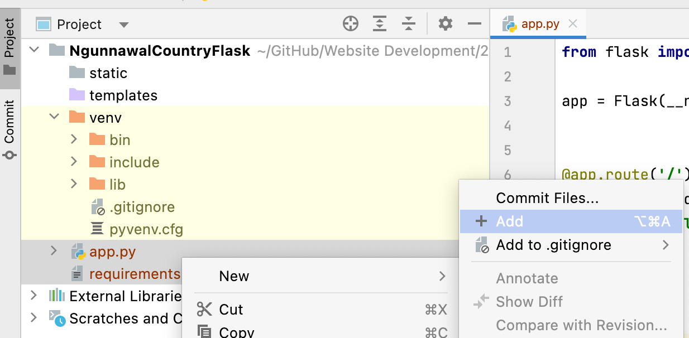

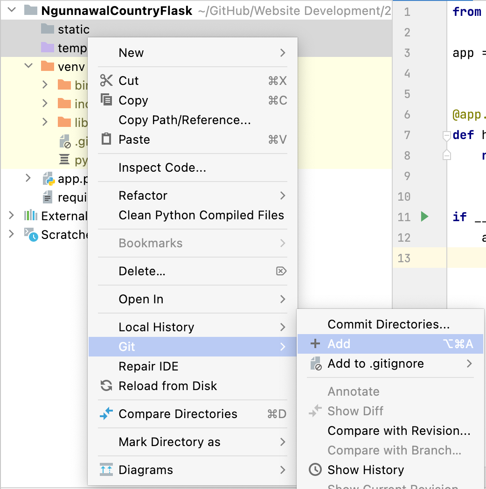

Commit the changes with “init” as the message.

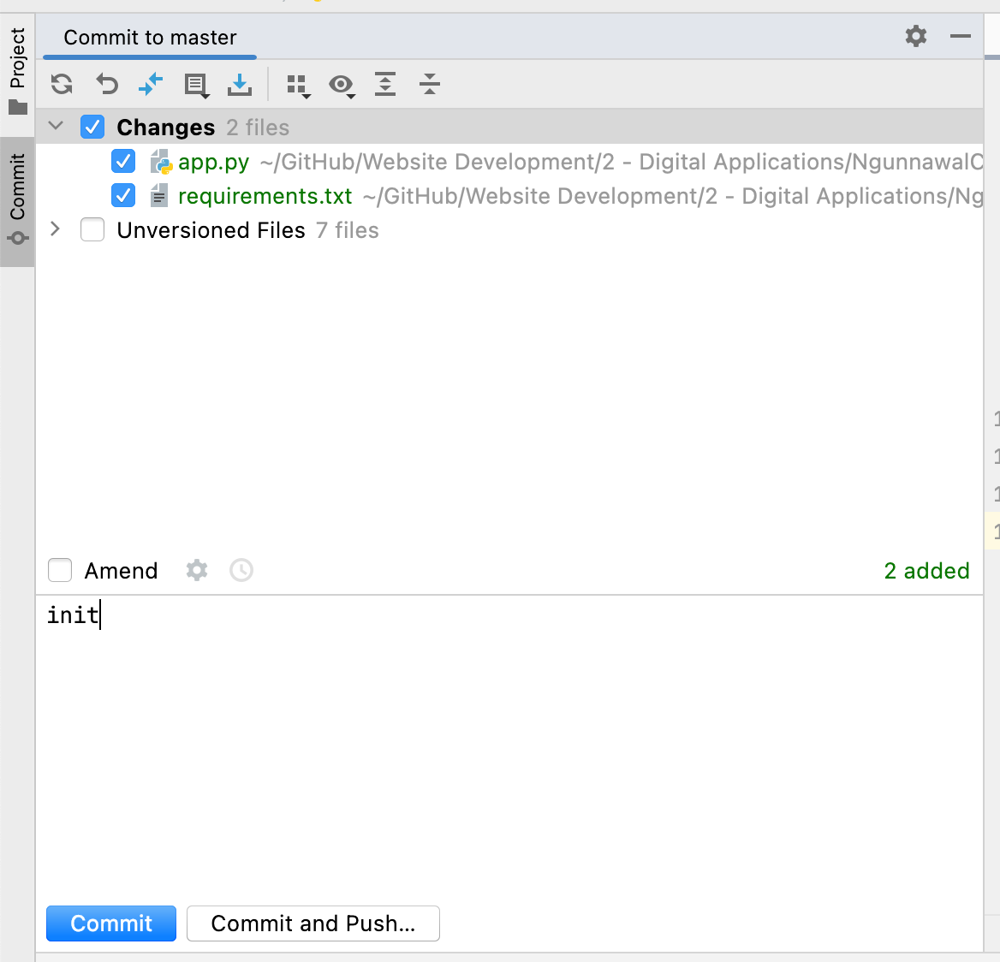

Now it’s time to publish to Github.

Under the Git (previously VCS) menu, choose Git→Share Project on Github.

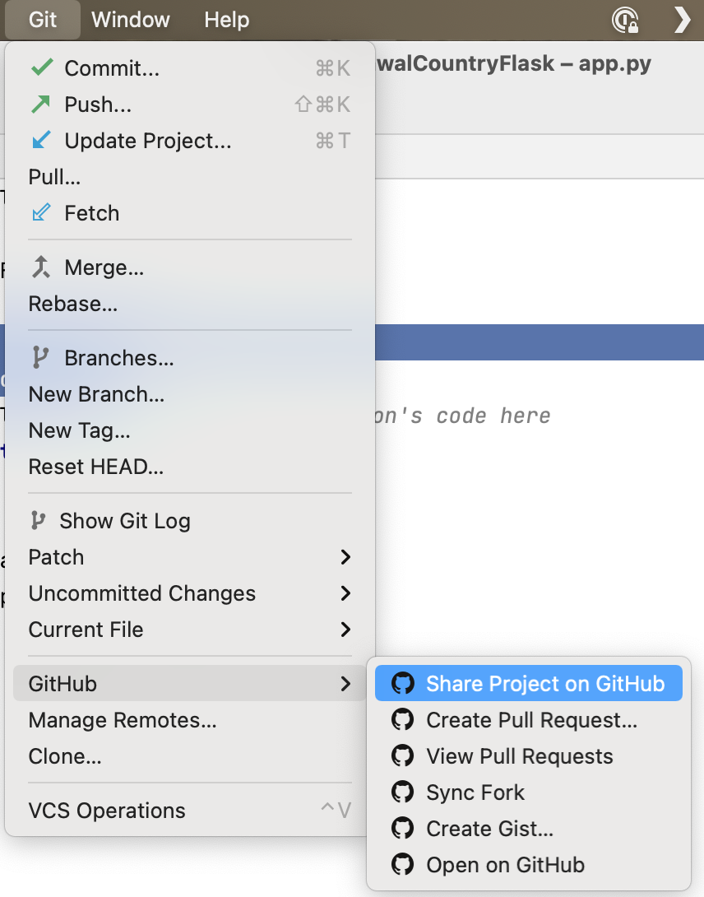

Accept the default there and click Share.

After a moment Pycharm will inform you that the project has been uploaded to Github.

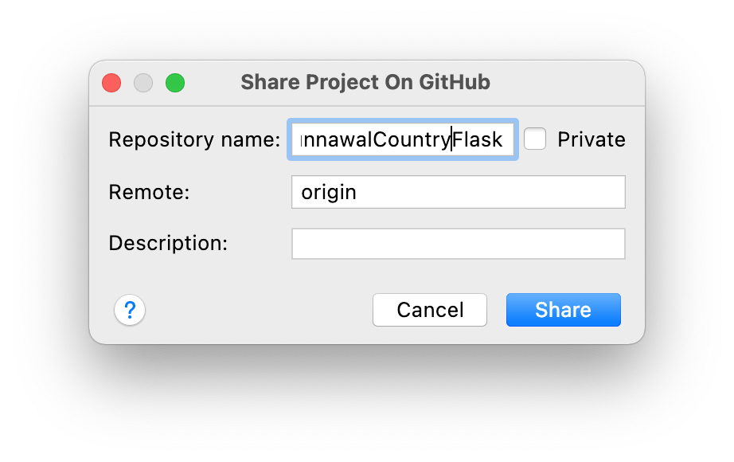

## Import Previous Project Files

In your file Browser, find the project folder from your previous Ngunnawal Website Project. This will include the HTML, CSS, image and any other files.

Drag those files into the **static folder** in your project.  

<aside>
‼️ Hold down Alt to copy the files, not move them.

</aside>

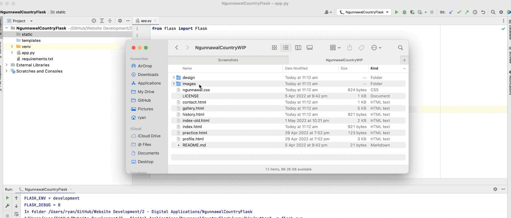

$\utilde {\color{black} \fcolorbox{darkorange}{darkorange}  {Commit and Push to Github}}$

# Web Servers Overview

[https://youtu.be/6ZDQiZHSYCE](https://youtu.be/6ZDQiZHSYCE)

# Configuration File

To access a database, you need to configure the project to have the correct information about the database - location, username and password (if required etc).

Create a new Python file in the root of the project called `config.py`.

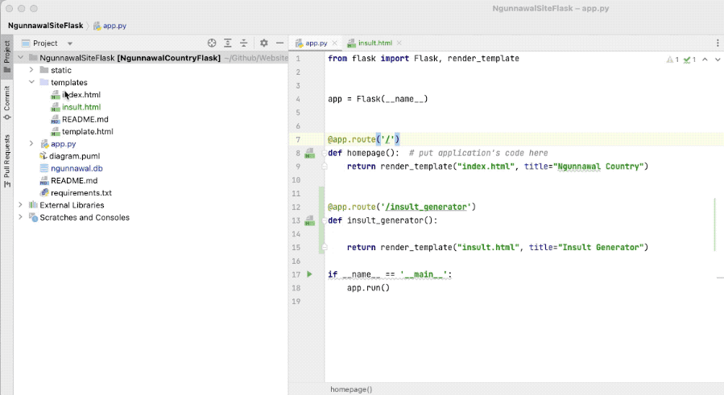

Copy this code into the file and save.

```python
import os
basedir = os.path.abspath(os.path.dirname(__file__))

class Config(object):
SECRET_KEY = os.environ.get('SECRET_KEY') or 'you-will-never-guess'
# Database configuration
SQLALCHEMY_DATABASE_URI = os.environ.get('DATABASE_URL') or 'sqlite:///' + os.path.join(basedir, 'ngunnawal.db')
SQLALCHEMY_TRACK_MODIFICATIONS = False
```

Open `app.py` and add the following line of code at the top, with the import statements.

```python
from config import Config
from flask_sqlalchemy import SQLAlchemy
```


Further down `app.py`, after `app = Flask(__name__)`  configure the app to use the database that you configured.

```python
app.config.from_object(Config)  # loads the configuration for the database
db = SQLAlchemy(app)            # creates the db object using the configuration
```

# Create the Database

Click on the database tab on the right-hand side of Pycharm window.

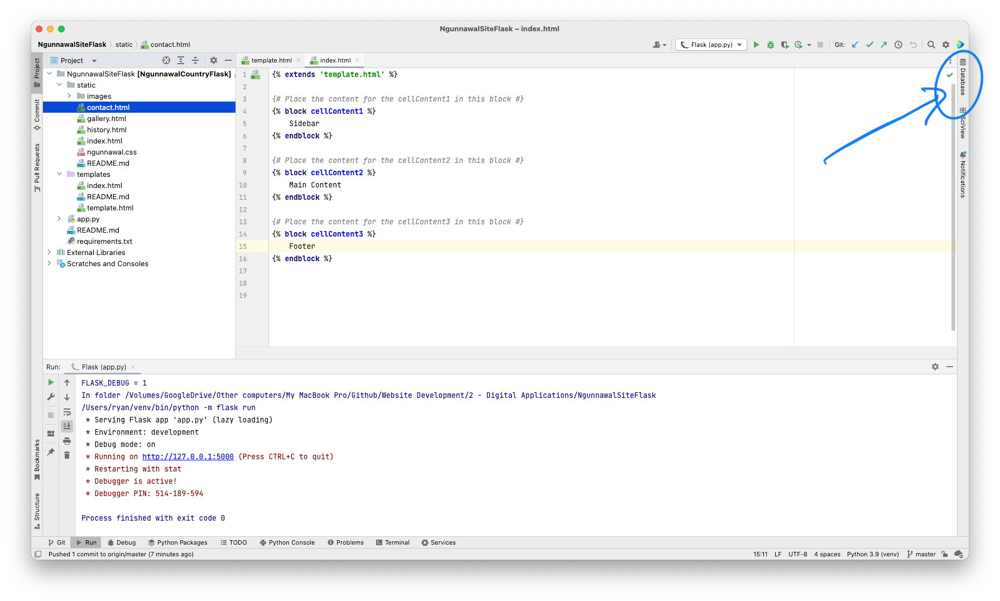

Click the + icon to create a new database.


In the dropdown, choose **Data Source** → **SQLite.**

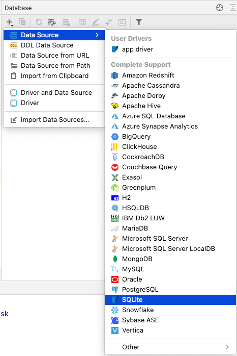

- Why SQLite?

There are many Database environments available (more than shown in the list) and they all ultimately serve the same function - provide access to data. 

In this project, SQLite is chosen because unlike other Database systems, **this does not require a separate server to run**. SQLite is stored in a single file that can be stored in the project folder and accessed through Pycharm. 

The other database systems available require the installation and management of a database server. Possible, but requires more overhead and management.

SQLite is not recommended in a production environment due to scaling issues (it can’t handle as many simultaneous users as other systems), but is fine for our needs.


Click the + icon to create a new database file.

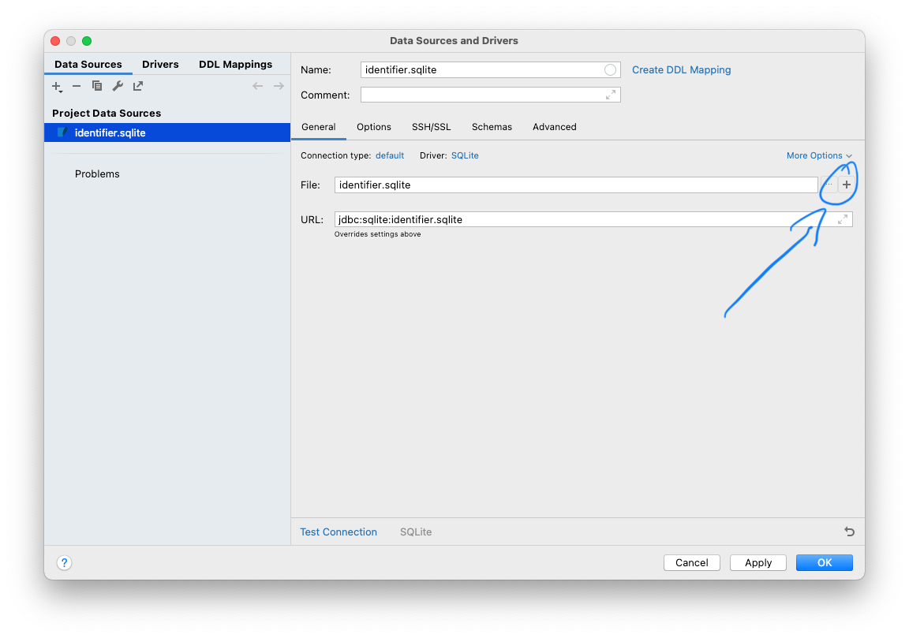

Name the file `ngunnawal.db` and click Save.

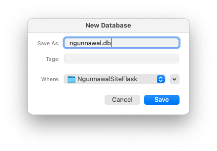

You **may** need to install some SQLite drivers. If, on your screen, it tells you to install or update drivers in the indicated spot, do so.

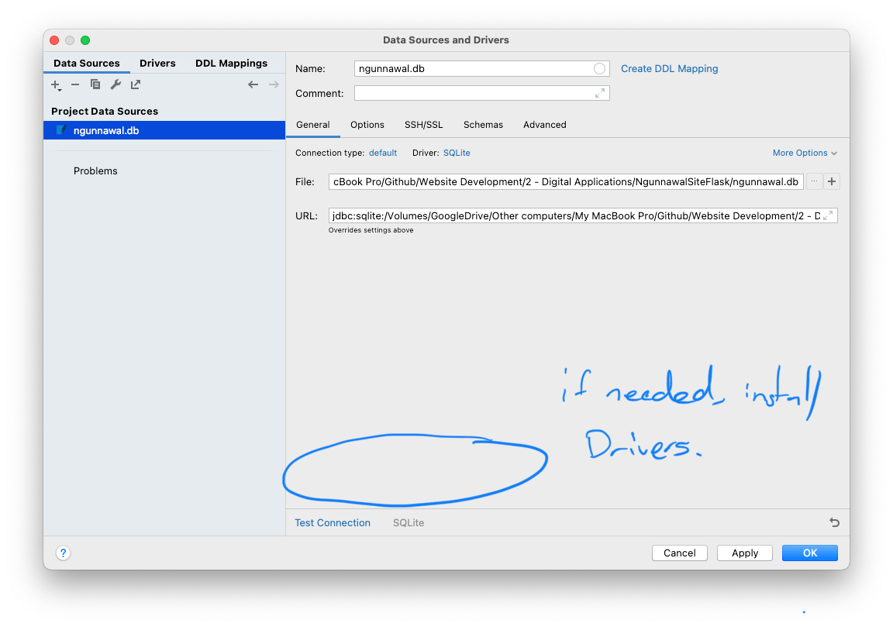

Click Test Connection.

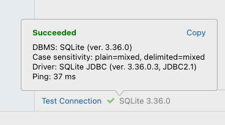

Click Ok.

# App.py

Open [`app.py`](http://app.py). This file contains all the python code to manage the server-side functionality. 

Each route has an associated function.

In this example, “`/`” is the route and `hello_world()` is the associated function.

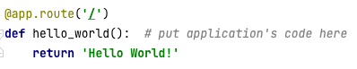

## How does this work?

When the browser access that route, it will run the associated function. This function performs any instructions that are programmed and sends the result back to the browser to display, through the `return` statement.

## Example

[2022S2 - How to run Flask.webm](https://drive.google.com/file/d/1z39dUnvYnL5cckQEu1scP4_6hp54Y6C3/view?usp=drivesdk)

- Site Template


# Template.html updates

In the templates folder open the HTML file called `template.html`.

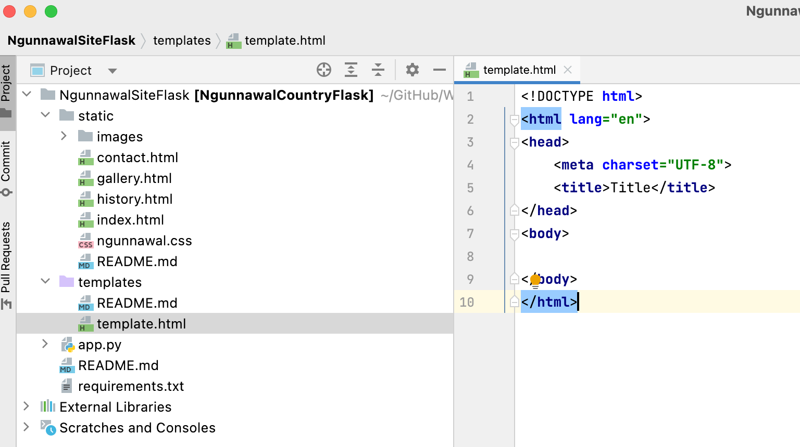

This file will be used by all the other pages of our website to contain any common code, such as the 

- design of the site
- navbar links
- CSS
- Javascript
- Logo and Banner
- etc.

For instance, in the previous versions of the site, “cells” were created to hold different content. In this template, you can define the layout of the pages, including the cells and define them as different places to include content on specific pages.

You’ll use this template later on for the Ngunnawal site.

# Template Code

Copy the contents of the `index.html` from the previous iteration of the site and replace the contents of `template.html`.

As can be seen in the screenshot, the CSS file is not loading correctly.


Change the link from `ngunnawal.css` to `/static/ngunnawal.css` and save the changes. The preview should update with the CSS loaded.

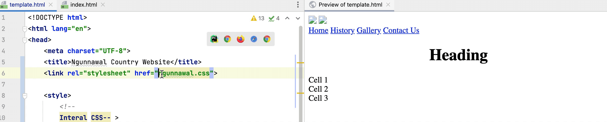

In the HTML, remove the content from the cells and leave them blank.

Include code in each cell such as:

` `

` `

` `

<aside>
‼️ The names within the  are Jinja2 blocks. These will be referred to later from the child pages.

</aside>

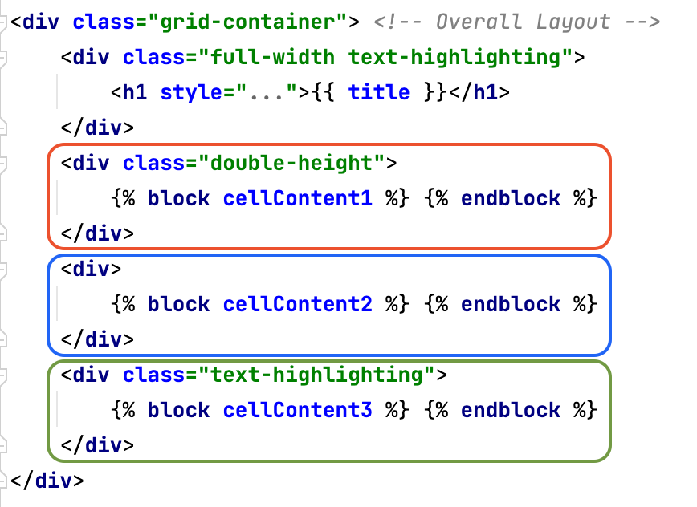

```python
<div class="grid-container"> <!-- Overall Layout -->
	<div class="full-width text-highlighting">
		<h1 style="text-align: center">{{ title }}</h1>
	</div>
	<div class="double-height">
		 
	</div>
	<div>
		 
	</div>
	<div class="text-highlighting">
		 
	</div>
</div>
```

## Parent? Child? Pages?

In Flask, the pages can be created as a hierarchy, with one or some being the parent. In this project, so far, the template.html page will be the parent.

The child pages will inherit everything from template.html and modify only the sections of the page that are ‘allowed’. 

.png)

## Update Images

Update the links for the Logo and Banner by including `/static/` at the start of the path.

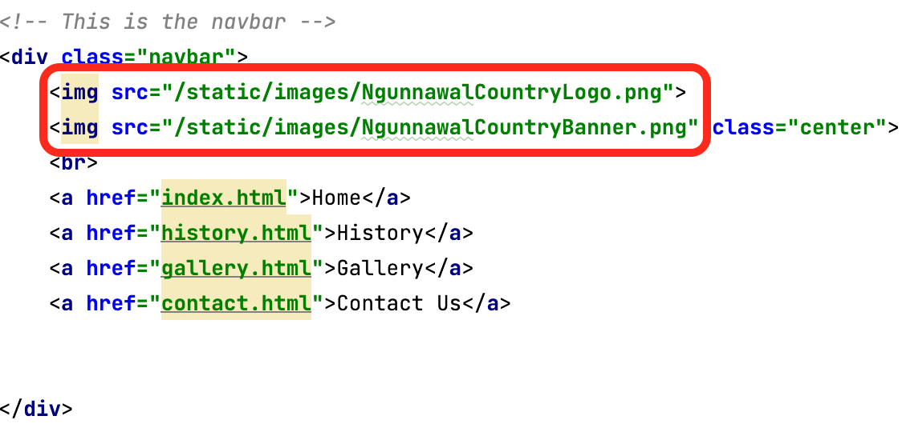

## Page Title

Modify the “heading” cell and the `<title>` tag to be replaced with `{{ title }}`.

This will allow us to define the title in the python code, specific for each individual page.

It has the added advantage that the Heading on the page will always be exactly the same as the page title that appears in the tab.

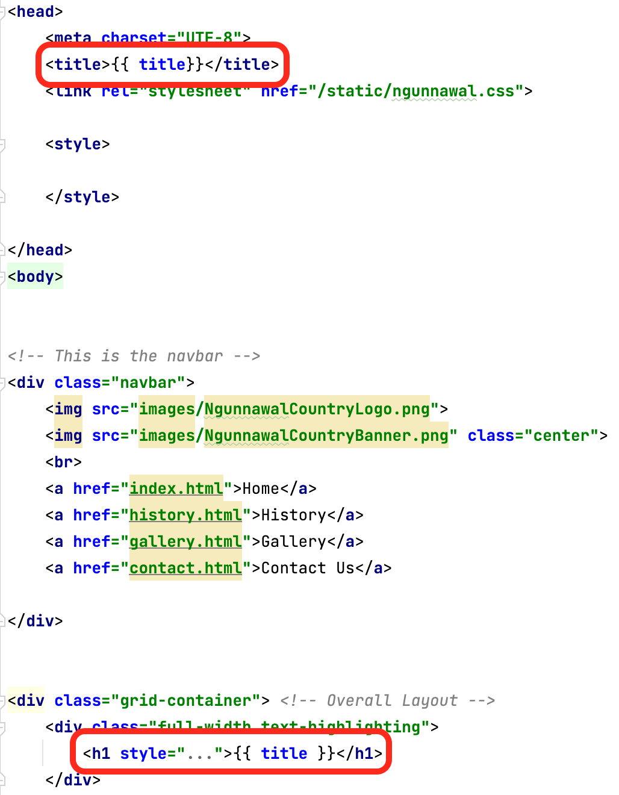

## Internal CSS Block

At this stage, there is no need for internal CSS on the template file, as it’s all imported through the ngunnawal.css external file. However some of the individual pages *may* require internal CSS. 

To make it easier in the future, create an empty block called `pageStyle` in the head section to be used if needed.

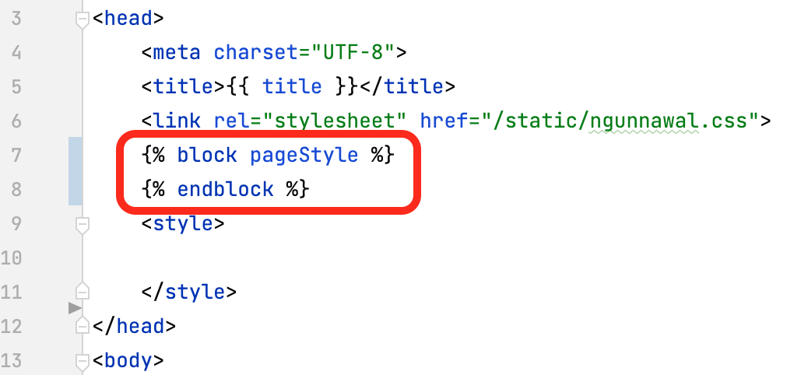

```python


```

## Template Example

```html
<!DOCTYPE html>
<html lang="en">
<head>
	<meta charset="UTF-8">
	<title>{{ title }}</title>
	<link rel="stylesheet" href="/static/ngunnawal.css">
	<link rel="stylesheet" href="/static/css/bootstrap.css">
	<script src="/static/js/bootstrap.bundle.js"></script>
	
	
	<style>

	</style>
</head>
<body>

<nav class="navbar navbar-expand-lg navbar-dark bg-dark">
	<div class="container-fluid">
		<a class="navbar-brand" href="#">
			
		</a>
		<button class="navbar-toggler" type="button" data-bs-toggle="collapse" data-bs-target="#navbarNav"
				aria-controls="navbarNav" aria-expanded="false" aria-label="Toggle navigation">
			<span class="navbar-toggler-icon"></span>
		</button>
		<div class="collapse navbar-collapse" id="navbarNav">
			<ul class="navbar-nav">
				<li class="nav-item">
					<a class="nav-link" href="/">Home</a>
				</li>
				<li class="nav-item">
					<a class="nav-link" href="history.html">History</a>
				</li>
				<li class="nav-item">
					<a class="nav-link" href="gallery.html">Gallery</a>
				</li>
				<li class="nav-item">
					<a class="nav-link" href="contact.html">Contact Us</a>
				</li>

				<li class="nav-item">
					<a class="nav-link" href="/todo">Web App - Todo</a>
				</li>
				
					<li class="nav-item">
						<a class="nav-link" href="/register">Registration</a>
					</li>
					<li class="nav-item">
						<a class="nav-link" href="/login">Login</a>
					</li>
				
					<li class="nav-item">
						<a class="nav-link" href="/logout">Logout</a>
					</li>
					<li class="nav-item">
						<a class="nav-link" href="/reset_password">Reset Password</a>
					</li>
				
			</ul>
		</div>
		<div style="color:white">{{ user.name }}</div>
		

	</div>
</nav>

<div class="container-fluid"> <!-- Overall Layout -->
	<div class="row">
		<div class="col">
			<h1 style="text-align: center">{{ title }}</h1>
		</div>
	</div>
	<div class="row">
		<div class="col-4">
			

			
		</div>
		<div class="col-8">
			 
		</div>
	</div>
	<div class="row">
		<div class="col text-highlighting">
			 
		</div>
	</div>
</div>

</body>
</html>
```

- Bootstrap Integration


# Download and Copy Bootstrap

Go to [https://getbootstrap.com/](https://getbootstrap.com/) and click on the Read Installation docs link.

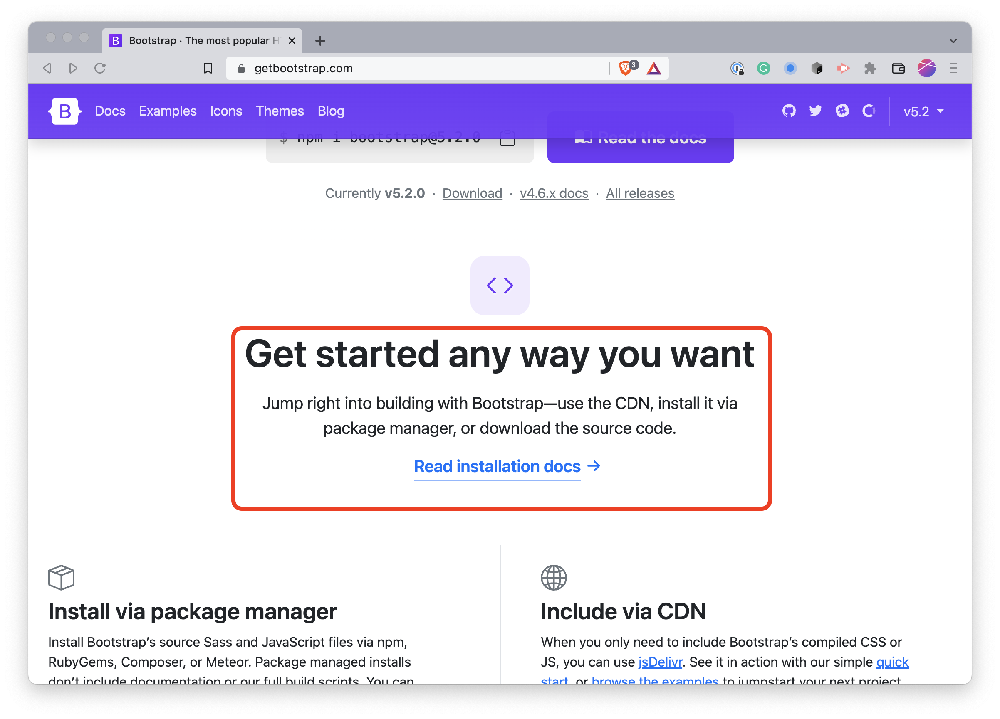

Download the Compiled CSS & JS.

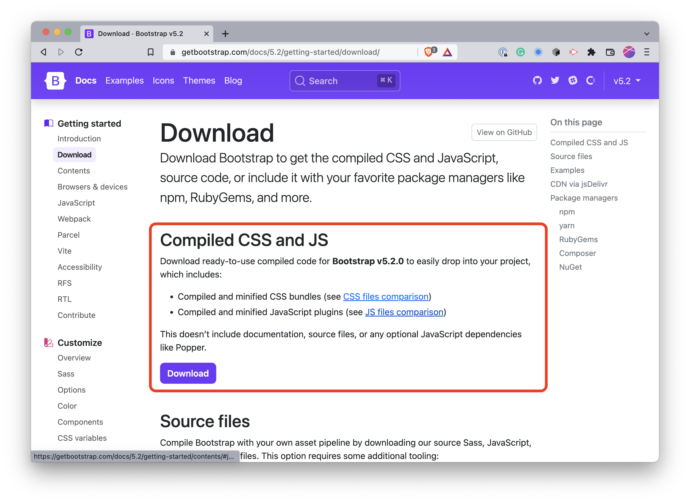

Unzip (Extract) the zip file and copy the `CSS` and `JS` folders into the `static` folder in your project.

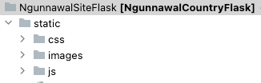

# Add Bootstrap into Template

Open templates/template.html and add the following code to import the new Bootstrap CSS and JS libraries.

```python
<link rel="stylesheet" href="/static/css/bootstrap.css">
<script src="/static/js/bootstrap.bundle.js"></script>
```

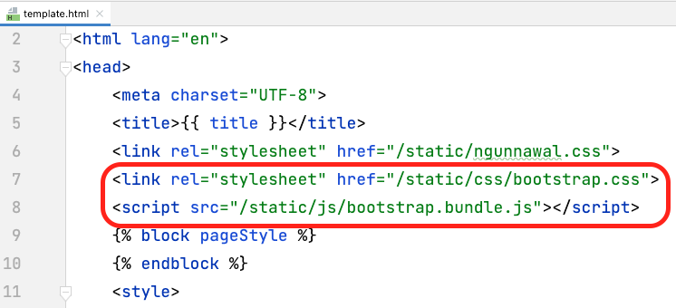

If you run the project and load the site you may notice some changes.

<aside>
‼️ These will need to be fixed by updating the site to utilise the Bootstrap libraries more effectively.

</aside>

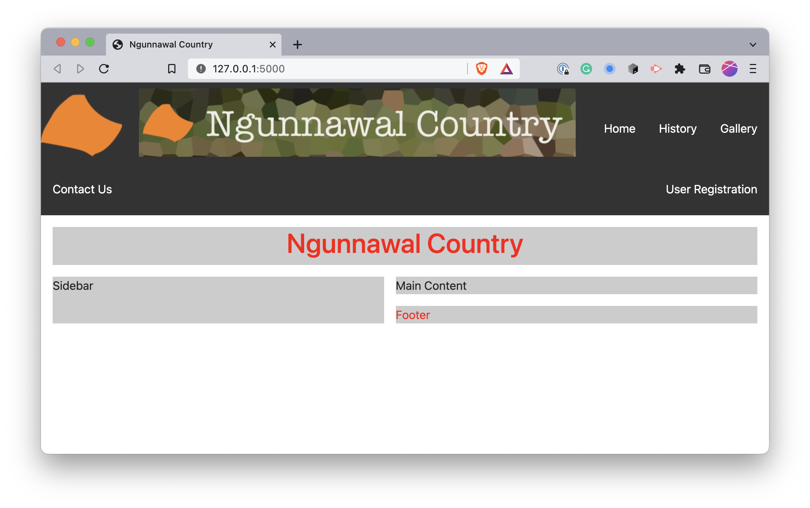

# Navbar Updates

Bootstrap has a number of different, configurable, navbars that you can use in your sites. The Bootstrap site (linked) has a number of the different styles that you can choose from or take parts that you want or need to include.

[https://getbootstrap.com/docs/5.2/components/navbar/](https://getbootstrap.com/docs/5.2/components/navbar/)

Some examples are shown here.

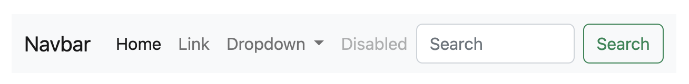


<aside>
‼️ It’s up to you to decide how exactly your navbar appears to the user. You can configure it as much or as little as you want.

</aside>

Start by Using the simplest version of the navbar code. Using the link above, this can be found under “Nav” down the page. 

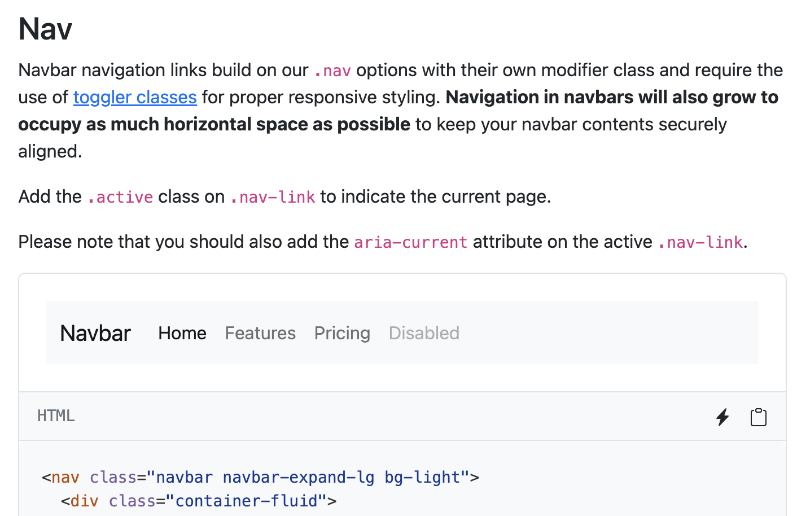

Copy the code shown there. 

<aside>
‼️ The code shown here *may* be the same as shown on the website, however the website code may have been updated. Check the site for the latest version.

</aside>

```python
<nav class="navbar navbar-expand-lg bg-light">
  <div class="container-fluid">
	<a class="navbar-brand" href="#">Navbar</a>
	<button class="navbar-toggler" type="button" data-bs-toggle="collapse" data-bs-target="#navbarNav" aria-controls="navbarNav" aria-expanded="false" aria-label="Toggle navigation">
	  <span class="navbar-toggler-icon"></span>
	</button>
	<div class="collapse navbar-collapse" id="navbarNav">
	  <ul class="navbar-nav">
		<li class="nav-item">
		  <a class="nav-link active" aria-current="page" href="#">Home</a>
		</li>
		<li class="nav-item">
		  <a class="nav-link" href="#">Features</a>
		</li>
		<li class="nav-item">
		  <a class="nav-link" href="#">Pricing</a>
		</li>
		<li class="nav-item">
		  <a class="nav-link disabled">Disabled</a>
		</li>
	  </ul>
	</div>
  </div>
</nav>
```

Look for the first link and modify it to instead of the href being `#`, it instead directs the user to `/`.

You’ll also need to remove any code that indicates it’s the current page, as this will not work through Flask and the template.

**Before**

```python
<a class="nav-link active" aria-current="page" href="#">Home</a>
```

**After**

```python
<a class="nav-link" href="/">Home</a>
```

<aside>
‼️ You can check the website changes by refreshing the page at each step to make sure it works.

</aside>

Change the other links in the nav bar to link to the pages that will be included later (from the previous project).

**Before**

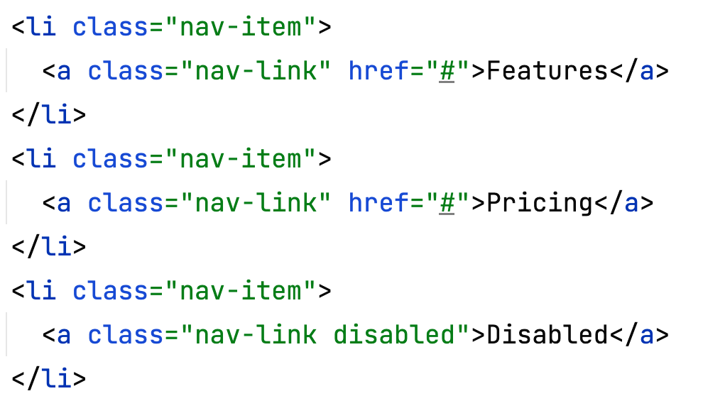

**After**

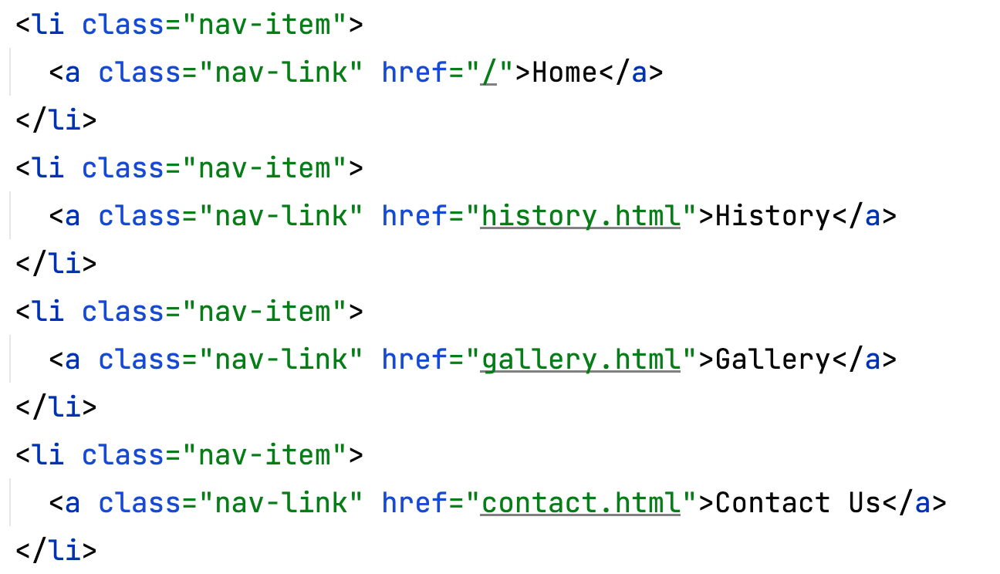

Included in the default code is the first link `Navbar` ****which is a placeholder link to return the user back to the homepage. As our previous project had a logo, change this text to be the logo used previously. 

<aside>
‼️ The image should be in the static/images folder. If it is not, copy it in.

</aside>

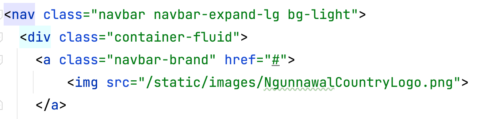

Move the banner image from the old navbar code to just above the new navbar code block.

Remove the `class="center"` attribute as well.

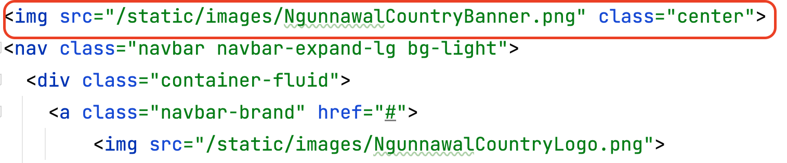

Remove the old navbar code as it is no longer required.

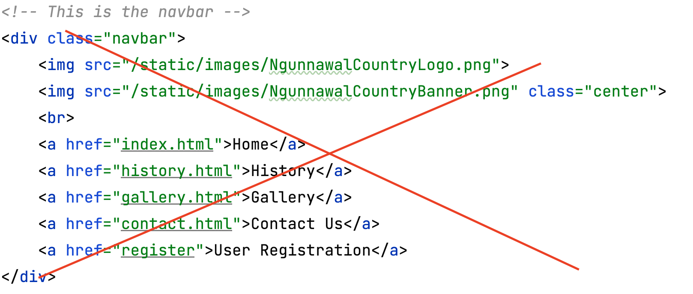

The site now appears similar to this. The issue is that the links in the navbar are not visible.

This can be changed using some of the other colour styles for Navbars.

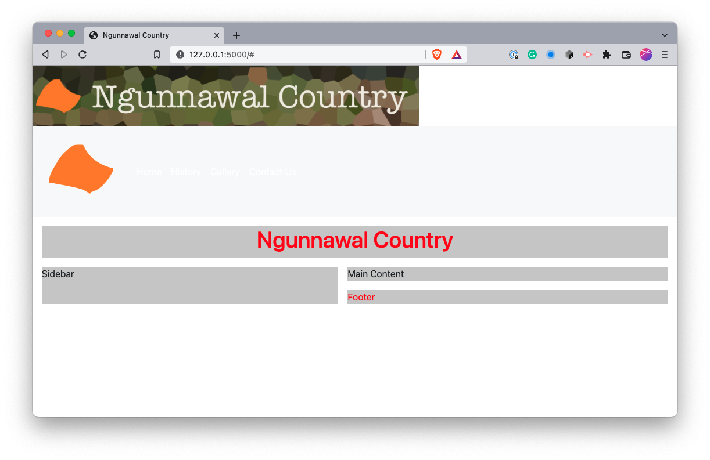

Again, on this site - [https://getbootstrap.com/docs/5.2/components/navbar](https://getbootstrap.com/docs/5.2/components/navbar) Click on the Color Schemes section to look at the different options and copy the code relevant to what you want.

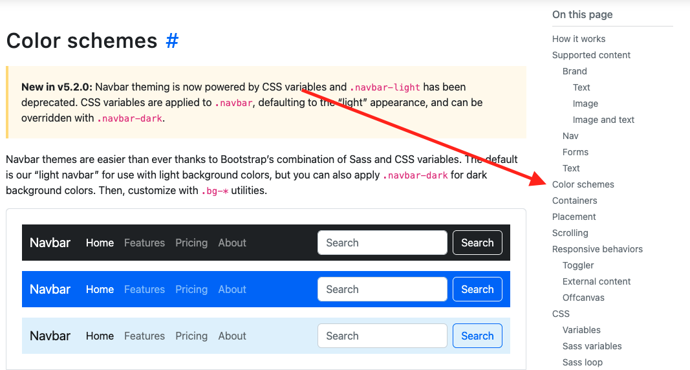

You will need to change the `<nav ...>` line of code to match what the code is on the website.

**Before**

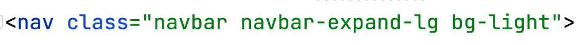

**After**

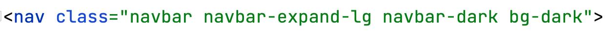

After that small change, you should be able to see a significant difference in the navbar.

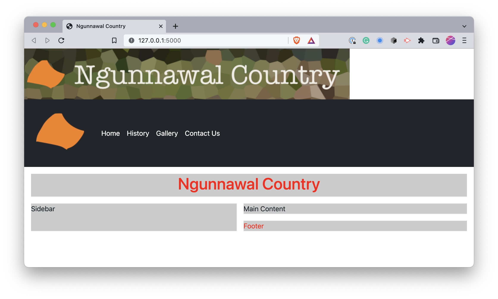

<aside>
‼️ The site will still need some more changes required, however this already has added some additional functionality that you may have already noticed. If not, try resizing the width of the window!

</aside>

# Bootstrap Layout

Bootstrap allows for much more flexible layout organisations, and due to its responsive website feature, allows you to build grids with up to 12 columns.

Bootstraps Grid system is described in detail on this page. 

[Grid system](https://getbootstrap.com/docs/5.2/layout/grid/)

<aside>
‼️ Each row can be split into 12 columns, and each row can be separated in individuals ways. This allows for a lot of flexibility.


[https://www.tutlane.com/tutorial/bootstrap/bootstrap-grid-system](https://www.tutlane.com/tutorial/bootstrap/bootstrap-grid-system)

</aside>

Now, the layout of the site, previously CSS’s `Grid` layout can be updated to use Bootstrap’s `Grid` layout.

<aside>
‼️ As with much of the site, the design choices are yours to make - this is only an example.

</aside>

Change the class of the main layout to `container-fluid`.

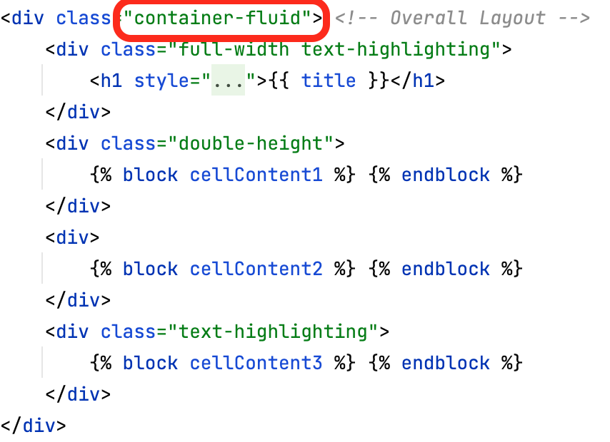

In this example, the first row will contain just the heading. The second row will contain `cellContent1` and `cellContent2`, and the third row will contain `cellContent3` as the footer.

Here is the wireframe of what the following code will attempt.


Add a new section of the layout to organise the site into rows.

The three rows have been added - `<div class="row">` matching the wireframe above.

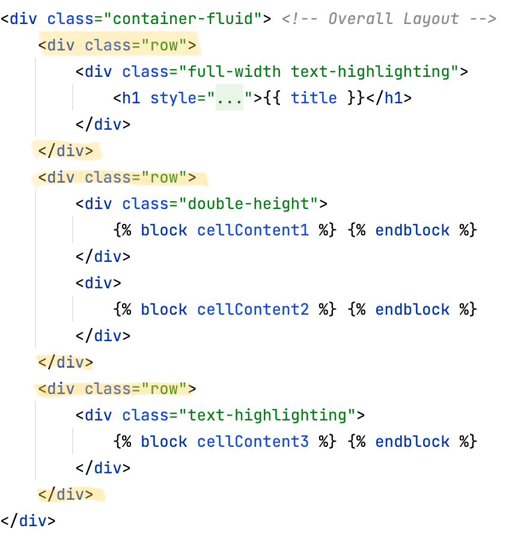

<aside>
‼️ You can use CTRL+ALT+L to automatically format the code.

</aside>

For each Row, you need to add the class `col` to indicate it’s a new column, even if there is only one column for the row.

You can see in the screenshot that `col` can be used in conjunction with other custom-written CSS classes such as text-highlighting if needed.

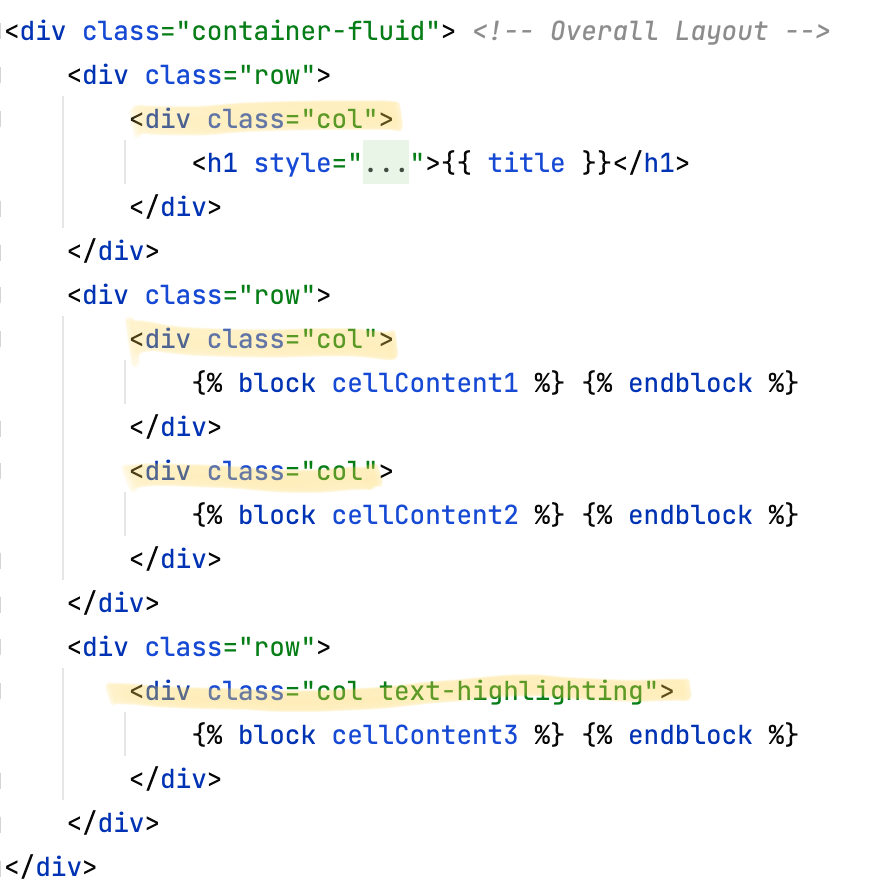

Lastly, the width of each column can be set. In this case, the sidebar in the second row is roughly a third of the width of the page, and the main content is roughly two thirds. 

Bootstrap defines a row has 12 columns, so that would mean the Sidebar column has a width of 4, and the main content has a width of 8.

Change the different sizes of the columns to suit your layout design.

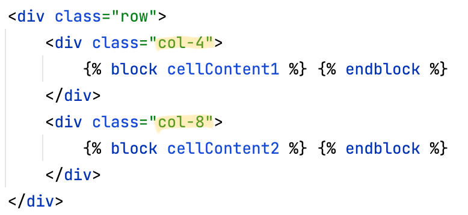

After this process, the site should look similar to this (depending on your layout design choices)

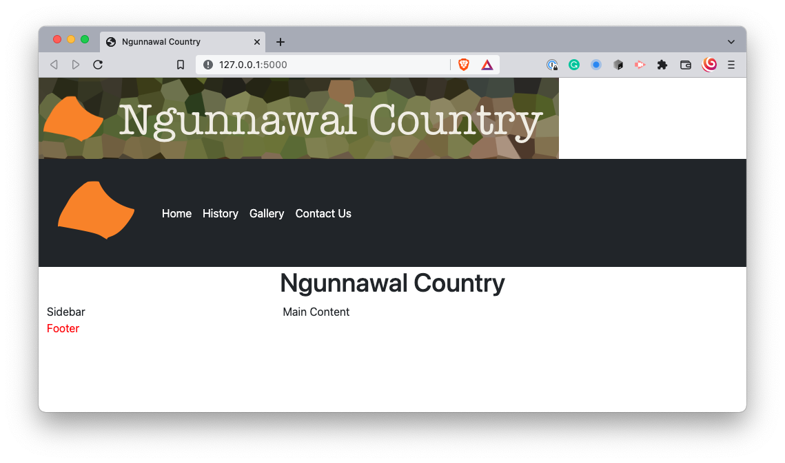

# Further Development

There are many other updates that can be made throughout the site. Some of these will be addressed later in the process, however you may look at Bootstraps Docs for some ideas.

[Get started with Bootstrap](https://getbootstrap.com/docs/5.2/getting-started/introduction/)

- Todo App


# CRUD

](_images/CRUD.jpeg)

[https://www.atatus.com/glossary/crud/](https://www.atatus.com/glossary/crud/)

**Create**, **Read**, **Update** & **Delete** (CRUD) are the standard operations for use with databases, especially with SQL statements using a relational data system such as SQLite. 

You can read more on CRUD by accessing [this page](https://www.humio.com/glossary/crud/).

In this exercise, you’ll demonstrate each of these processes with a simple ToDo application.

# Create the Database Table

In the database tab, right click on the tables and choose New → Table in the popup menu.

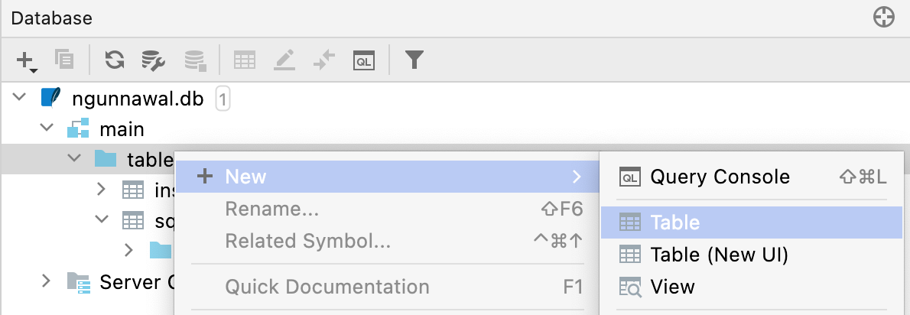

Name the table `todo`.

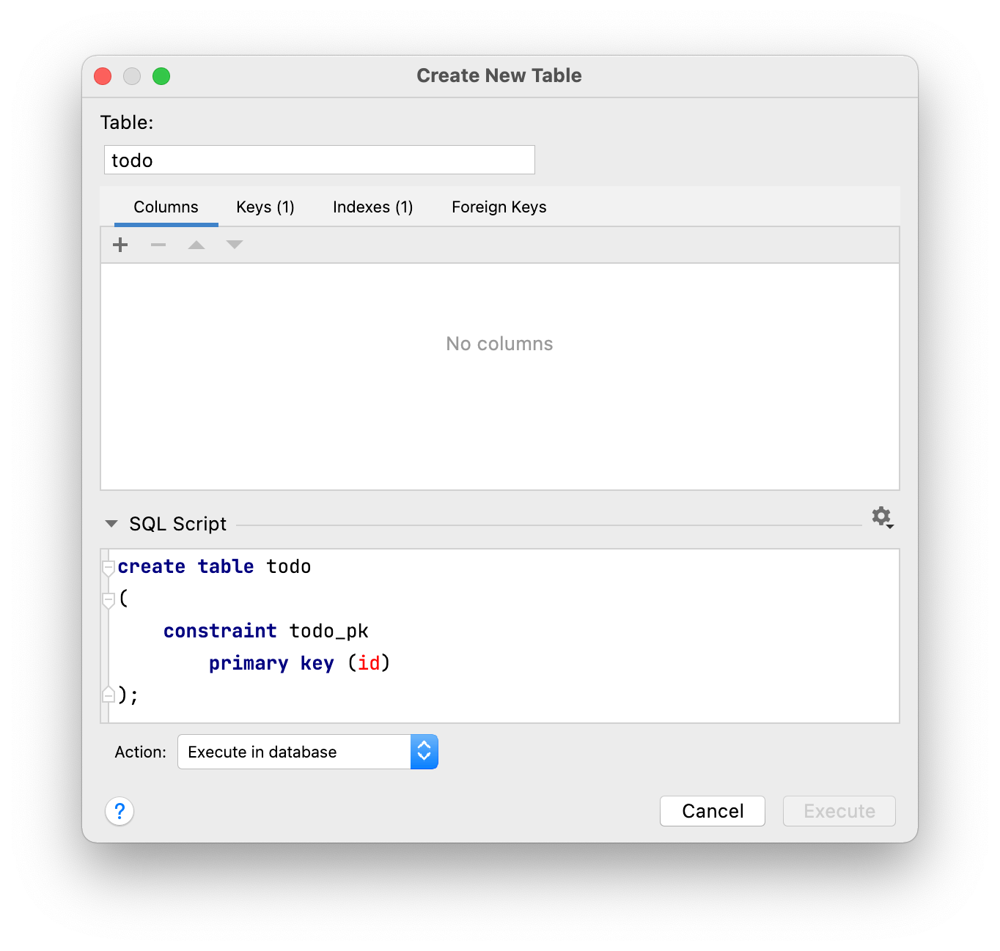

Create the first field or column in the table, called `id` by clicking on the `+` button. 

Make sure you tick all the boxes as this will be the primary key and auto incremented. This means that the database itself will manage the numbering of the row and doesn’t need to be manually programmed.

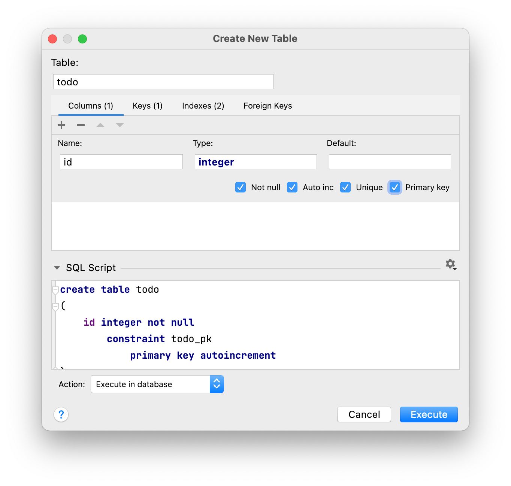

Create three more field (or columns). 

The first is called `text`. The type of this field should be `TEXT`.

The second is called `done`. The type of this field should be `BOOLEAN`.

When creating the fields, do not tick any of the boxes.

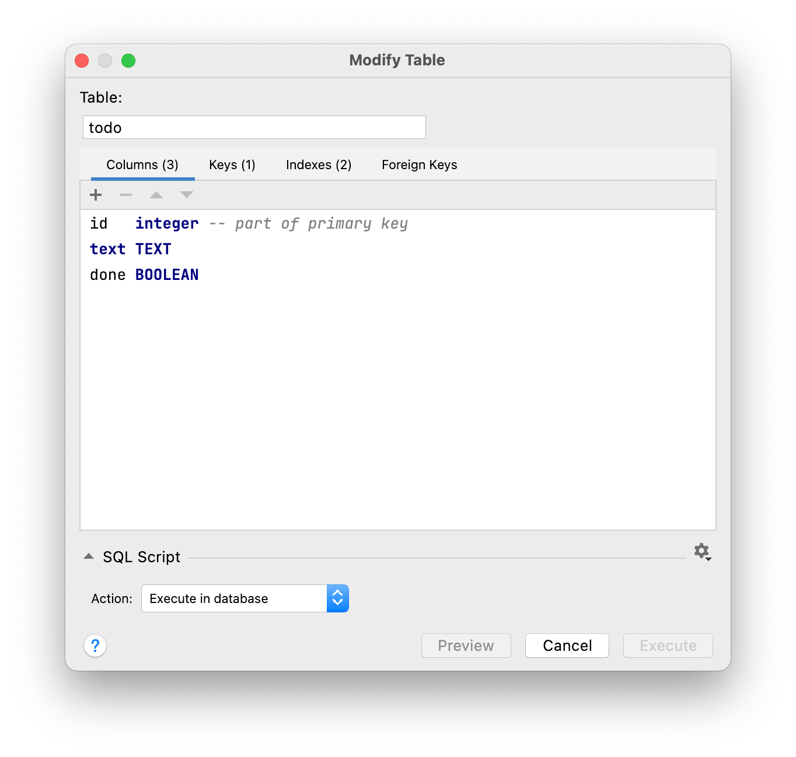

Click Execute. Once that process is complete, expand the database tables, and todo. The fields created should appear.

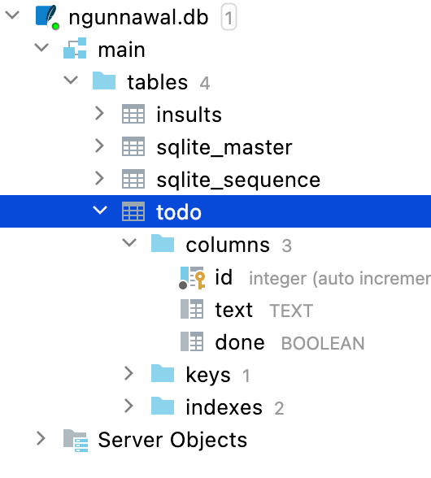

# Create Model

Open `models.py`

At the end of the file, and after any other classes, add the following `todo` class.

<aside>
‼️ Like with any other classes in this case, the names of the class and the variables need to match what the the names are in the database. If you’ve named them different, you will need to make them match.

</aside>

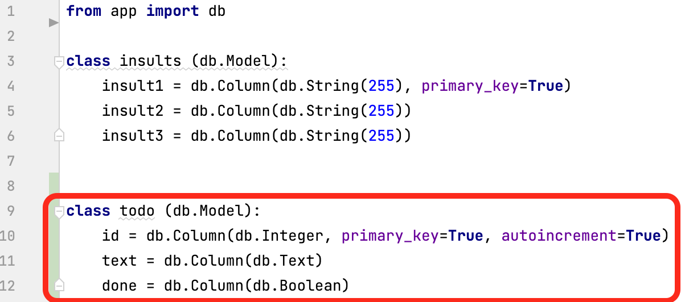

```python
class todo (db.Model):
	id = db.Column(db.Integer, primary_key=True, autoincrement=True)
	text = db.Column(db.Text)
	done = db.Column(db.Boolean)
```

**Save** the file.

# Todo Template

Right click on the Templates folder and create a new HTML file called `todo.html`. Replace the contents with this standard code.

```python


{# Place the content for the cellContent1 in this block #}

	Sidebar


{# Place the content for the cellContent2 in this block #}

	Main Content


{# Place the content for the cellContent3 in this block #}

	Footer


```

Replace the sidebar with the code to create a new entry in the todo list.

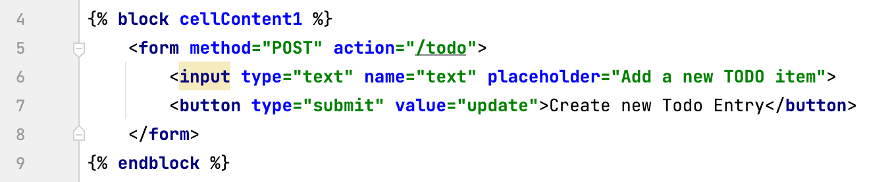

```python
<form method="POST" action="/todo">
	<input type="text" name="text" placeholder="Add a new TODO item">
	<button type="submit" value="update">Create new Todo Entry</button>
</form>
```

Replace the cellContent2’s content with the following.

This code **loops** for each entry in the Todo list (how many rows are in the table). For each entry, it creates a checkbox to indicate in the task is done or not, and the text of the todo. 

It also adds an Update button for each entry.

An example of what it will create is:


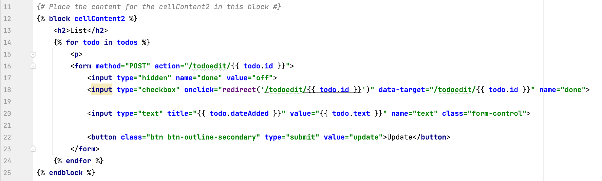

```python
<h2>List</h2>

	<p>
	<form method="POST" action="/todoedit/{{ todo.id }}">
		<input type="hidden" name="done" value="off">
		<input type="checkbox" onclick="redirect('/todoedit/{{ todo.id }}')" data-target="/todoedit/{{ todo.id }}" name="done">

		<input type="text" title="{{ todo.dateAdded }}" value="{{ todo.text }}" name="text" class="form-control">

		<button type="submit" value="update">Update</button>
	</form>
<form method="GET" action="/todoedit/{{ todo.id }}">
			<button type="submit" value="delete">Delete</button>
		</form>

```

**Save** the file.

# ‘Create Todo’ Route

Open `app.py` .

Update the Flask import line of code to include the `request` library.

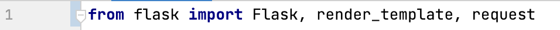

Update the following import. This allows this file to load and use the new class just created.


## View Todos

Create a new route by copying this code into `app.py.`

```python
@app.route('/todo', methods=["POST", "GET"])
def view_todo():
	all_todo = db.session.query(todo).all()
	if request.method == "POST":
		new_todo = todo(text=request.form['text'])
		new_todo.done = False
		db.session.add(new_todo)
		db.session.commit()
		db.session.refresh(new_todo)
				return redirect("/todo")
	return render_template("todo.html", todos=all_todo)
```

### An Explanation for each line

| Line | Explanation |
| --- | --- |
| 41 | Creates the new route, called `/todo` and also adds the extra functionality of POST and GET methods. This means that this route will send data from the server to the browser (GET) and also accept data being sent back from the browser to the server (POST). POST is the common method to submit form data back to the server.
You can read more [here](https://pythonbasics.org/flask-http-methods/). |
| 42 | Defines the function name |
| 43 | Queries the database and retrieves the whole `todo` table. The results are stored into the `all_todo` variable. |
| 44 | Checks if the Create todo form  (in `cellContent1` or sidebar) is attempting to submit data back to the server (POST). |
| 45 | Creates a new variable - `new_todo` by collecting the text entered in the form. |
| 46 | Sets the done field to `False` as default. |
| 47-49 | Writes the new entry into the database temporarily, and then commits ****it to the database permanently. The refresh command updates the entry in memory to match the database. |
| 50 | After submitting the new ToDo entry to the database, this reloads the current page. |
| 51 | “Sends” the template to the browser with all the notes loaded from the previous query on line 34. |

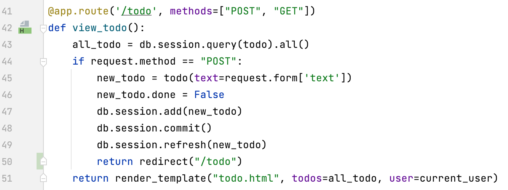

## Run and test the page.

Run the project and access the link:

[http://127.0.0.1:5000/todo](http://127.0.0.1:5000/todo)

You should see something like this:


Create a new Entry and reload the page.


# ‘Edit Todo’ Route

This route will handle both the update and delete functions.

Update the Flask import statement to also import the `redirect` library.


Add the following code to `app.py`

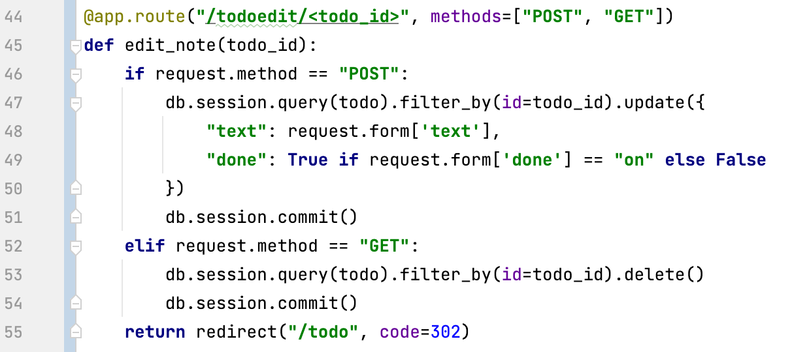

```python
@app.route("/todoedit/<todo_id>", methods=["POST", "GET"])
def edit_note(todo_id):
	if request.method == "POST":
		db.session.query(todo).filter_by(id=todo_id).update({
			"text": request.form['text'],
			"done": True if request.form['done'] == "on" else False
		})
		db.session.commit()
	elif request.method == "GET":
		db.session.query(todo).filter_by(id=todo_id).delete()
		db.session.commit()
	return redirect("/todo", code=302)
```

## Code explanation

| Line | Explanation |
| --- | --- |
| 44-45 | Creates the route and python function. This is different from other routes as it accepts a variable in the route. `<todo_id>` is anything that is in the url after the `/todoedit/` in the browser. For instance if the url is [http://127.0.0.1:5000/tododit/5](http://127.0.0.1:5000/tododit/5) then `todo_id` is 5. In this case, it will refer to the the entry in the table with 5 as the ID. |
| 46 | Checks if the form has been POSTed to the server. This will be True when the user submits the form in `todo.html` created by the line : `<form method="POST" action="/todoedit/{{ [todo.id](http://todo.id/) }}">` |
| 47-50 | This first queries the database to find the entry with the ID matching `todo_id` and updates it with the text in text field and the done field whether it is ticked or not. |
| 51 | Commits any changes to the database. |
| 52 | Checks if the form has been submitted using the GET method. This will be True when the user submits the form in `todo.html` created with the line: `<form method="GET" action="/todoedit/{{ [todo.id](http://todo.id/) }}">` |
| 53 | Finds the entry in the database with the ID matching `todo_id` and deletes it. |
| 54 | Commits the change to the database. |
| 55 | redirects the browser to `/todo` after any changes have been made. |

---

# Extension

This completes the core TODO task. There are many changes that could be made, for instance making the form ‘prettier’ by using an established CSS library such as [Bootstrap](https://getbootstrap.com). 

# VET Competency

This task, if completed as part of the assessment, will be used as evidence for the **ICTICT210 - Operate database applications** competency.

[training.gov.au](https://training.gov.au/Training/Details/ICTICT210)

- Homepage


# Create Index.html

<aside>
‼️ The individual pages, such as index.html, will have limited HTML, CSS and JS in them - this will be inherited from template.html.

</aside>

Right click on the template folder, and choose New → HTML File.


Call the file `index`.

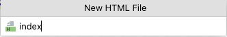

Replace the contents of `index.html` with the following code.

For the moment, make no other changes.

Save the file.

```python


{# Place the content for the cellContent1 in this block #}




{# Place the content for the cellContent2 in this block #}




{# Place the content for the cellContent3 in this block #}



```

# Update App.py

First, update `app.py` to also import `render_template` from the flask library.

<aside>
‼️ This new import allows Flask to take the index.html and template.html pages written and replace the contents with what is required.

</aside>

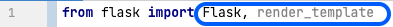

Rename the `hello_world()` function to something more appropriate - `homepage()`.

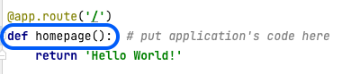

Update the return statement to render the `index.html` file, and also assign the title variable to be “Ngunnawal Country”.

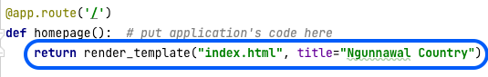

- Code
	
	```python
	return render_template("index.html", title="Ngunnawal Country")
	```
	

Run the site and click the link to open in the browser.

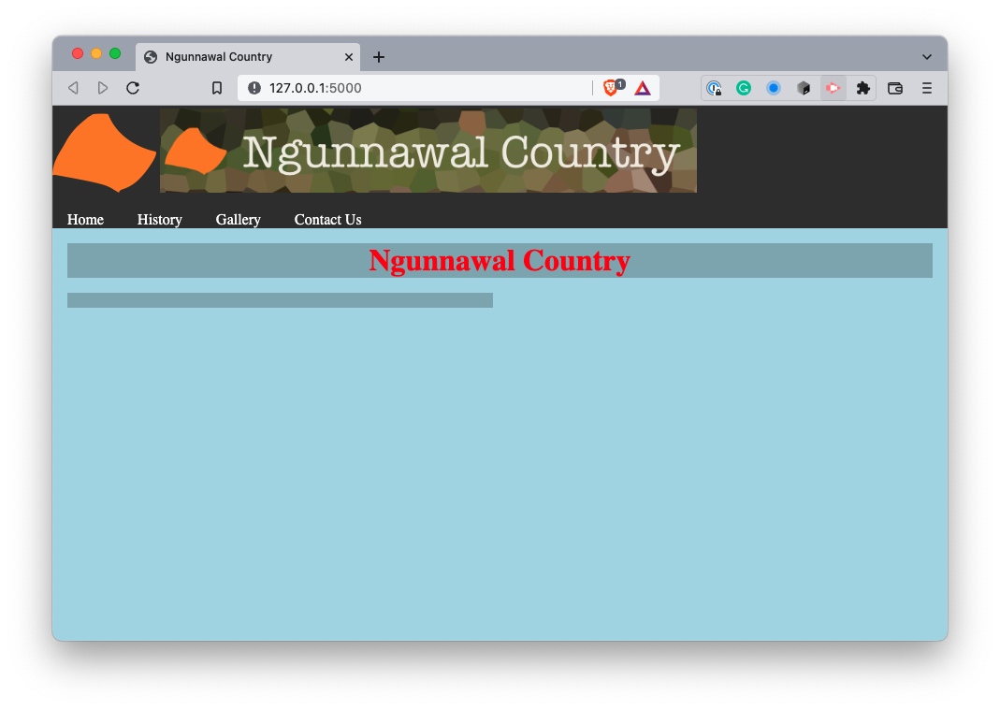

Back in Pycharm, update the cellContent blocks with some text.

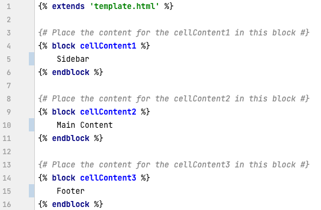

Reload the page in the browser, and you should see the update content.

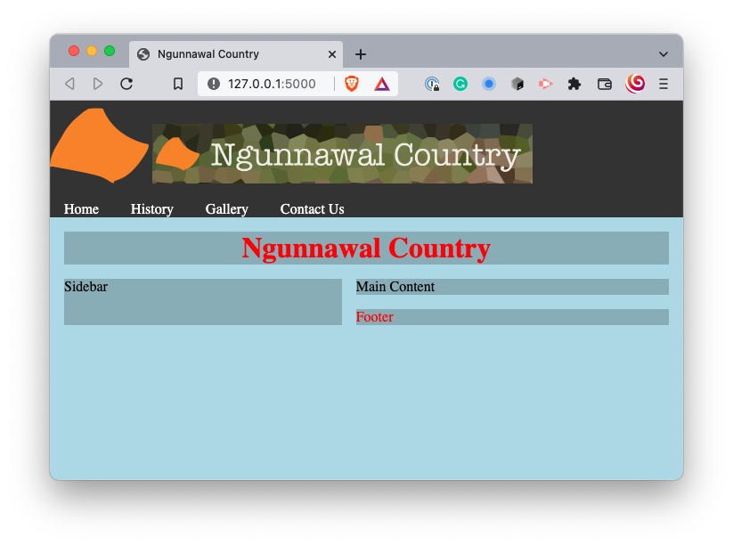

## Refreshing the page doesn’t work?

If you save changes to your code, and the changes aren’t reflected in the browser, try this:

Click on the Configurations dropdown in the toolbar, and then **Edit Configurations**.

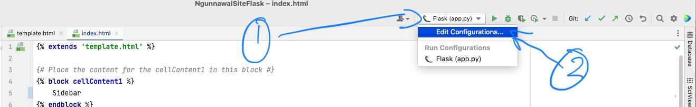

Tick the **FLACK_DEBUG** checkbox and click Ok.

<aside>
‼️

You may need to restart the server for this setting to take effect.

</aside>

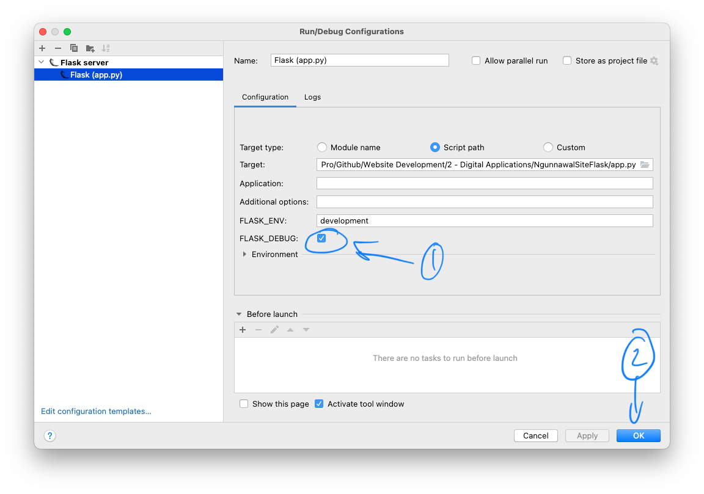

That should let you make changes to the code, and not restart the server to see the changes made.

- Contact Form


# Contact Us Form

This task implements the back-end functIonality for the “contact us” page. To do this, there are a number of steps, and areas of the project to modify, namely the database, model, form and html. 

This process will be similar to the process for adding future functionality in the project. 

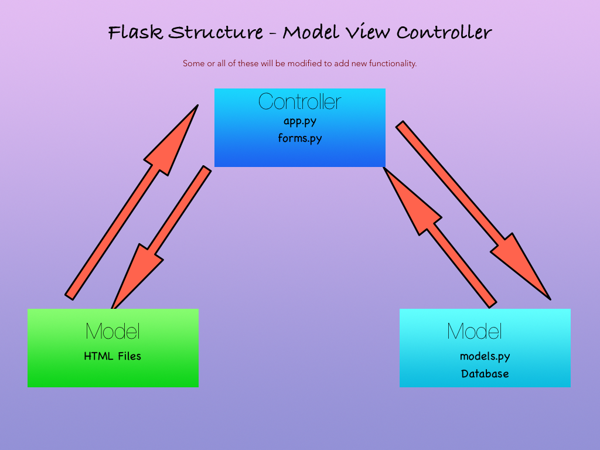

# Contact Page Configuration

Create a new HTML file in the templates folder called `contact.html` and replace the contents of the file with the standard code:

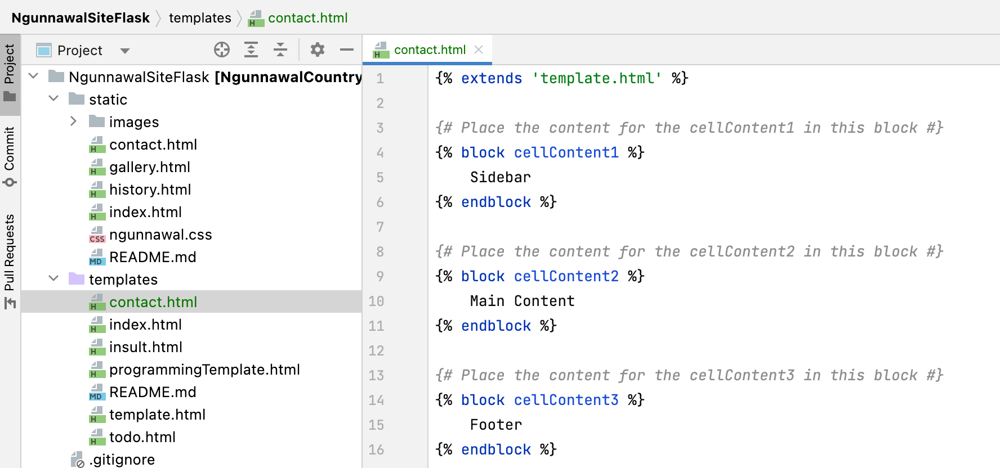

```python


{# Place the content for the cellContent1 in this block #}

	Sidebar


{# Place the content for the cellContent2 in this block #}

	Main Content


{# Place the content for the cellContent3 in this block #}

	Footer

```

Replace the Main Content text with form tags.

`form.hidden_tag()` is required for security purposes. It generates a CSRF token. You can read about Cross Site Request Forgery [here](https://owasp.org/www-community/attacks/csrf).

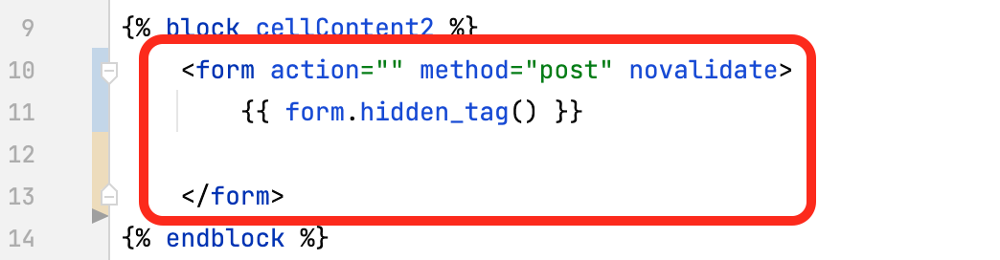

```html
<form action="" method="post" novalidate>
{{ form.hidden_tag() }}

</form>
```

For each field required in the form, this template can be used.

The `name` field that is highlighted in the screenshot refers to variables that will be defined later. These **must** match the variables, and in each <p> block shown, they must be **identical**.

Create three of these blocks, the first for `name`, the second for `email` and the third for `message`.

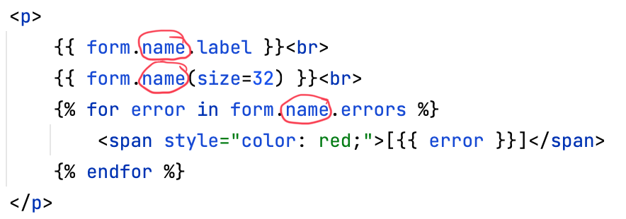

```html
<p>
	{{ form.name.label }}<br>
	{{ form.name(size=32) }}<br>
	
	<span style="color: red;">[{{ error }}]</span>
	
</p>
```

After the field, and just prior to the </form> add in the code for the submit button.

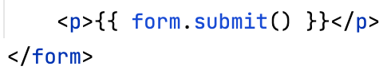

```html
<p>{{ form.submit() }}</p>
```

At the end of the process, the code for the cell content should appear similar to this.

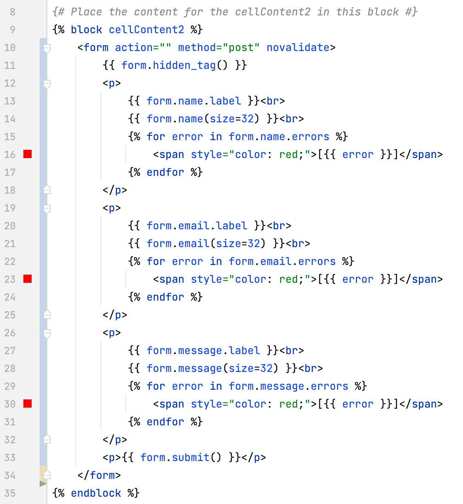

Save the file.

# Database Table Creation

Previously the contact form was front-end only and had no functionality. To enable this functionality, a table in the database needs to be created for the data to be stored in.

The table fields that need to be created depend on the specific contact form being developed. The one in the example will need the following fields:

- Id
- Name
- Email Address
- Message
- Date Submitted

The `id **`and `Date Submitted` fields were not included in the contact form, but are required in the database regardless of what other fields you need.

<aside>
‼️ The instructions only show creating the fields indicated. If you have others, you will need to add these to your process.

</aside>

Open the Database Tab in Pycharm.

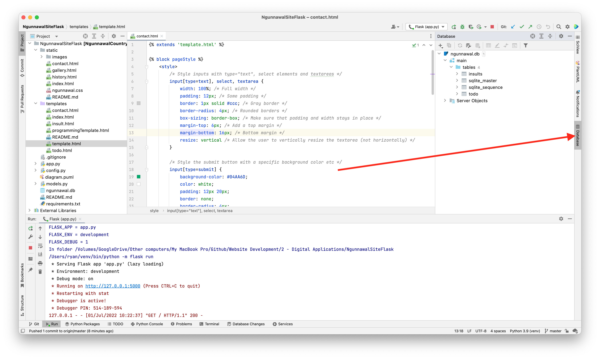

Right-click on the database name → New → Table.

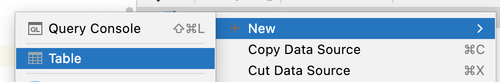

In the dialog that appears, name the table `contact`. 

Click on the plus button to add a new column/field and name this `id`. For this field, tick all the boxes.

<aside>
‼️ Spelling & capitalisation is critical.

</aside>

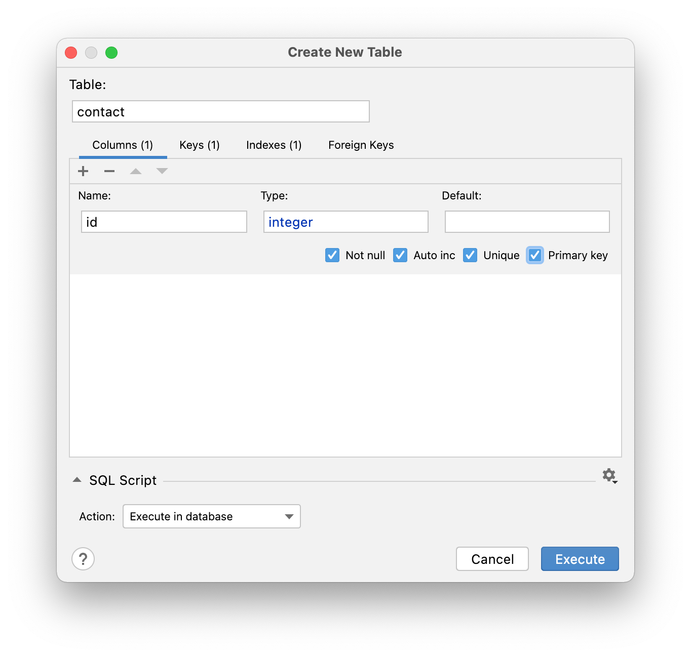

Add the other fields to the table, for the other ones, **you do not need to tick any of the boxes.**

These options refer to specific restrictions for database tables, and entering data for data integrity, and not critical at this stage. These will be focused on and discussed in detail at another time.

<aside>
‼️ Name all the fields as single words, and all lowercase. This makes it easier when coding the python side of the app.

</aside>

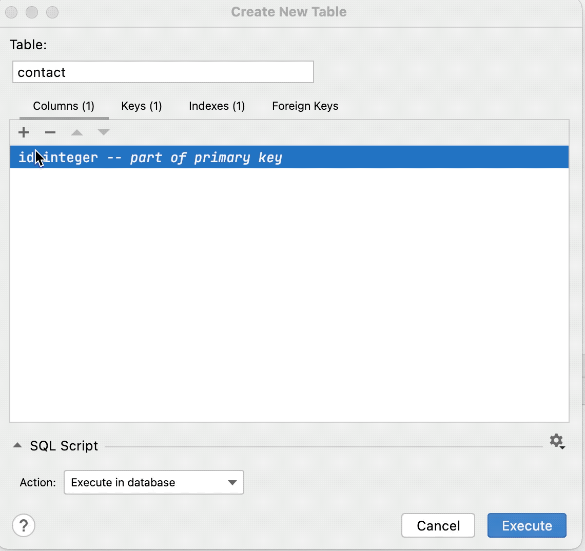

Press **Execute** once completed. The tables will appear in the database.

You may need to press the refresh button to have the database update.

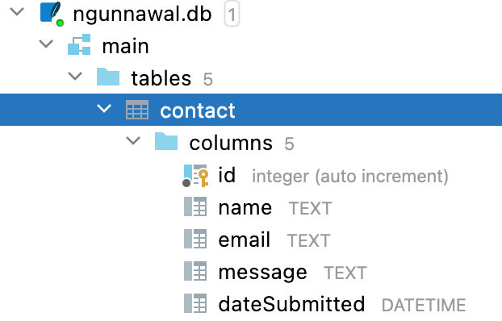

The table has been created and now will be able to be accessed from within Flask.

# Create Models.py

<aside>
‼️ In flask, and other programming architectures, a ‘model’ refers to the computer modelling the data in the code.

</aside>

Create a python file in the root directory of the project called `models.py`

<aside>
‼️ For each database table that you’ll be reading from or writing to, you need a *model* created in this file.
Each table will have its corresponding **class** which will have the same name. Each class has a variable for each column set to the data type of the table in the database.

</aside>

Copy the following code in. This will allow the models file to access the database configuration.

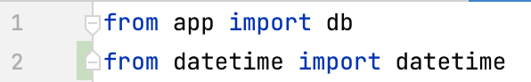

```python
from app import db
from datetime import datetime
```

To create the model, Flask requires a **class** to be created for it to store the database records in memory when required. For instance, when the code loads a particular entry, or before writing to the database.

The syntax for this is `class Contact(db.Model):`

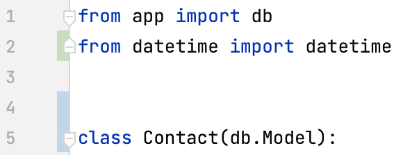

Each field that is in the database will need it’s corresponding entry in the model class. For instance, the first field in the database is `id`, so the first variable created is the id.

As this id variable is the primary key, and autoincrements (as defined when creating the table), this needs to be indicated in the declaration.

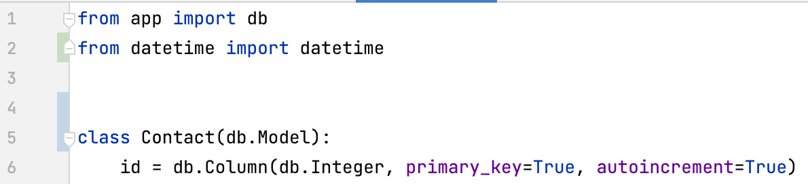

```python
class Contact(db.Model):
	id = db.Column(db.Integer, primary_key=True, autoincrement=True)
```

The next three fields are just TEXT fields, and can be defined as such.

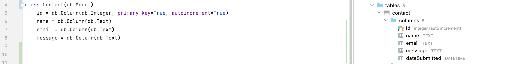

```python
name = db.Column(db.Text)
email = db.Column(db.Text)
message = db.Column(db.Text)
```

<aside>
‼️ If your database differs from this example, you will need to modify the class definitions accordingly.

</aside>

The final field is the `dataSubmitted` field. As this is stored as a DATETIME in the database, this needs to be declared as such.

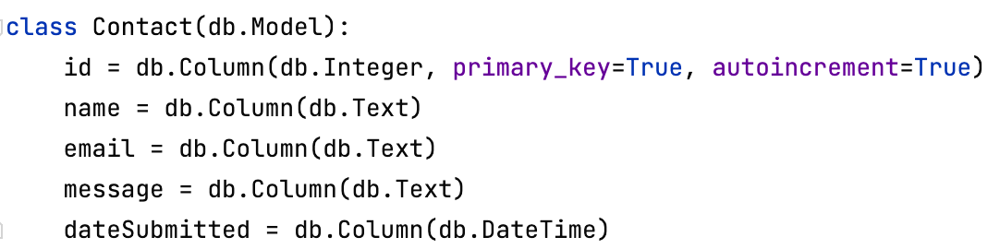

```python
dateSubmitted = db.Column(db.DateTime)
```

The last part to add is a function that automatically runs when a new contact object is created. 

This can be very complicated, however whenever a class is created in python (referred to as instantiating an object), a prebuilt function called `__init__` is executed if it is there. 

After the class definition, add the function

```python
def __init__(self, name, email, message):
		self.name = name
		self.email = email
		self.message = message
		self.dateSubmitted = datetime.today()
```

This function assigns all the variables as necessary, but importantly, also sets the dateSubmitted field to be the time of the computer when it’s submitted.

The final class should look similar to this one. 

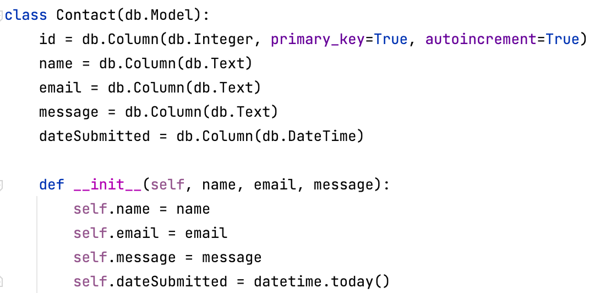

<aside>
‼️ Python is extremely strict with indentation. Make sure the fields are indented (press tab) once after the class definition.

</aside>

**Save the file.**

# Create Forms.py

To capture the form information submitted by the form, a Python class needs to be defined. This is similar to the idea of a model, which represents the database. Whereas this class ‘models’ the form.

Create a `forms.py` file in the root directory of the project.

Do this by right-clicking on the project folder and choose New → Python file. Call it `forms.py`.

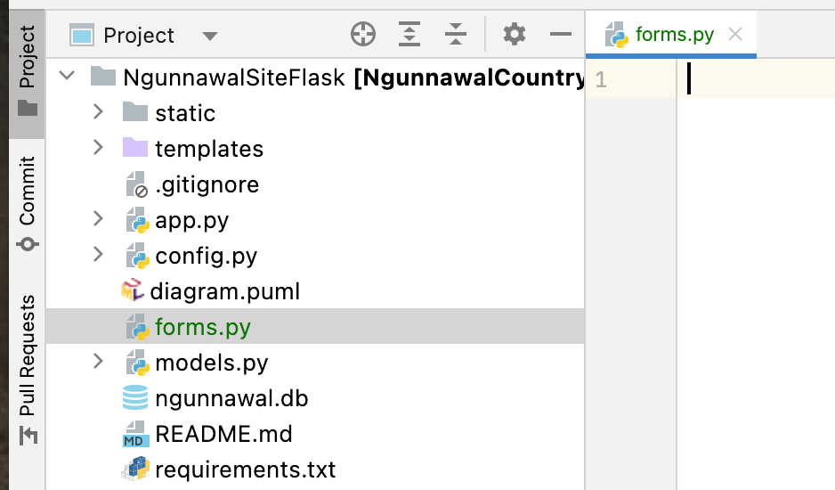

Add the necessary imports to the top of the file.

These imports are used to create the structure of the forms in memory. Additionally the `DataRequired` and `Email` validators easily allow the code to require data to be submitted for each field, and also force the email address entered by the user to be in a valid format.

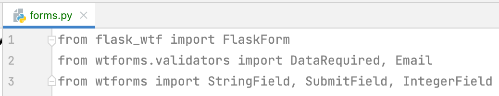

```python
from flask_wtf import FlaskForm
from wtforms.validators import DataRequired, Email
from wtforms import StringField, SubmitField, IntegerField
```

Create the class, indicating that it will be used as a `FlaskForm`.

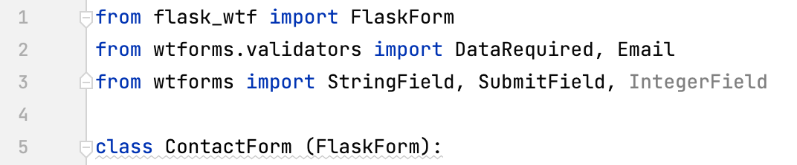

```python
class ContactForm (FlaskForm):
```

Similarly to the Model file, each field that will be collected by the form will need to have a corresponding variable.

<aside>
‼️ The variable names **must** match the variables created in the contact.html form.

</aside>

Each of these entries are defined as a `StringField`, meaning that they’ll be collecting text information - which matches the requirement of the database.

The text immediately inside the brackets - “Name”, “Email”, “Message” and “Submit” - will be displayed on the form in the place of the label (for instance `{{ form.name.label }}<br>` in contact.html). Submit will be displayed as the text on the submit button.

The `validators` forces the data to be required before submitting, and in the case of the email address, also forces it to be a valid email address.

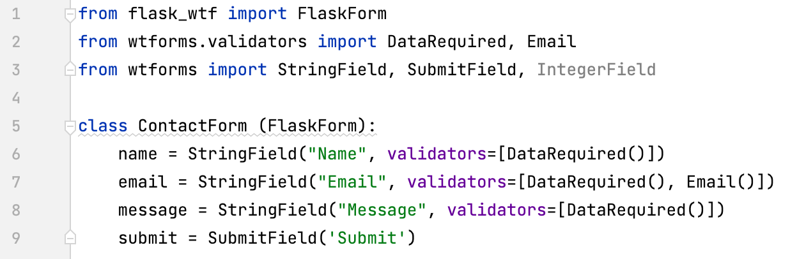

```python
name = StringField("Name", validators=[DataRequired()])
email = StringField("Email", validators=[DataRequired(), Email()])
message = StringField("Message", validators=[DataRequired()])
submit = SubmitField('Submit')
```

Save the file.

# Contact Route

The final step in the process is to implement the route in `app.py`. This is the part of the project which links the other parts (model & form) together, and directs what happens when the user accesses the URL (route), and what happens when they submit the form.

Start by opening `app.py` and adding code to import the two new classes created:

- Update the model import to include Contact, and
- import ContactForm from forms.

<aside>
‼️ These lines of code need to be AFTER the `db=SQLAlchemy(app)` line of code.

</aside>

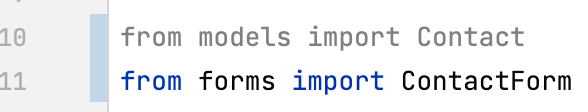

```python
from models import Contact
from forms import ContactForm
```

and creating a new route.

<aside>
‼️ The error showing in ‘form’ will be fixed at the next step.

</aside>

This code creates the route entry point for `/contact.html` and associates it with the `contact()` function.

The route also is defined with `, methods=["POST", "GET"])` which indicates that the route will not only display the c`ontact.html` page, but also accept data back to the server, through the form submit.

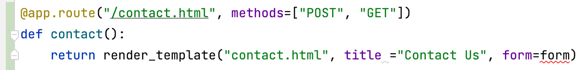

```python
@app.route("/contact.html", methods=["POST", "GET"])
def contact():
	return render_template("contact.html", title ="Contact Us", form=form)
```

The first step for this function is to load the ContactForm to be displayed to the user. Add the following code to load the class and store it in a variable called `form`.

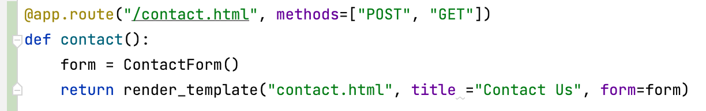

```python
form = ContactForm()
```

## Time to Test!

Run the project and load the page to see if it works.

Flask has lots of moving parts that interact with each other, and therefore this is the first chance to test to see if it’s all working. 

Ideally, it all works and you should see a page similar to this example.

[http://127.0.0.1:5000/contact.html](http://127.0.0.1:5000/contact.html)

<aside>
‼️ This site may appear different if you’ve included Bootstrap into the template.

</aside>

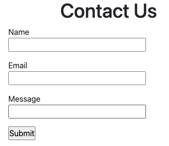

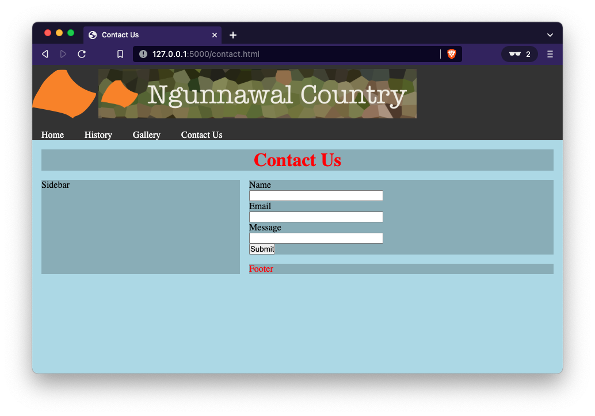

## Form Submission

The form is displayed to the user but data can not be submitted as yet. The final step is to check if the user has pressed the submit button and then what to do with the information in the input boxes.

First, check if the user has pressed the submit button. This is done through the `validate_on_submit()` function.

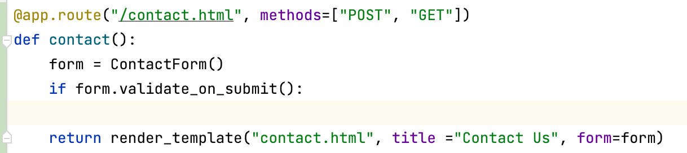

```python
if form.validate_on_submit():
```

Then create a new_contact object which contains all of the information in the form fields - name, email and message. 

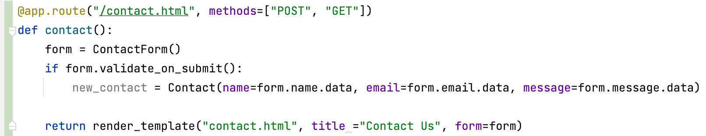

```python
new_contact = Contact(name=form.name.data, email=form.email.data, message=form.message.data)
```

This is where the benefit of doing all the previous work with forms and models, because this `new_contact` variable has all the information needed to write to the database, including the table and SQL data. Ordinarily, you would have to write the SQL to add it to the database in the correct format.

The last step is writing the `new_contact` data to the database.

“commit” means it actually writes it to the database.

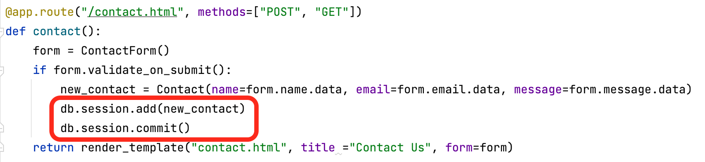

```python
db.session.add(new_contact)
db.session.commit()
```

Save the file.

## Test the Submission Process!

Hopefully the project functions just as it does below.

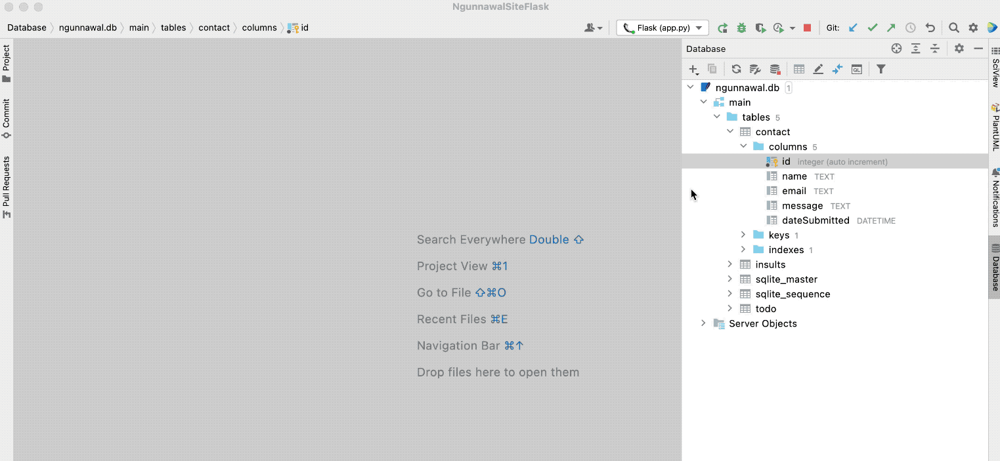

# Custom CSS in Forms.

To add CSS classes to form elements, you can do this by updating `forms.py`. 

For instance, applying CSS classes to the Submit button, to incorporate standard Bootstrap classes, you could update the submit button defintion by adding a `render_kw` attribute:

```python
submit = SubmitField('Submit', render_kw={"class": "btn btn-primary btn-block"})
```

You can add additional details using the standard dictionary structure (`key:value`). 

- User Access Level


So far in the development process, there is very little access control. 

<aside>
‼️ Access control is the term to cover which users can access certain pages and other resources.

</aside>

A Quick Summary of what is implemented so far: 

- In the User table in the database, there is a `user_level` field, which is defined as an integer.
- A 1 in this field means standard user. A 2 means the user is an administrator.
- The User model has a function - `is_admin()` - which will return `True` if the user_level is set to 2.
- Some routes have `@login_required` defined which requires the user to be logged in or will redirect the user to the login page.

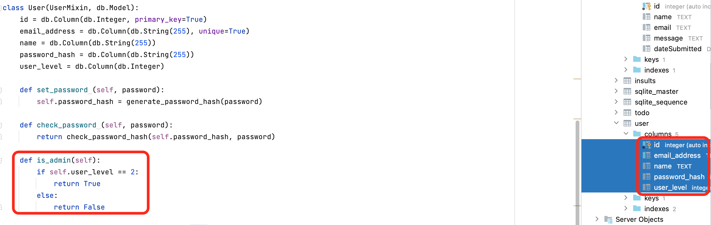

This is not *great* security and can use a lot of work. 

Ideally, only Administrators will be able to access certain pages of the website, and standard users will be redirected if they attempt to access those resources. 

For instance, only administrators should be able to view all the messages on the [Contact Messages](https://www.notion.so/Contact-Messages-727997aeeb73406a91fb930af1d5a6cd?pvs=21) Page. Currently, **any** logged-in user can view that page (if they know the link)

## Update Contact Messages Route

Open `app.py` and find the `contact_messsages` route.

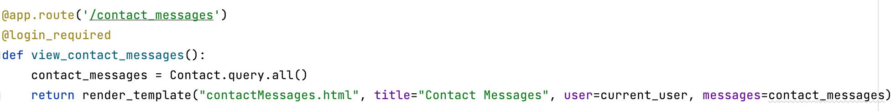

To implement access control, before the Contact table is loaded and the template is rendered, first implement an `if` statement to check to see if the current user is an admin.

If the user is an administrator (level 2) then the page will load as it did previously.


```python
if current_user.is_admin():
```

Include an `else` clause to redirect the user to the home page if they are not an administrator. 


```python
else:
	return redirect(url_for("homepage"))
```

## Update the Navbar

The `is_admin()` function can also be used in the base template to control which links administrators see vs regular users.

Currently there is a check to see if the current_user is logged in or not and displays the relevant links.

Add in a check to see if the user is an admin, and if so, show the link to the contact messages route.

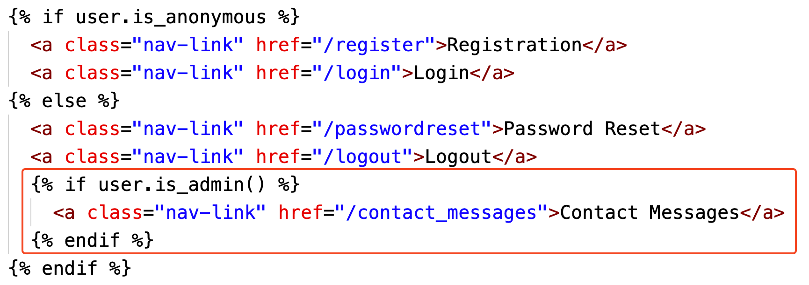

## Test the implementation

Try to view the site as a regular user and then and administrator.

To change the access level, you’ll need to view the User table, change the value in the `user_level` field and write the changes back to the database.

Attempt to access the URL without logging in, and it should redirect you to the login page.

Attempt to access the URL logged in as a user with an access level set to 1.


Attempt to access the URL logged in as a user with an access level set to 2.


## Continue Implementing Access Control

What other pages should be limited to administrators only? Any that need to be, just add the same structure as was implemented for the contact messages route:

```python
if current_user.is_admin():
	# Normal Route code. For administrators only.
else:
	return redirect(url_for("homepage"))
```

- Dynamic Navbar - Current User


In this instance, ‘dynamic navbar’ means that the navbar only shows links that are relevant or accessible that the current user can access.

For instance, if the user is not logged in, they will need the login link, however a user already logged in, will need a logout link instead.

---

`current_user` is built into `Flask-Login` allowing you to check to see if the user of the website is logged in or not, and if they are, then access the `User` model you defined in `models.py`. Hence using `user=current_user` on every route.

As the current user details is being sent to the template to be rendered, you can run some checks on that user.

Open `templates/base.html` and find the registration and login links.


Surrounding these two links, add an `if` statement to check to see if the user is anonymous. This means that the user has **not** logged in yet.


```python

...

```

Test this code and you’ll notice that the Registration and Login links only show for users who are not logged in!

The next step is to extend this by adding in an  section to only show the links that are accessible for users who are logged in.

In the example shown, you can see that the **Registration** and **Login** links are shown if the user is not logged in (`is_anonymous`) and the **Profile**, **Photos**, **Logout** and **Reset Password** Links are shown if the user is logged in (`is_anonymous` is false)


- Administrator Tools


This section of the project focuses on Administrator functionality. 

It is *generally* a bad idea to allow anyone, aside from a core group of people, direct access to the database, which means that most functions need to be configured to be allowed through a web interface. 

Administrator functionality that would require a web interface could be:

- Resetting other users passwords
- Removing or disabling user accounts
- Removing or disabling photos uploaded
- etc.

## Navbar updates

Update the navbar component in `base.html` to add links to the administrator functionality.

Look for the `` code and replace the existing links to be a dropdown menu.


```html
<li><a class="nav-link" href="/contact_messages">Contact Messages</a></li>
<li><a class="nav-link" href="/admin/list_all_users">List all Users</a></li>
```

## Reseting User Passwords

## Listing All Users

To be able to access individual users to reset their passwords, a new route can be added to list all the users current in the system and providing a link to the direct url, such as : [http://127.0.0.1:5000/reset_password/6](http://127.0.0.1:5000/reset_password/6)

Before creating the route code, create the structure for the HTML template to load.

Create a new HTML file in the templates folder called `listAllUsers.html` and include the following code.

```python


{# Place the content for the cellContent1 in this block #}





  


{# Place the content for the cellContent2 in this block #}

  



  <div class="footerText">Copyright 2024.</div>

```

In the `rowTwoColTwoContent` block add the code to loop over the number of users given, and automatically generating URLs for the reset password functionality defined below.

Save the file.


```html
<div class="container-fluid">
	
		<div class="row">
			<div class="col-md-4">{{ user.email_address }}</div>
			<div class="col-md-4"><a href="/reset_password/{{ user.id }}">Reset Password</a></div>
		</div>
	
</div>
```

Open `app.py` and Start by defining the route.

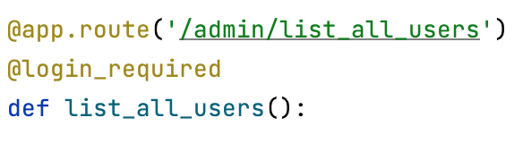

```python
@app.route('/admin/list_all_users')
@login_required
def list_all_users():
```

The code to load all the user details is simple enough, querying the entire user table, however this route needs to be limited so that only administrators can access it. If a user accesses it who is **not** an administrator, it will redirect them back to the front page.

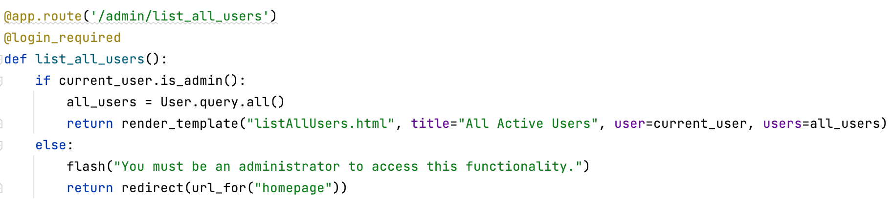

```python
if current_user.is_admin():
	all_users = User.query.all()
	return render_template("listAllUsers.html", title="All Active Users", user=current_user, users=all_users)
else:
	flash("You must be an administrator to access this functionality.")
	return redirect(url_for("homepage"))
```

When the site is run and the url accessed, the administrator will see a page similar to this:

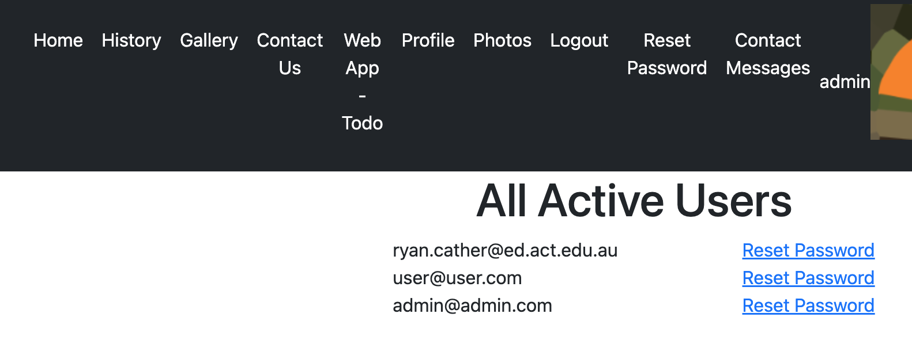

## Reset User Password Route

The site already allows for the user to reset their own password. The process for administrators to reset other peoples passwords is very similar.

<aside>
‼️ Consider the reset password function in `app.py` that already has been coded.


</aside>

To allow administrators to reset other peoples passwords, you can reuse `ResetPasswordForm` and the majority of the code shown with slight tweaks. The main one of these tweaks is the addition of the `userid` as a variable in the route and the function.

Enter the function in `app.py`. 

```python
@app.route('/reset_password/<userid>', methods=['GET', 'POST'])
@login_required
def reset_user_password(userid):
	form = ResetPasswordForm()
	user = User.query.filter_by(id=userid).first()
	if form.validate_on_submit():
		user.set_password(form.new_password.data)
		db.session.commit()
		flash('Password has been reset for user {}'.format(user.name))
		return redirect(url_for('homepage'))
	return render_template("passwordreset.html", title='Reset Password', form=form, user=user)
```

The differences between the existing reset password route and this one can be seen here.

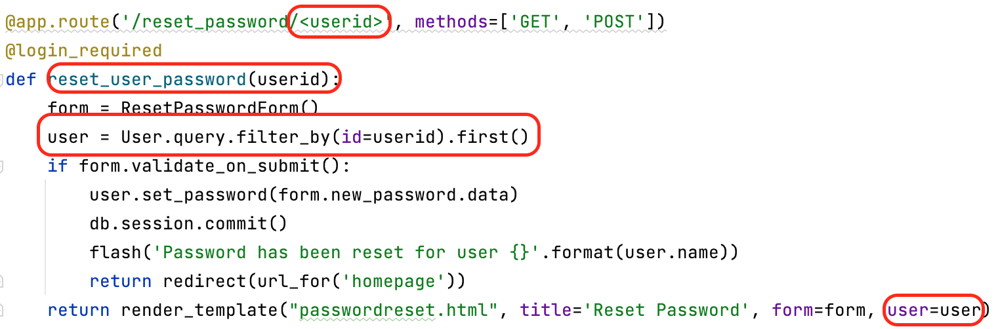

Notice the `/reset_password/<userid>` in the route and `reset_user_password(userid)` in the function header. This allows for the browser to access a URL such as [http://127.0.0.1:5000/reset_password/6](http://127.0.0.1:5000/reset_password/6). Where the `6` indicates the user id to be accessed as can be seen below.

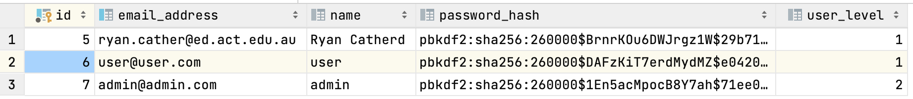

Additionally, the User.query code has been moved to be run before the if statement. This is so that the user details can be loaded to display on screen (as indicated in the render_template code with `user=user`). This allows the intended users email address to be shown instead of the `current_user` details.

Test the functionality to ensure it works. 

<aside>
‼️ It may be useful to register a test account to practice the resetting of passwords on.

</aside>

## Disabling User Accounts

User accounts can be disabled or deleted for any number of reasons - an account could have been made in error, legal issues, or the user just wishes to get rid of the account for some reason. Whatever the reason, it may be better to *disable* the account rather than delete it. 

To enable the disabling of accounts will require a few changes throughout the system:

1. The Login process needs to only allow users to login with active accounts.
2. User Registration needs to default active to true.
3. Administrators need to be able to enable and disable accounts as needed.

There may be other changes required, however these are the main ones.

<aside>
💡 The Database and model already has support for enabling and disabling of user accounts through the `active` field.

</aside>

### Login

The login process does not need to be changed significantly - the only addition is a check to ensure the user account is active (the field is `1`) before the login process proceeds.

This is only a minor change to the existing code.

<aside>
‼️ It would be useful to add a flash message to the user if the login process fails, instead of just redirecting them back to the user page.

</aside>

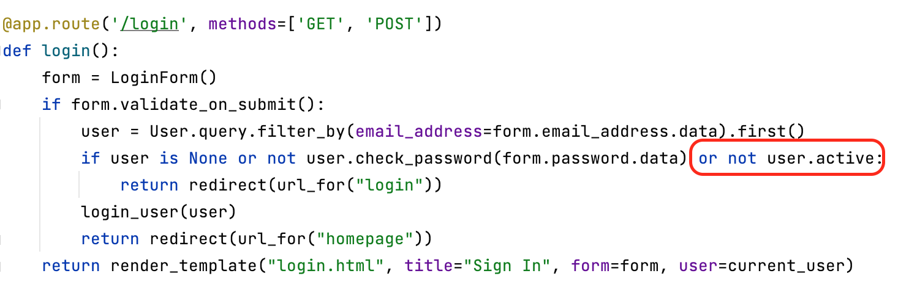

### Administrator Control

To allow administrators to enable and disable user accounts, there are a number of approaches to take.

**One** easy method is to update the `listAllUsers.html` file to show if the account is enabled or disabled, and to generate a link to flip the account status (enabled→disabled or disabled→enabled).

Save the file.

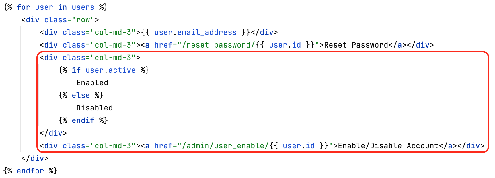

```html
<div class="col-md-3">
	
		Enabled
	
		Disabled
	
</div>
<div class="col-md-3"><a href="/admin/user_enable/{{ user.id }}">Enable/Disable Account</a></div>
```

Open [`app.py`](http://app.py) and create a new route for `/admin/user_enable`

This route loads the user identified by their user id, then flips the status. The changes are written back to the database.

Notice that this route doesn’t display a template to the user, just redirects them back to the `list_add_users` route. The user performing this function will see the changes reflect in the user list.

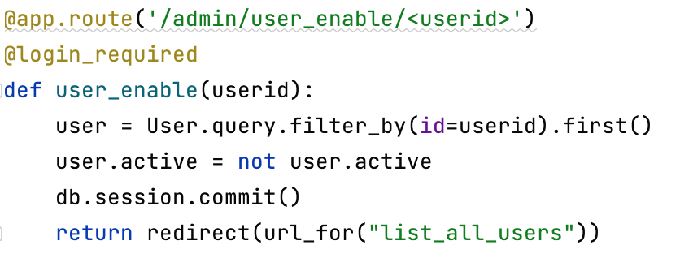

```python
@app.route('/admin/user_enable/<userid>')
@login_required
def user_enable(userid):
	user = User.query.filter_by(id=userid).first()
	user.active = not user.active
	db.session.commit()
	return redirect(url_for("list_all_users"))
```

### Extension

Update the `user_enable` route to limit access to administrators only. 

Hint: Look at the `list_all_users` route for suggestions.

Open `models.py` and add a new variable to the `User` class to reflect the new addition to the database.

<aside>
‼️ Create an account to test the process - check the database to ensure that the new account has been created correctly.

</aside>

Similarly to login, the registration process only needs a small addition to make the account active by default.

- Contact Message


So far, users can send messages through the contact form, however the only way to view those messages is to access the database directly, which is not user-friendly and is a security issue. The next logical step is to build a page to dynamically load the table and display the messages to the user through the webpage.

## Route

Open `app.py` and create a new route.

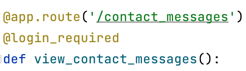

```python
@app.route('/contact_messages')
@login_required
def view_contact_messages():
```

Load all the entries in the contact table and store them in a variable.

<aside>
💡 The code `Contact.query.all()` reads the entire Contact table from the database and stores it in the `contact_messages` variable.

</aside>

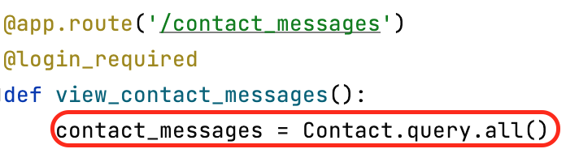

```python
contact_messages = Contact.query.all()
```

Using this `contact_messages`, send the messages to a template page called `contactMessages.html`.

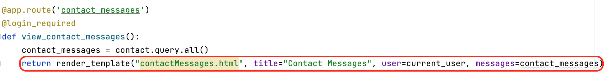

```python
return render_template("contactMessages.html", title="Contact Messages", user=current_user, messages=contact_messages)
```

 

## Contact Messages Template

Duplicate `index.html` and name the new file `contactMessages.html`. 


To display the contact messages from the database, output the user's name, email address, message and the date it was submitted. This can be done using the bootstrap grid system as previously used.

Remove the contents of the `rowTwoColTwoContent` block and add the new `div`.


```python
<div class="container-fluid">
		
</div>
```

To create a structure that will create as many rows as needed to display the whole table, the temples can dynamically create rows using a loop.

This **for** loop will iterate over the entries in `messages` (which is the `contact` table). Each time the loop iterates, it’s accessing a different record in the table.

<aside>
💡 The first time, it will be accessing the first entry in the table, the second time it will access the second entry etc.

</aside>


```python
<div class="container-fluid">
	

	
</div>
```

Each entry will be a row, so a new `div` tagged with `row` is needed inside the for loop.


```html
<div class="row">

</div>
```

Output each of the fields in the record (except for the ID) in different columns.


```html
<div class="col-3"> {{ message.name }}</div>
<div class="col-3"> {{ message.email }}</div>
<div class="col-3"> {{ message.message }}</div>
<div class="col-3"> {{ message.dateSubmitted }}</div>
```

## Test the route

Run the site and login. Modify the URL by adding `/contact_messages` to the end.

You should see a page similar to this (with different messages).


## Extension

The Date Submitted output isn’t very user-friendly. How could this be improved?

- Answer
	
	Update `contactMessages.html` to change how the date is outputed by placing `.strftime('%H:%M - %d/%m/%Y')` after the `datetime` output.
	
	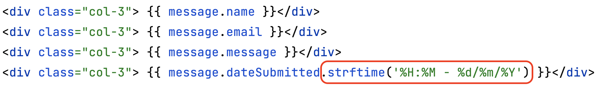
	

How could the administrator control which messages they’ve seen or responded to? What would need to be added to the database and webpage? 

- User Profile


This section demonstrates how to create a profile page where the user can see details about their account. This page will later be updated to allow users to upload photos, see what photos they’ve uploaded and delete photos.

# Version 1 - Read Only

## User Profile Page

Create a new HTML file called `userProfile.html`. Replace the contents with the default code for the site.

```html


{# Place the content for the cellContent1 in this block #}

	Sidebar


{# Place the content for the cellContent2 in this block #}

	Main Content



{# Place the content for the cellContent3 in this block #}

	Footer

```

How the profile information is displayed is flexible, however all the fields in the user table can be displayed. As the site already has bootstrap included, a bootstrap grid system can be employed in `cellContent2` (or whichever ‘cell’ is appropriate for your site).


```html
<div class="container text-left">

</div>
```

The contents of the user table can be displayed as a simple table, with rows for each field (email address, name etc) and two columns - the label and the data.

For instance, a row in the grid to display “User Name” and then the users email address would be entered as shown.

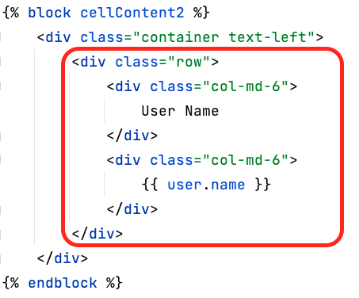

```html
<div class="row">
	<div class="col-md-6">
		User Name
	</div>
	<div class="col-md-6">
		{{ user.name }}
	</div>
</div>
```

Create a row block for each of the fields in the user table. The end result will look similar to this.

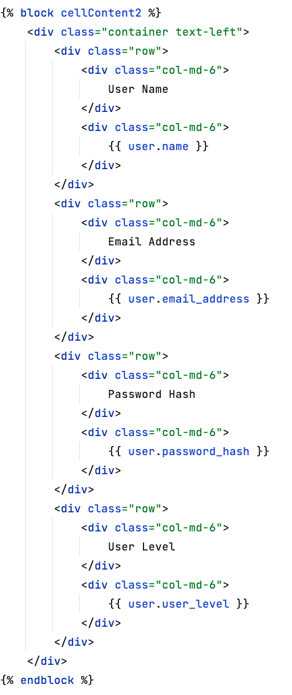

```html

	<div class="container text-left">
		<div class="row">
			<div class="col-md-6">
				User Name
			</div>
			<div class="col-md-6">
				{{ user.name }}
			</div>
		</div>
		<div class="row">
			<div class="col-md-6">
				Email Address
			</div>
			<div class="col-md-6">
				{{ user.email_address }}
			</div>
		</div>
		<div class="row">
			<div class="col-md-6">
				Password Hash
			</div>
			<div class="col-md-6">
				{{ user.password_hash }}
			</div>
		</div>
		<div class="row">
			<div class="col-md-6">
				User Level
			</div>
			<div class="col-md-6">
				{{ user.user_level }}
			</div>
		</div>
	</div>

```

## Route

Open `app.py` and create a new route for the user profile.

The route is set to GET and POST for future use, where the page could be changed to allow users to edit their details instead of just viewing.

The route is also set to require the user to be logged in, otherwise there could be a security breach, or crashing the page.

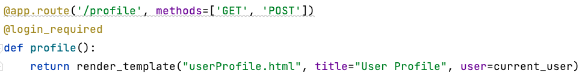

```python
@app.route('/profile', methods=['GET', 'POST'])
@login_required
def profile():
	return render_template("userProfile.html", title="User Profile", user=current_user)
```

## Navbar updates

Open `templates/template.html` and add a new navbar entry in the section with Logout and Reset Password. This is the section of the code which only displays when the user is logged in.

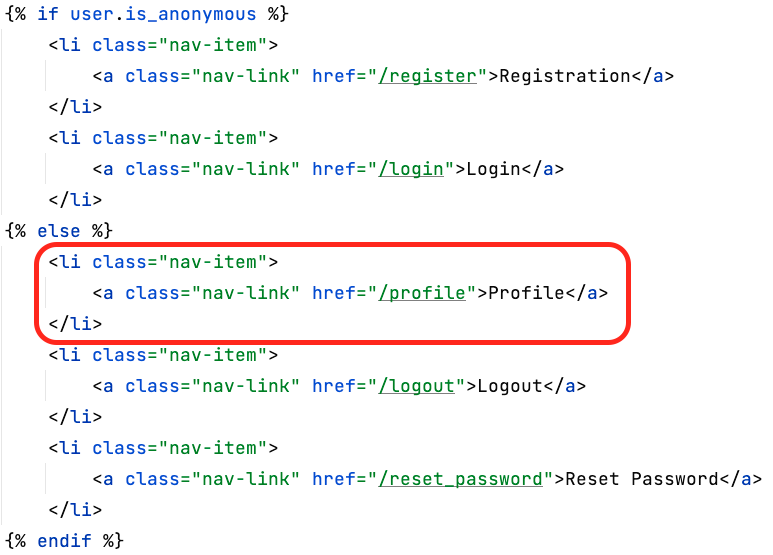

```html
<li class="nav-item">
	<a class="nav-link" href="/profile">Profile</a>
</li>
```

## Run and Test

Run the project, log in and access the User Profile link.

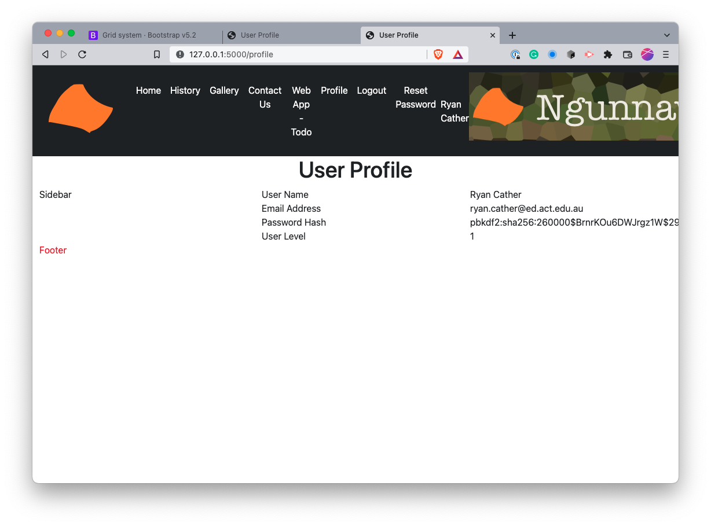

# Version 1.5 - User Interface Updates

Showing the user their `user_level` is not useful as standard users will not know what this number represents. It would be better to output information that would be more useful to the user. 

Instead of simply outputting `user.user_level` you can first check what value it is and output a string which represents that level. For instance, level 1 then the user is an Administrator. 

In `userProfile.html` replace `user.user_level` with an if statement and appropriate output.

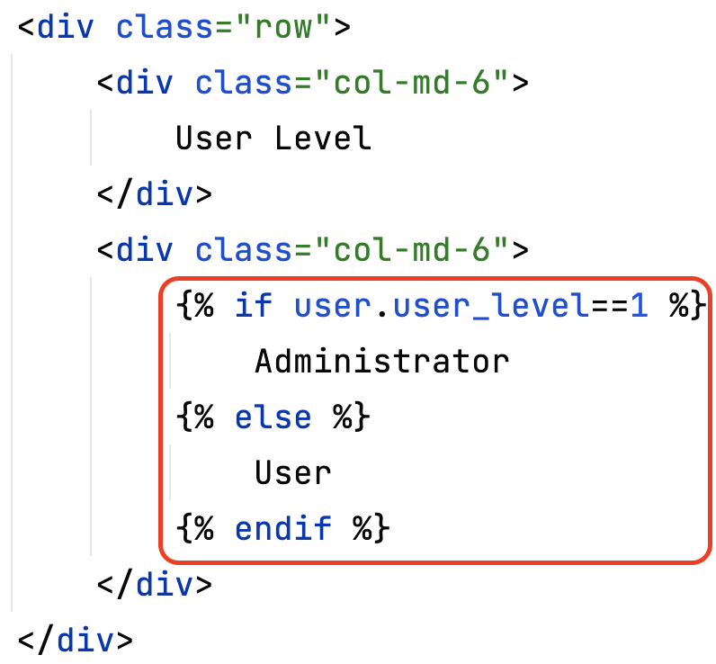

```python

	Administrator

	User

```

When the profile page is accessed now, it should show the more user friendly output.

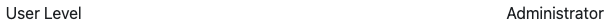

Additionally, showing the password hash is not helpful to the user at all. It would be more useful to change that entry to be a link to the reset Password page.

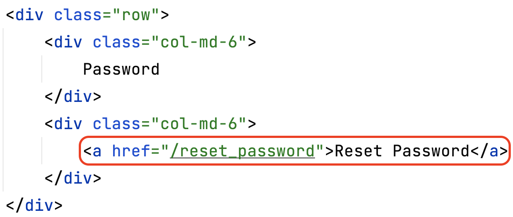

```html
<a href="/reset_password">Reset Password</a>
```

When the site is run, you should see this

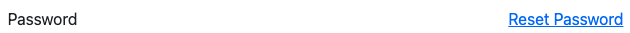

# Version 2 - Editable Data

To enable the user to edit their data, you can allow the user to directly edit their profile data through this page. To do so, you’ll need to create a form to collect the data and then write the data back to the database. It’s essentially the same process as user registration, except the data will be updated instead of a new user being created.

You will need to decide what data the users can edit. For instance, you may want the users to be able to edit their name, but not their email address or password. This will depend on the requirements of the system.

## Form

Open `forms.py` and create a new `UserProfileForm` class.

Include the fields that you want the user to be able to edit.

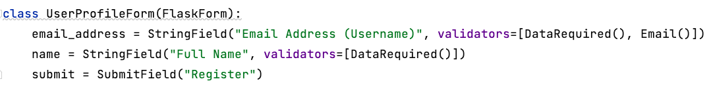

```python
class UserProfileForm(FlaskForm):
	email_address = StringField("Email Address (Username)", validators=[DataRequired(), Email()])
	name = StringField("Full Name", validators=[DataRequired()])
	submit = SubmitField("Update Profile")
```

## Update Model

In order to be able to edit the details in the database, you will need to update the User Model to allow for those changes.

Add a update_details() function to the User model to update only the fields that you wish to allow the users to update.

<aside>
‼️ This function may need different variables depending on which fields are allowed to be changed.

</aside>

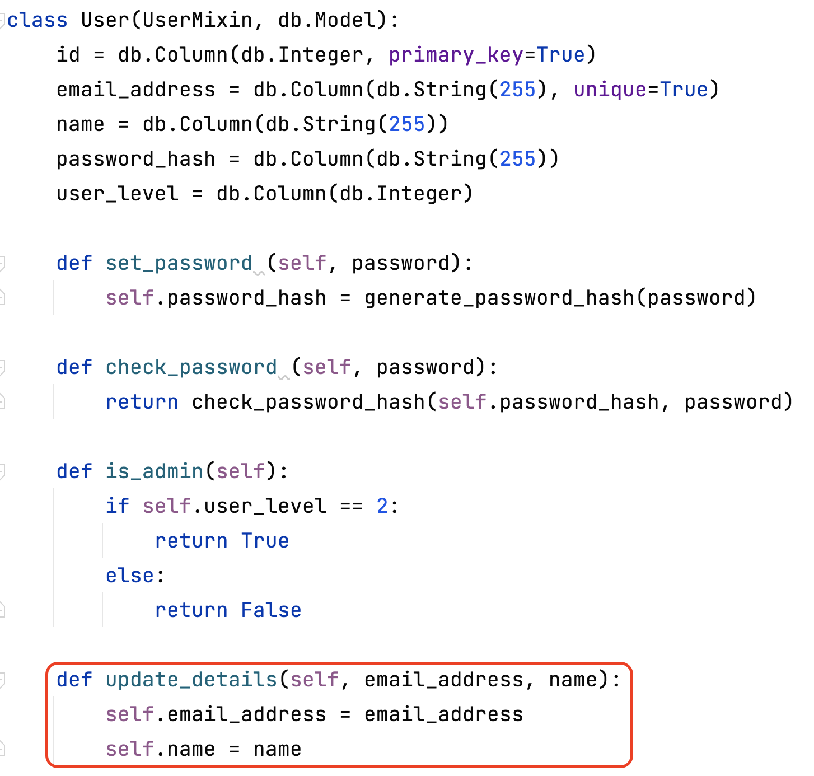

```python
def update_details(self, email_address, name):
	self.email_address = email_address
	self.name = name
```

## Update userProfile.html

Currently `userProfile.html` only displays the information, rather than the form, so this page will need to be updated.

For instance, the Users name is displayed using the following code.

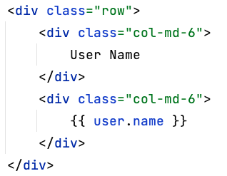

Whereas the form code, taken from registration.html looks like this.

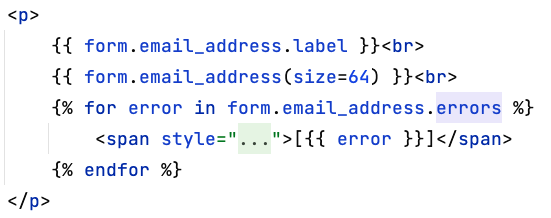

Therefore in `userProfile.html` each field that is determined to be updatable, the simple **display** will need to be replaced  with the **form** code.

For instance:

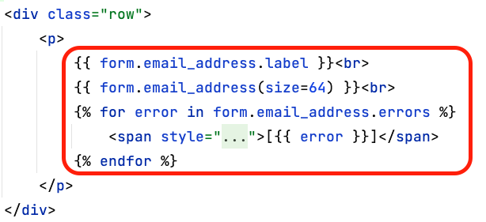

# Update route

Open `app.py` and import `UserProfileForm` from forms.

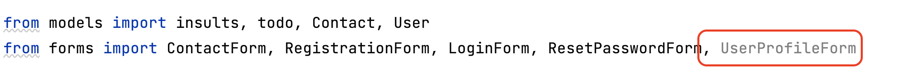

Find the `profile()` route. Create the `form` variable, loading the `UserProfileForm`, and then send the form to the template.

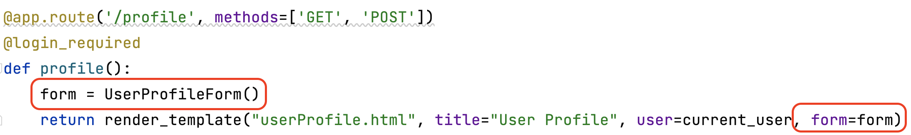

When the site is run now, the form should appear.

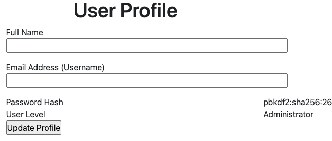

## Update Route

Open `app.py` and add the following code to the route to update the database record.

<aside>
‼️ You’ll need to change the user.update_details() command to match the variables needed by the model.

</aside>


```python
if form.validate_on_submit():
	user = User.query.filter_by(email_address=current_user.email_address).first()
	user.update_details(email_address=form.email_address.data, name=form.name.data)
	db.session.commit()
	flash("Your details have been changed")
	return redirect(url_for("homepage"))
```

# Version 2.5 - User Interface Updates

One of the issues with the current system is that the user can’t see their current details in the form.

To do so, the code first needs to load the current data from the database, and then pre-populate the data into the form. The first step is to move the line of code which loads the current user to outside the `form.validate_on_submit()` block.

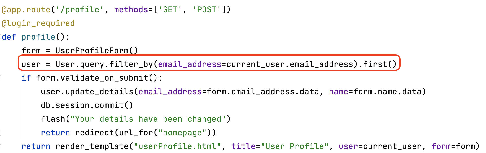

After loading the data, the code should then check if the page being loaded (not submitted). If it is, then fill in the data into the form.

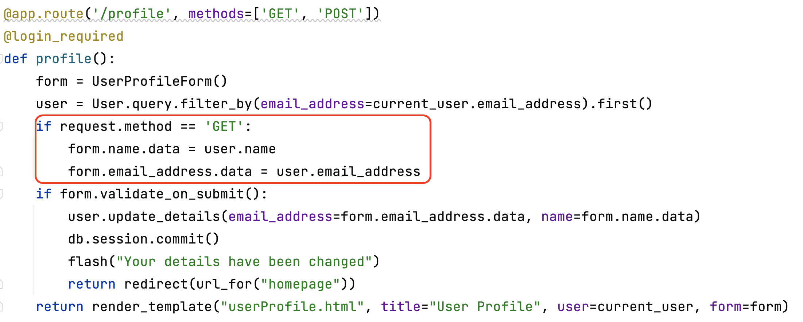

```python
if request.method == 'GET':
	form.name.data = user.name
	form.email_address.data = user.email_address
```

- Error Handling


# Errors!

By this stage of the development process, this screen may be familiar to you.

There are a number of issues with this page.

1. There’s an error in the code that needs to be fixed.
2. The user doesn’t get any information to help them solve the problem.
3. The user loses confidence in the website as the site ‘is broken’.

It is possible to build custom ‘error’ pages to keep the user ‘within’ the website and allow them to continue using the site.

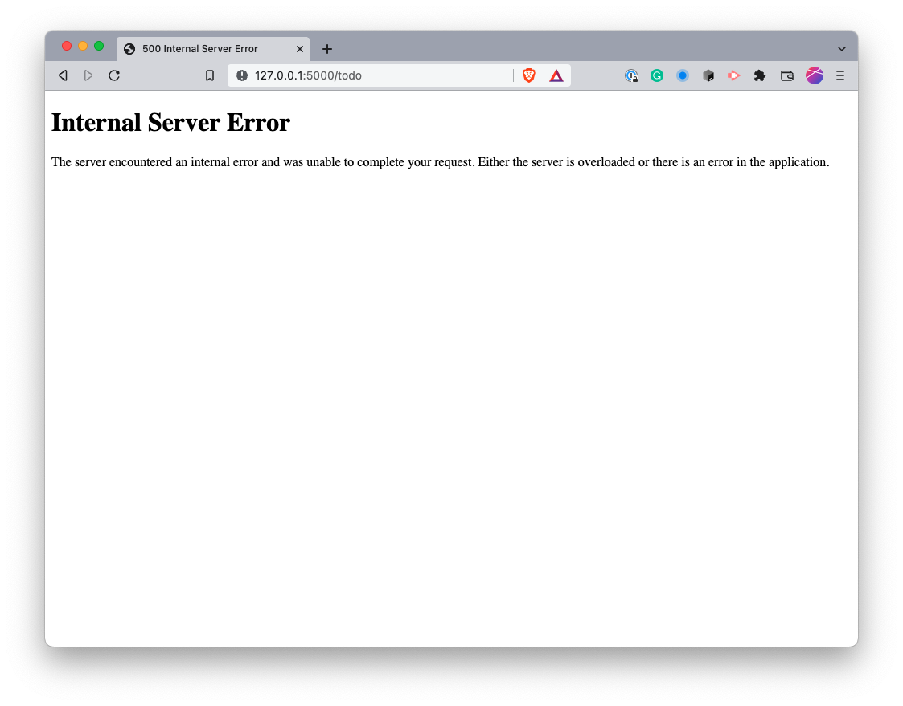

# HTML Pages

Create a html page in the templates folder called `500.html`. Include the default code for the website:

```html


{# Place the content for the cellContent1 in this block #}

	Sidebar


{# Place the content for the cellContent2 in this block #}




{# Place the content for the cellContent3 in this block #}

	Footer

```

In `cellContent2`, add a message to the user to indicate that there is a problem, but in a more user friendly way than the example above.

<aside>
‼️ Consider what the user would want to see on this page.

</aside>


You can choose how you want the messages to display. Using Bootstraps built-in Alerts can be a quick and easy solution, such as:


```html
<div class="alert alert-danger" role="alert">
  File Not Found!
</div>
```

Repeat this process for a `404.html` error page for if the page doesn’t exist.

# Error Handlers

Open `app.py` and add the following routes.

<aside>
💡 These routes capture any `404` or `500` HTTP errors and instead of showing the standard error for the browser, it will show a custom built error, using based on the template. From a UX point of view, this ‘keeps’ the user within the site and can allow them to rectify the error by returning to other pages.

- 404 error - Not Found
- 500 error - Internal Server Error

You can find information on HTTP errors here: [https://developer.mozilla.org/en-US/docs/Web/HTTP/Status](https://developer.mozilla.org/en-US/docs/Web/HTTP/Status)

</aside>

```python
# Error Handlers
@app.errorhandler(404)
def page_not_found(e):
	return render_template("404.html", user=current_user), 404

@app.errorhandler(500)
def internal_server_error(e):
	return render_template("500.html", user=current_user), 500
```

# Test the site!

Run the project and attempt to access a page that doesn’t exist. Make sure the custom error page loads.

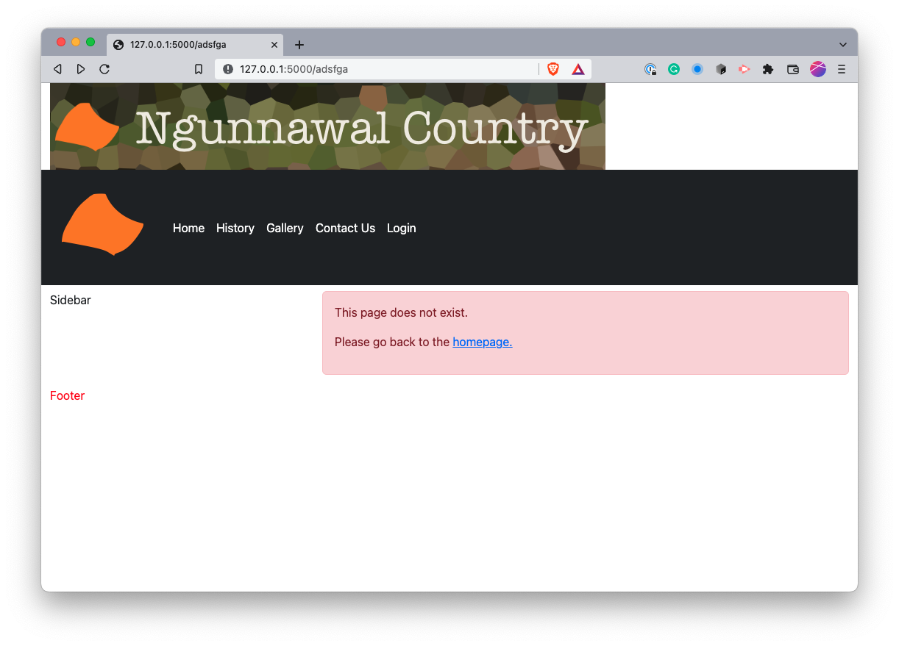

To force the page to load correctly, you may need to **turn off** the FLASK_DEBUG setting. To do so, click on Edit Configurations under the Flask (app.py) dropdown.


Uncheck the box, and click ok.


Then, in `index.html` comment out the last line of code to force an error.


Rerun the site and the 500 error page should appear.

# Example error pages


- Current User


Flask has a built-in variable called `current_user`. This variable stores the instance of the user that is currently logged in, for instance, their username, password_hash etc. But also has access to any custom functions written for the User model, such as `is_admin().`

This is incredibly useful for the Flask application as this user can be sent to the template to change behaviour. In this case, the nav bar is or will be changing the links based on whether the user is logged in or not. For this to occur, each template needs access to the `current_user` which in turn **requires each route to be updated to send the variable**.

Open `app.py` and **update EVERY route** **rendering a template** to include the additional argument `user=current_user**.**`

For instance, the homepage route needs to have the `render_template` line of code updated as shown.


- Photo Upload


The requirements for the site indicate that the users should be allowed to upload images to celebrate Ngunnawal Country. The site should enable this functionality with users self selecting images to upload once they’ve logged in, where they can see the images they’ve uploaded. There should also be a page where anyone (unregistered users, registered users and administrators) can see all the images uploaded across the site.

There are different approaches to this issue in terms of storing the images and data. Broadly, the development process can take one of two paths:

1. Store the images in the database
2. Store the images in the file system inside the project and then store the filename to the image in the database.

This tutorial will show option 2 for a number of reasons. The primary is that it reduces the size of the database. This may not be a show stopping issue for an application the size of this site, however in production, storing binary data, such as images, in a database can be problematic. 

> [https://medium.com/@vaibhav0109/should-i-use-db-to-store-file-410ee22268c7](https://medium.com/@vaibhav0109/should-i-use-db-to-store-file-410ee22268c7)
> 
> 
> ## **Why store in FileSystem ?**
> 
> - read/write to a DB is always slower than a file system.
> - your DB backups become huge, which makes restoration & replication slower.(Its a problem where daily size is in TB’s)
> - access to the files now requires going through your Application and Database layers.(It increases the application memory requirements)
> - allows usage of lightweight web-server/CDN/Amazon S3 for serving.
> - cost effective, file servers are much cheaper compared to database.
> - avoids database overhead with its CRUD operations.
> - easier in cases where files (video, audio etc) are to be shared with third party providers.
> 
> ## **Then why store files in DB ?**
> 
> - DB provides ACID compliance(Atomicity, Consistency, Isolation, Durability) for each row.
> - DB provides data integrity between the file and its metadata.
> - Database Security is available by default.
> - Backups automatically include files, no extra management of file system necessary.
> - Database indexes perform better than file system trees when more number of items are to be stored.
> - Images smaller than 64kb and the storage engine of your db supports inline Blobs (InnoDB puts only 767 bytes of a `TEXT` or `BLOB` inline, MyISAM puts inline), it improves performance further as no indirection is required ([Locality of reference](https://en.wikipedia.org/wiki/Locality_of_reference) is achieved, more about this can be read [here](https://www.geeksforgeeks.org/computer-organization-locality-of-reference-and-cache-operation/)).
> - File deletion/updation is always in sync with row operations, no extra maintenance needed.

# Users Photo Page

At the end of this process, the user photo page will look similar to this.

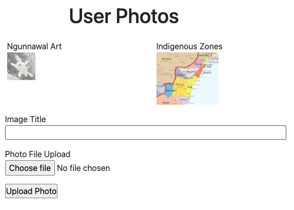

## Project Configuration

For users to be able to upload images, there needs to be a directory created to store them.

Under Static, right-click on images and create a directory.

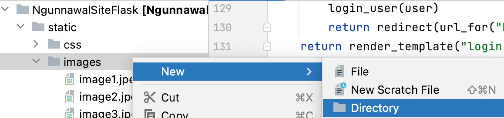

Name this directory `userPhotos`.

This will be the directory where the photos will be stored when they’re uploaded by the users.

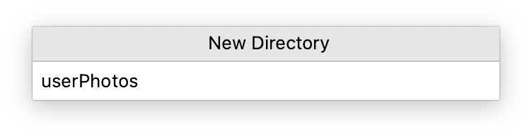

## Database Table

Users will be able to upload anywhere between **0** and **many** images. 

The `user` table does not have the flexibility to store the details for potentially thousands of images. This would require many fields (columns) which would impose a limit, and could also be a lot of wasted space taken up with empty fields.

A arguably better solution would be to create another table which focuses on the images and simply stores the user id of the user that image belongs to.

<aside>
‼️ There is no upper limit on the number of images users can upload from a technical standpoint. As a developer you could impose a limit, but that is beyond the scope of this tutorial.

</aside>

A new table will be created - `photos` - which will store the data, and link to the user id stored in the `user` table, as can be seen in the UML diagram shown here.

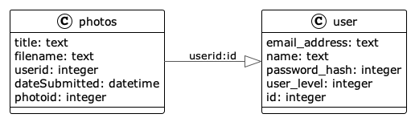

An example of the data that could be stored in the database is shown here.

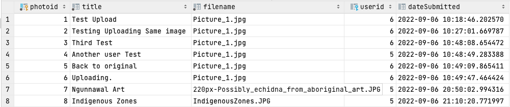

---

Right click on `main` in the database tab, and choose New → Table.


Create the table columns as shown.

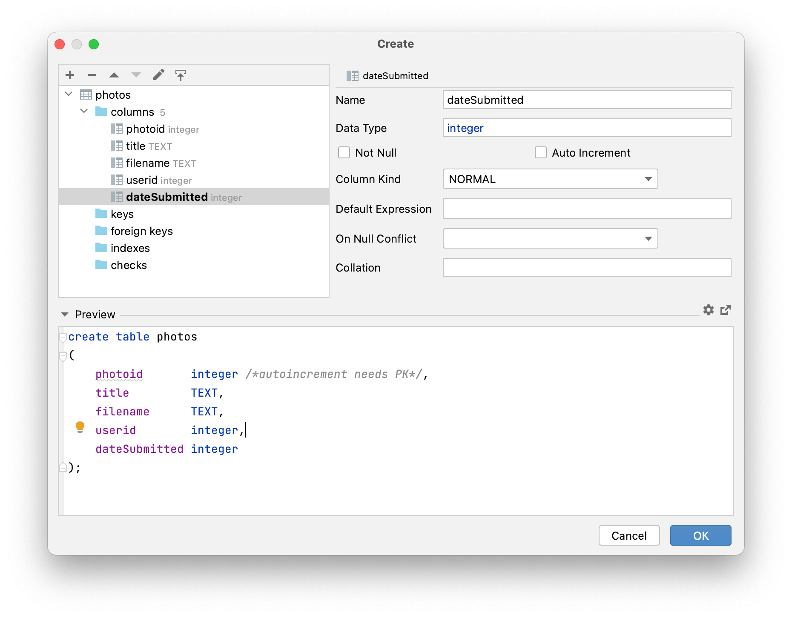

Add a new Primary Key, setting the name to be `photoid` and set the column name to be `photoid`.

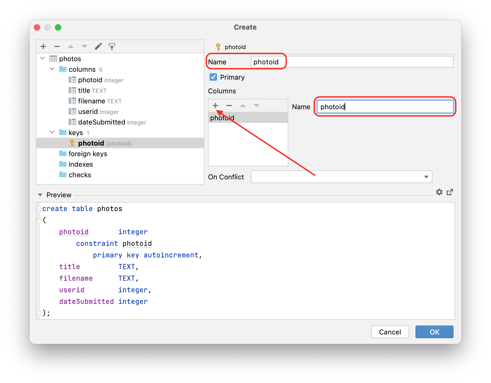

Click Ok. This will create the table in the database.

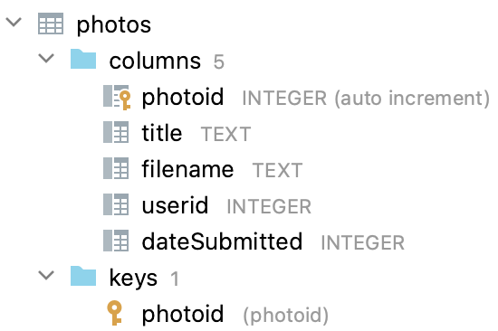

## Photo Upload Form

Open `forms.py` and update the import statements to allow the form to upload files.

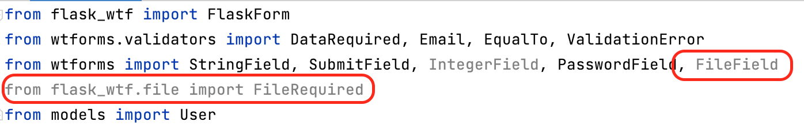

Create a new `class` called `PhotoUploadForm`, which contains the form fields for the user to select a file and set the title of the image.

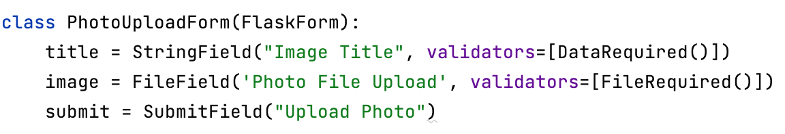

```python
class PhotoUploadForm(FlaskForm):
	title = StringField("Image Title", validators=[DataRequired()])
	image = FileField('Photo File Upload', validators=[FileRequired()])
	submit = SubmitField("Upload Photo")
```

## Photos Model

Open `models.py` and create a new model to match the database created.

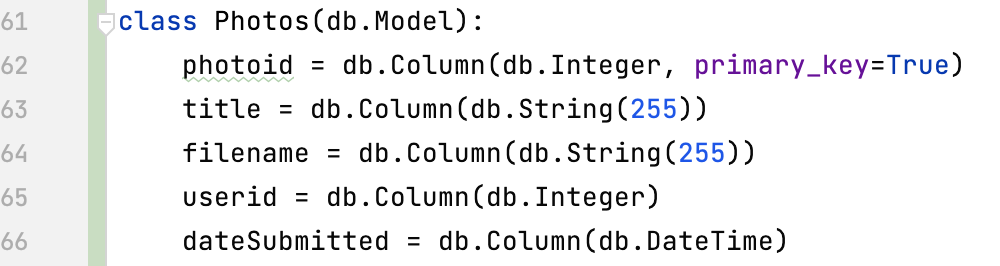

```python
class Photos(db.Model):
	photoid = db.Column(db.Integer, primary_key=True)
	title = db.Column(db.String(255))
	filename = db.Column(db.String(255))
	userid = db.Column(db.Integer)
	dateSubmitted = db.Column(db.DateTime)

```

To simply the process in the future, create a `__init__` method to assist in creating new Photo objects.

This function will make it easier to create new entries in the database when uploading images, in particular by automatically assigning the date time when the file is uploaded. This is done in the same way for the `contact` model.

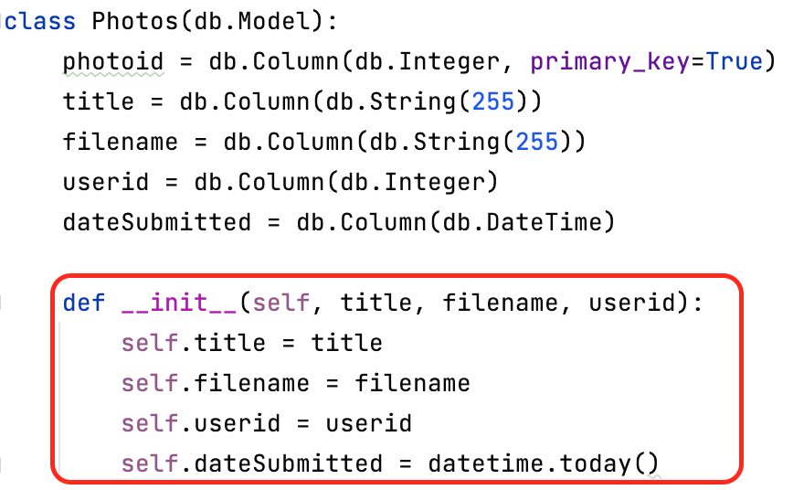

```python
def __init__(self, title, filename, userid):
		self.title = title
		self.filename = filename
		self.userid = userid
		self.dateSubmitted = datetime.today()
```

## Photos Page v1

Edit `template.html` by adding a link to the new page to be created in the navbar. Place it under the link to the Profile page.

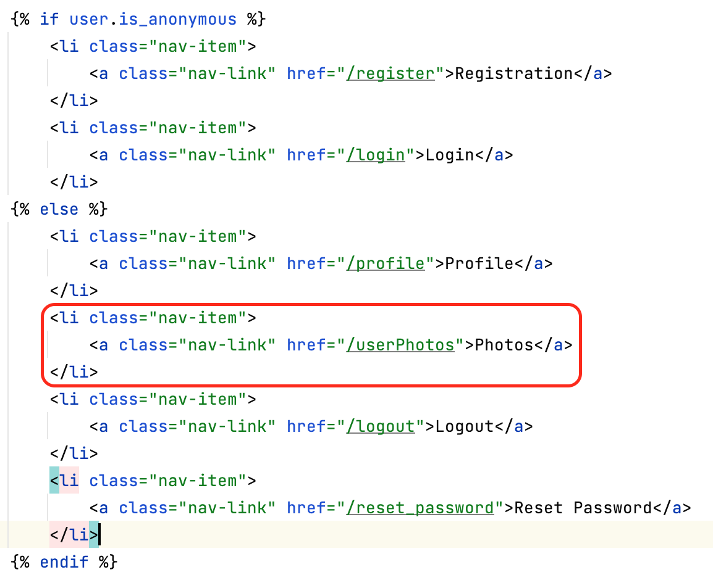

```html
<li class="nav-item">
	<a class="nav-link" href="/userPhotos">Photos</a>
</li>
```

Create a new HTML file in the templates folder called `userPhotos.html`. Insert the standard initial code.

This page requires two parts to it:

1. Displaying the form to upload a new image, and
2. Displaying the images uploaded by the user.

This stage of the tutorial focuses on part 1.

```python


{# Place the content for the cellContent1 in this block #}

	Sidebar


{# Place the content for the cellContent2 in this block #}

	


{# Place the content for the cellContent3 in this block #}

	Footer

```

Displaying the form is very similar to other forms already created in this project. The code utilises the class created in `forms.py` to configure the different fields.

This code create the `title` field for the user to enter a title for the image.

It then creates a button to allow the user to select an image to upload. This is referred to as `image` in the code, similar to the title, but it is rendered differently on the webpage.

Finally, it generates the submit button.

```html
<div class="container text-left">
	<form method="post" enctype="multipart/form-data" action="">
		{{ form.hidden_tag() }}
		<div class="row">
			<p>
				{{ form.title.label }}<br>
				{{ form.title(size=64) }}<br>
				
					<span style="color: red;">[{{ error }}]</span>
				
			</p>
		</div>
		<div class="row">
			<p>
				{{ form.image.label }}<br>
				{{ form.image(size=64) }}<br>
				
					<span style="color: red;">[{{ error }}]</span>
				
			</p>
		</div>

		<p>{{ form.submit() }}</p>
	</form>
</div>
```

Save the file.

## Route v1

Now it’s time to create the code to upload photos.

Open `app.py` and update the import statements to include new libraries that will be needed, and the newly created `photo` model.

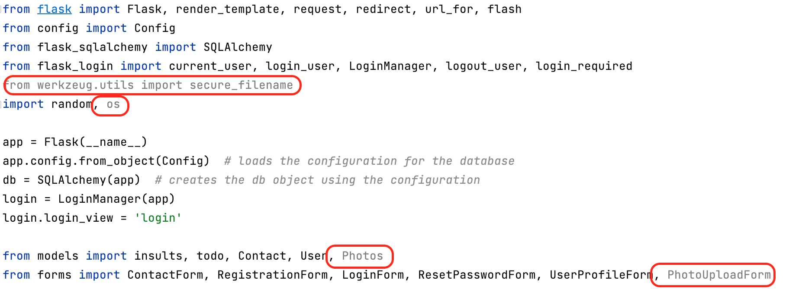

Configure the project to set the uploads folder for the image, and set the allowed extensions. 

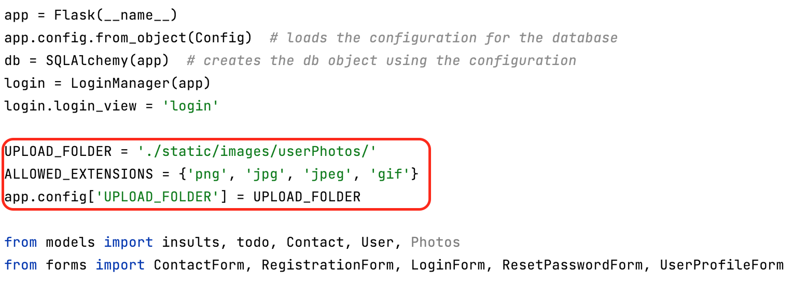

```python
UPLOAD_FOLDER = './static/images/userPhotos/'
ALLOWED_EXTENSIONS = {'png', 'jpg', 'jpeg', 'gif'}
app.config['UPLOAD_FOLDER'] = UPLOAD_FOLDER
```

Create a function, separate to the standard routes created so far, which will take in a filename and confirm that it has an allowed file extension, in this case it’s one of the following - png, jpg, jpeg, or gif.

This is to prevent users from uploading any file they wish to. 

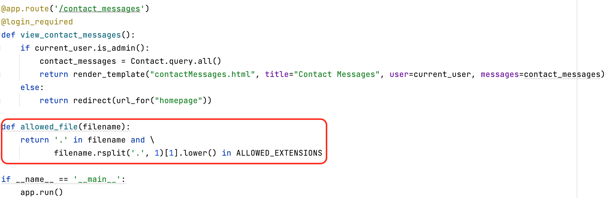

```python
def allowed_file(filename):
	return '.' in filename and \
		   filename.rsplit('.', 1)[1].lower() in ALLOWED_EXTENSIONS
```

Create a new route for the page. As this route will both send data to the user and allow uploading data, this needs to be set to be both GET and POST.

The page will need the form defined in `forms.py` and the current user details.

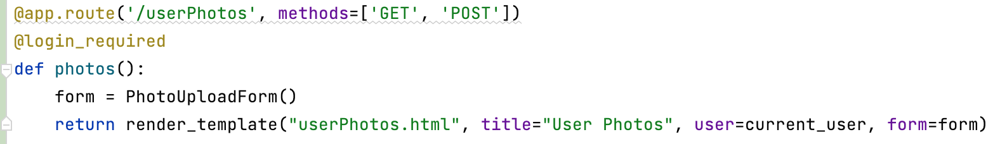

```python
@app.route('/userPhotos', methods=['GET', 'POST'])
@login_required
def photos():
	form = PhotoUploadForm()
	return render_template("userPhotos.html", title="User Photos", user=current_user, form=form)
```

If you run the project now, and click on the Photos link in the navbar, you should see the form being rendered.

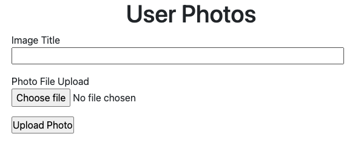

The next step is to process the uploading of the file. There are a few steps to go through. First, the file and filename of the image needs to be collected. If the filename is an approved one, then the file will be uploaded and saved in the correct folder, and the data be written to the database.

Starting with collecting the image and filename, update the route to check if the user has pressed the submit button, and collect the appropriate data.

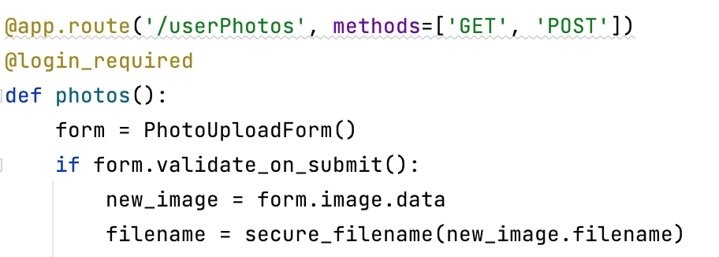

```python
if form.validate_on_submit():
  new_image = form.image.data
  filename = secure_filename(new_image.filename)
```

After collecting the image data, the code will then need to confirm it has a correct file extension, using the `allowed_file()` function, then upload the file.


```python
if new_image and allowed_file(filename):
	new_image.save(os.path.join(UPLOAD_FOLDER, filename))
```

Once the file has been uploaded, then create the new photo model, write it to the database, inform the user that it was successful, and reload the page.

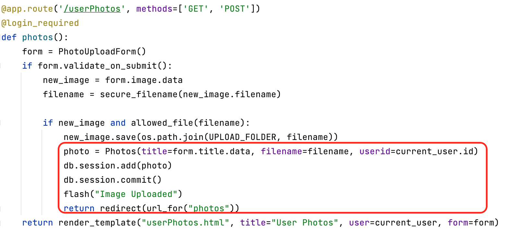

```python
photo = Photos(title=form.title.data, filename=filename, userid=current_user.id)
db.session.add(photo)
db.session.commit()
flash("Image Uploaded")
return redirect(url_for("photos"))
```

The final part of the route is to inform the user if the file upload was not allowed.

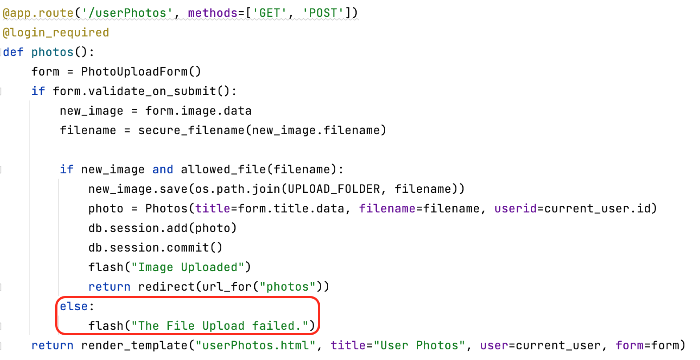

```python
else:
	flash("The File Upload failed.")
```

## Test!

Run the site and access the page. Choose an image and set a title. Make sure the file gets uploaded correctly.

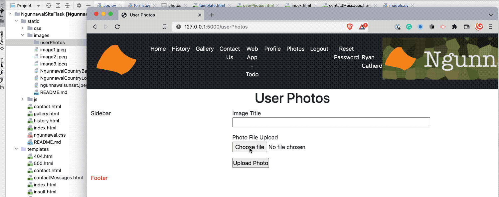

## Version 2 - displaying the users images

The page allows users to upload images, but they can’t see images they’ve already uploaded. This requires minor changes to the route and some changes to the html file to layout and display the images.

First, update the route by first collecting a list of all the images associated with the user that is currently logged in. Luckily, flask makes this easier than it sounds by providing some helper functions.

The code can query the Photos table and collect all records, filtered by the userid.

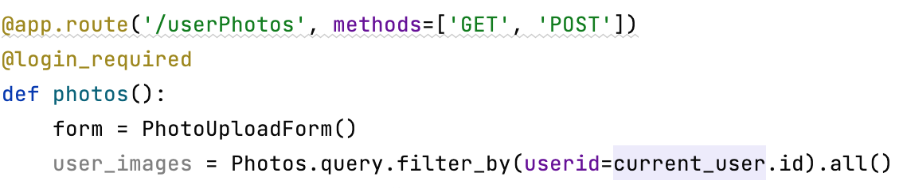

```python
user_images = Photos.query.filter_by(userid=current_user.id).all()
```

Then pass this list of records - `user_images` - to the HTML page to display by updating the `return render_template` command at the end of the function.

That’s the only changes required in the route.

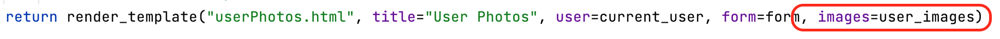

Displaying the users images could be problematic, depending on how exactly you wished them to be displayed. In a simple fashion, they could be displayed using a standard CSS Grid layout with a number of columns, with rows being autogenerated.

Open `userPhotos.html` and insert the following code in whichever cellContent is appropriate. In this case, it’s been placed at the top of `cellContent2`. 

This code uses the CSS class `grid-container` and then uses a for loop to create as many `<div>`s as required  - one per image. 

<aside>
‼️ The images are resized to 20% width. This is done for simplicity sake, however there are much more elegant ways to achieve the same goals through CSS.

</aside>

Save the File

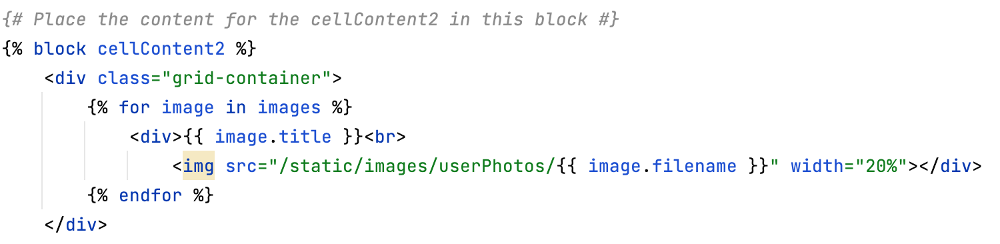

```python
<div class="grid-container">
	  
		  <div>{{ image.title }}<br>
			  </div>
	  
</div>
```

Open `static/ngunnawal.css` and look for the `.grid-container` selector. If there is none, create it.

If it’s already there, you can modify it to be similar to the one shown, or use the existing version.

```css
.grid-container {
	display: grid;
	grid-template-columns: auto auto auto;
	grid-gap: 1em;
	padding: 1em;
}
```

You may also find an existing selector - `.grid-container > div`. This can be deleted if unwanted.

After editing the CSS to match your design choices, you can reload the site and view the Photos page.

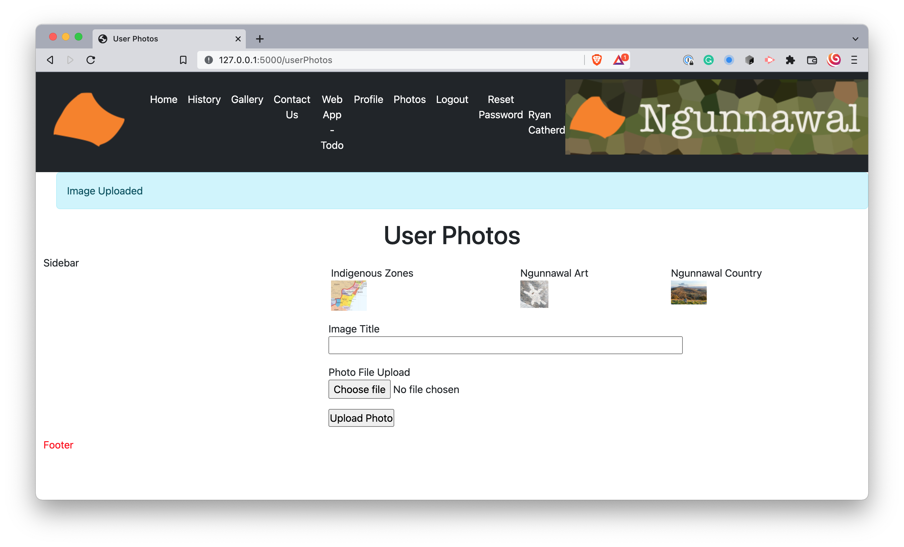

<aside>
‼️ These images can be displayed however you wish. Investigate and test different options for displaying images in a gallery. Experiment!

</aside>

## Version 3 - Extension

Currently the photos are displayed, however only small versions of them. To improve the User Experience, you could have these as thumbnails, and the user could click on them to load the larger image. This could require creating a new HTML page and route to display the single image, loading the image and relevant data.

# Security issue

Currently, if users upload photos, it stores the image in the `static/images/userPhotos` directory. There is an issue if users attempt to upload an image with the same name as a previous one. The system current simply ignores it and will override the existing image with the new one. Both users will then see the new image.

## How to solve the issue

To solve this issue, the file will need to be saved in the userPhotos directory with a unique filename. Once the file has been uploaded, the users don’t see the filename, only the image and the title, so it shouldn’t cause an issue.

In short, the filename variable when uploading needs to be overridden. Before this can be done, the extension needs to be extracted from the existing filename and added onto the end of the randomly generated one.

After the file extension is approved, extract the file extension and store is separately.

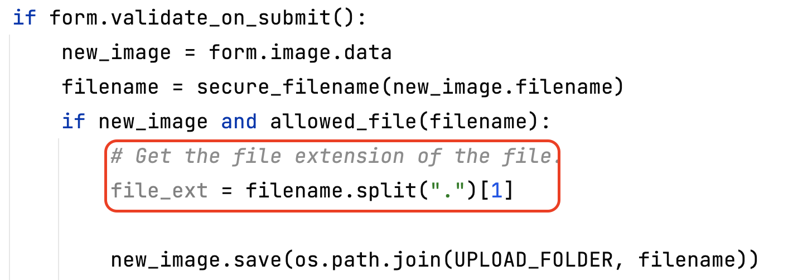

```python
# Get the file extension of the file.
file_ext = filename.split(".")[1]
```

Generate a random number using the `uuid` library.

<aside>
‼️ Information on UUIDs and why they can be considered completely unique : [https://en.wikipedia.org/wiki/Universally_unique_identifier](https://en.wikipedia.org/wiki/Universally_unique_identifier)

</aside>

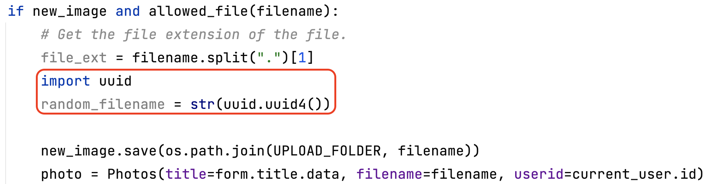

```python
import uuid
random_filename = str(uuid.uuid4())
```

Finally, override the filename variable, with the randomly generated uuid and the extension.

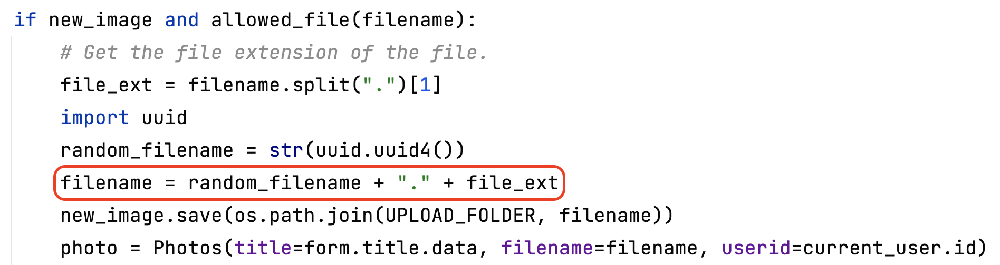

```python
filename = random_filename + "." + file_ext
```

Upload an image and you’ll notice that the image is uploaded with a random filename but still with the same extension.

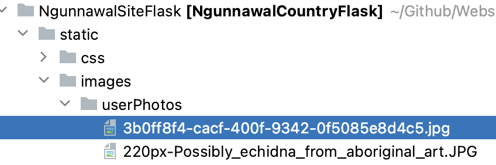

- Photo Gallery


## Gallery.html

At this stage, the users can upload and see photos that they have uploaded. These instructions show how to develop a photo gallery page of all images uploaded, but all users. As the page will simply be loading existing images, there will be no changes to the database or `forms.py` or `models.py`.

The page will be *similar* to the userPhotos.html file as this page already displays some of the images (filtered by the user) where as this new page will be displaying all users.

With that in mind, duplicate userPhotos.html and name the file `gallery.html`.

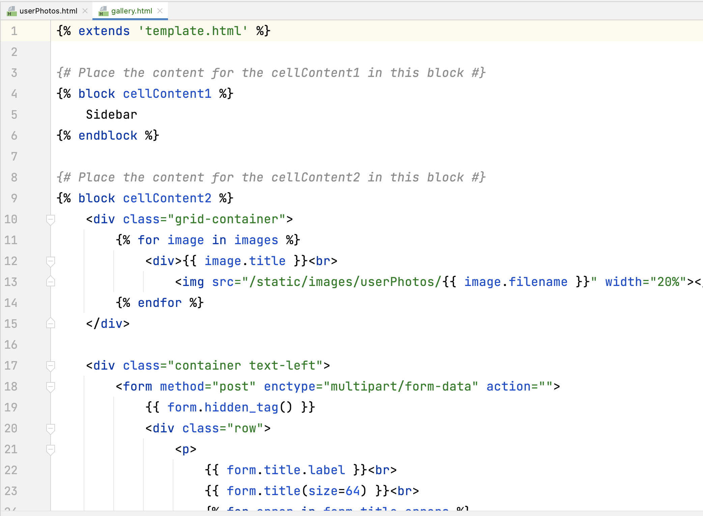

Leave the `grid-container` div block and remove the div block with the form. 


After this process, your `gallery.html` should appear similar to this.


Save the file.

## Route

Create a new route for the gallery page. This route will be very simple compared to other routes, as all it will need to do is read the entire table of images and send that to the gallery page to display.

```python
@app.route('/gallery.html')
def photo_gallery():
	all_images = Photos.query.all()
	return render_template("gallery.html", title="Photo Gallery", user=current_user, images=all_images)
```

### Version 3 - Extension

- Flash Messaging


Messaging is important to any User Interface - users need feedback to confirm if operations have been successful or not. 

**Flash** is a addon module for Flask which allows for messages to be sent back to the user. The message is only valid for the *next* page displayed that contains a flash block.

Luckily the project being built allows for a easy implementation of a flash message system. The template.html can be updated to display any flash messages, and existing routes can add in confirmation messages with a single line of code.

# Import flash

Open `app.py` and add `flash` to the `from flask import….` line of code.


# Update Routes

Update routes where feedback is important to the user. For instance, the password reset route. It would be useful for the user to get confirmation that the password has been changed.

To add a flash message, the command is: `flash("Message")`. 

<aside>
‼️ As a rule of thumb, add the flash statements near the end of the process but before any return statement, as shown here.

</aside>


Add appropriate messages to other routes, such as `loggout`, `contact`, and `User Registration`. 

# Update Template

Open `templates/base.html` and decide where you want the messages to appear. They could appear just under the navbar, or in another specific place on the website. It is up to you where they will appear.

Wherever the messages are to appear in your code, add the following code block.

```

	
		<ul class="flashes">
			
				<li><div class="focus">{{ message }}</div></li>
			
		</ul>
	

```

<aside>
‼️ Make sure you don’t put your message output into a block that will be overridden.

</aside>

This example shows that messages will appears just below the navbar.


# Flash CSS

Currently, the messages appear very simply, as a dot list. Ideally the messages need to draw the users attention, so should stand out. 

Open `static/site.css` and add the following CSS

```css
.flashes {
	color: red;
	list-style: none
}
```

Test out a flash message and you should see it appear similar to the one shown.


You can expand on this CSS to make the messages stand out even more by updating the CSS, as shown here.

Modify the CSS to make the messages appear the way you wish to. 

<aside>
💡 Find CSS code on the web, or use generative AI, to assist you.

</aside>

```css
.flashes {
	padding: 12px;
	border-radius: 3px;
	font-size: 1.2rem;
	margin-bottom: 16px;
	border: 2px solid orange;
	background-color: yellow;
	color: black;
}
```


# Demonstration

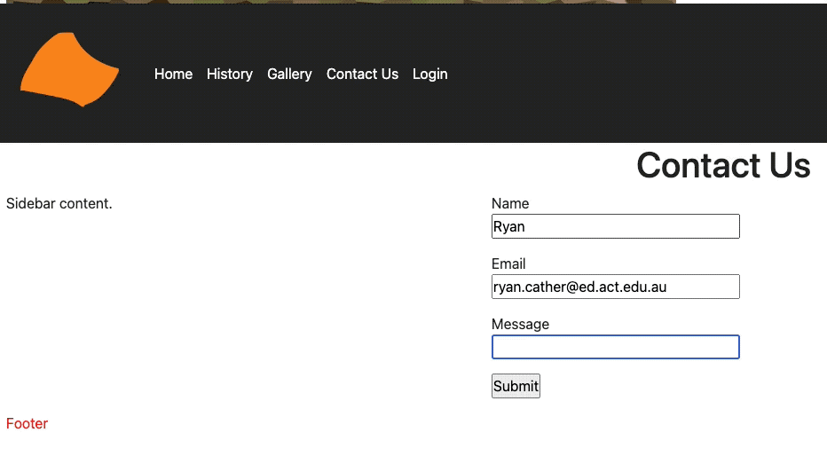

- User Registration


# Update the Template

Before delving into the user registration code, an easy place to start is to update the template.html file to link to the registration route that will be created later in the process.

Open `templates/template.html` . Update the navbar code to include a new link which directs the user to `/register`.

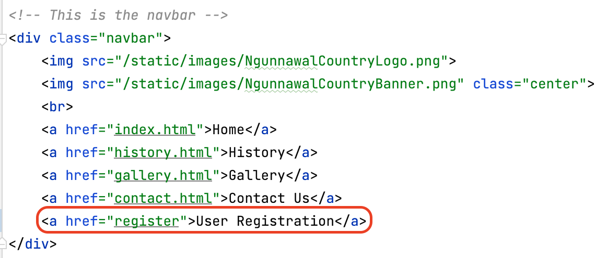

```python
<a href="register">User Registration</a>
```

When the site is next run, the User Registration link should appear on all pages based on this template.

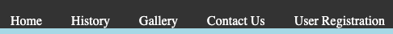

# Create User Table

The first step in the process of developing the functionality for users to register is to decide what data needs to be stored in the database.

For the purposes of this module, the data that will be stored will be:

| Data | Data Type | Description |
| --- | --- | --- |
| ID | Integer | Auto-incrementing, Primary Key. Unique identifier for each user. |
| Email Address | Text | Unique. Users email address that will double as their “username” |
| Name | Text | Users Full Name |
| Password_hash | Text | The password stored securely as a “hash”. This is explained later. |
| UserLevel | Integer | 1=Normal User
2=Administrator |

## Create the Table

Right-click on the Database in Pycharm and choose New Table. Call the table `user`.

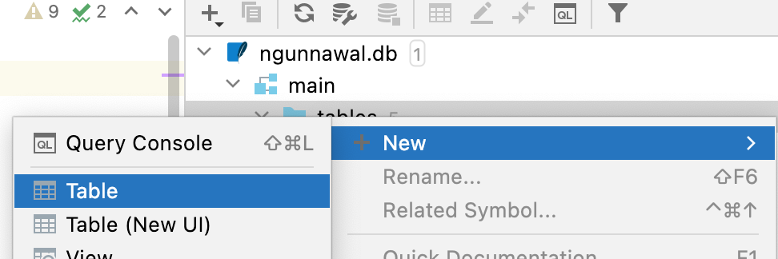

Create the fields as needed.

<aside>
‼️ Which ever field is going to be the users “username”, set that to be Unique in the database creation process.

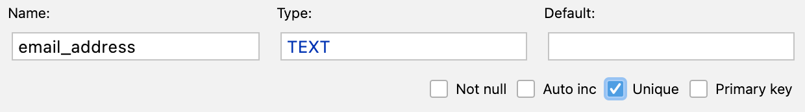

</aside>

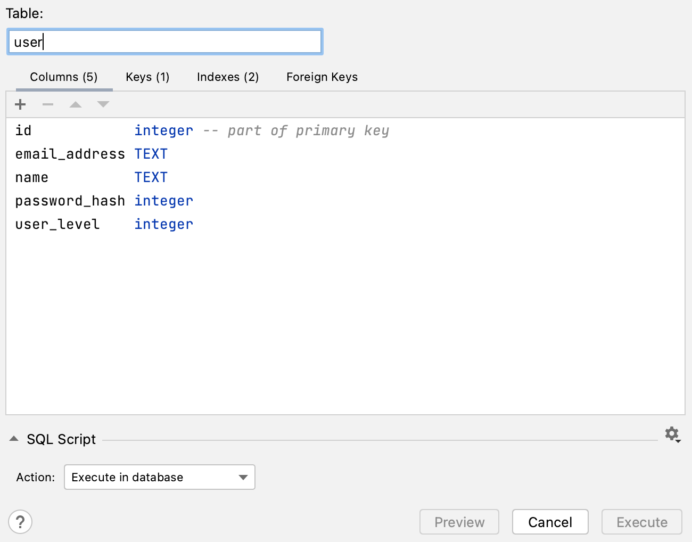

This is only an example. Create the fields as you need for the specific implementation requirements.

The table should be created similar to this example.

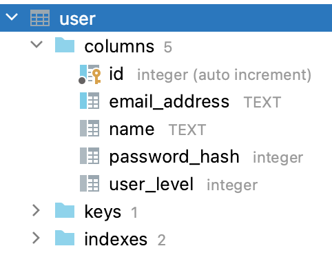

# User Model

Open `models.py` to create the User Class. Unlike other models, this model needs to be implemented slightly differently because Users have much more default functionality that needs to be supported - such as login and log off. Flask has some helper functions that assists with these types of processes.

At the top of `models.py` add the following import statements.

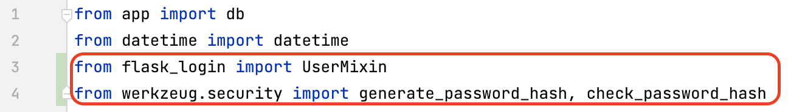

```python
from flask_login import UserMixin
from werkzeug.security import generate_password_hash, check_password_hash
```

<aside>
‼️

Remember the class has to match the specific implementation of the database, not necessarily a direct copy from here.

</aside>

The code for the user class is shown here.

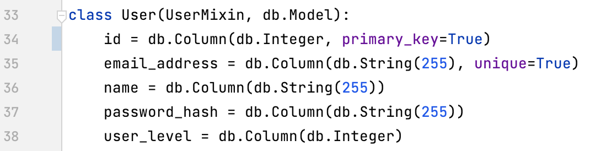

```python
class User(UserMixin, db.Model):
	id = db.Column(db.Integer, primary_key=True)
	email_address = db.Column(db.String(255), unique=True)
	name = db.Column(db.String(255))
	password_hash = db.Column(db.String(255))
	user_level = db.Column(db.Integer)
```

## Password Storage

User passwords is a tricky topic. So far, all the data stored in the database is being stored ‘in the clear’, meaning that if a human was to read the table data, they can read the unencrypted data.

Passwords should be encrypted before being stored in the database and if an unauthorised person gained access to the database, they would not be able to read the passwords and therefore still not be able to log in.

This process is called **password hashing**.

To read more about Password Hashing, see the following page.

> Password Hashing
> 

## Password Functions

The website application will need to perform two main password functions:

1. When a user registers, the application will need to encrypt the password using the hash function and store the hash in the database.
2. When a user logs into the site, the application will need to retrieve the password hash from the database, and compare it to the hash of what the user typed into the website in the password box.

In brief, the application will need to perform a hash many times. To assist with that, some specialised functions should be implemented.

The first sets the user password. This function takes the unencrypted password and sets the password_hash variable as the encrypted (hashed) version of the password.

The second compares the stored hash with an unencrypted password. This will be used when the user logs in.

Add the following functions to your User class.

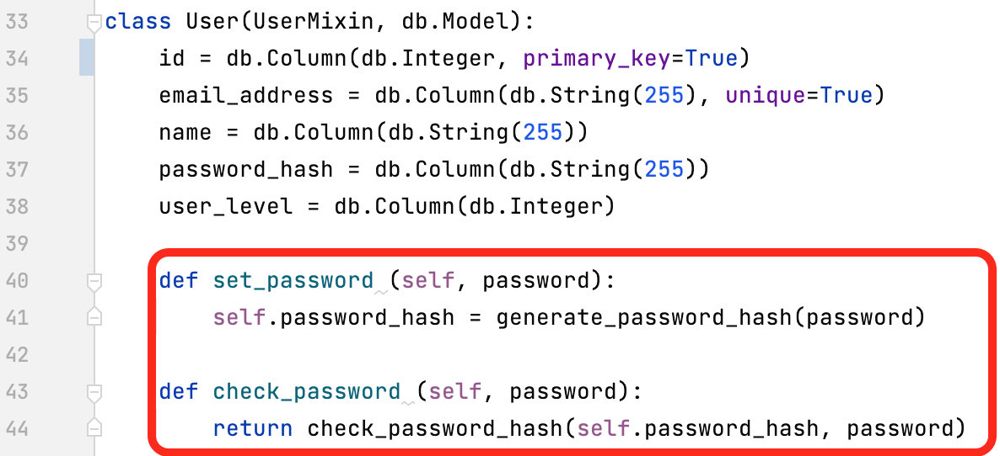

```python
def set_password (self, password):
		self.password_hash = generate_password_hash(password)

def check_password (self, password):
	return check_password_hash(self.password_hash, password)
```

## Is the user an administrator?

One of the fields shown in the example is `user_level`. This indicates whether the user is a normal user (1) or an administrator (2). 

<aside>
‼️ This could have been achieved with a boolean (True/False), however this limits the application from implementing another user type, such as content manager with more access than a normal user, but not be able to edit user details.

</aside>

A simple helper function can be added to the User class to return a true or a false indicating if the user is an administrator or not. This will help the system when implementing administrator functions later.

At this stage, the function can return true is the `user_level` value is a 1 and false for everything else.

<aside>
‼️ Implementing the function, rather than coding the remainder of the site to check `user_level` means that if this needs to be changed at a later stage (say, and administrator changes to 10), then only the `is_admin()` function needs to be changed, not all throughout the code.

</aside>

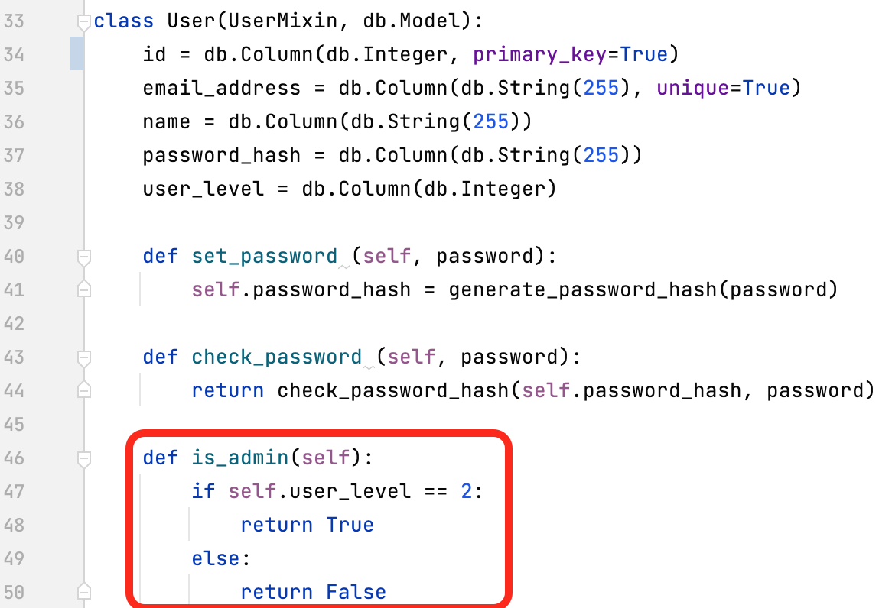

```python
def is_admin(self):
  if self.user_level == 2:
	  return True
  else:
	  return False
```

# Registration Form

The register form needs to collect the information needed to create a User entry in the database.  The form doesn’t need to collect the `id` as this is automatically generated.

Depending on the system requirements, the fields may be required or not. Modify the form specifications as needed.

Open `forms.py`. 

Add a new `PasswordField` to the `wtforms` imports to enable the password to be hidden.

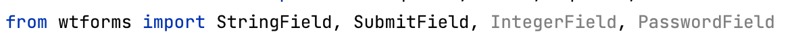

Add a new validator in the import statements, this one `EqualTo`.


The RegistrationForm class will be similar to this.

<aside>
‼️ Remember to match the form to the requirements of the database!

</aside>

Collecting the password is done a little differently, as per standard practice, the user should enter the password twice to confirm the passwords are identical.

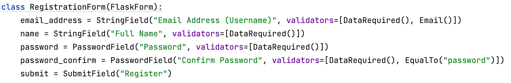

```python
class RegistrationForm(FlaskForm):
	email_address = StringField("Email Address (Username)", validators=[DataRequired(), Email()])
	name = StringField("Full Name", validators=[DataRequired()])
	password = PasswordField("Password", validators=[DataRequired()])
	password_confirm = PasswordField("Confirm Password", validators=[DataRequired(), EqualTo("password")])
	submit = SubmitField("Register")
```

## Unique Users

One issue with users self-registering is that the system should not accept duplicated email addresses, or user names, as this is used to identify the user. Another helper function is required to check if the same email address exists **before** registration can continue.

Import the User model into the `forms.py` file.

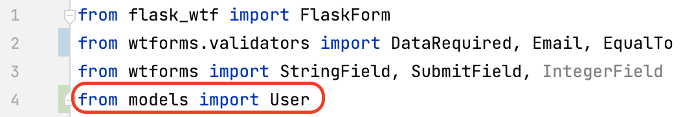

```python
from models import User
```

Also add a new Validator - `ValidationError`

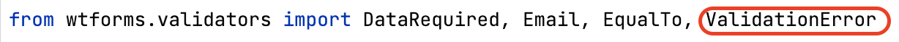

Add the verification function to the RegistrationForm class.


```python
def validate_email_address(self, email_address_to_register):
  user = User.query.filter_by(email_address=email_address_to_register.data).first()
  if user is not None:
	  raise ValidationError("Please Use a Different Email Address)")
```

# Registration Template

Create a new HTML page in the `templates` folder, called `registration.html` and copy in the standard starting code.

The HTML template will again be based on the main site `template.html`. 

```python


{# Place the content for the cellContent1 in this block #}

	Sidebar


{# Place the content for the cellContent2 in this block #}

	Main Content


{# Place the content for the cellContent3 in this block #}

	Footer

```

## Form Structure

Replace the Main Content text with the structure for the form.

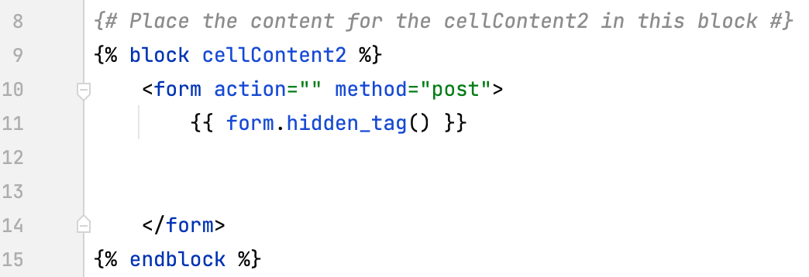

```python
<form action="" method="post">
  {{ form.hidden_tag() }}
	
	
</form>
```

## Form Fields

Similar to previous forms, you will need to create a copy of this block of code for each field that is being displayed - matching the RegistrationForm class defined earlier. 

The only parts that need to change for each field are highlighted red.


```python
<p>
	{{ form.name.label }}<br>
	{{ form.name(size=32) }}<br>
	
	<span style="color: red;">[{{ error }}]</span>
	
</p>
```

The final version will appear similar to this.

<aside>
‼️ Remember: The form field names have to match **exactly** the variable names in the RegistrationForm class. For Example:
form.`email_address`.label

</aside>

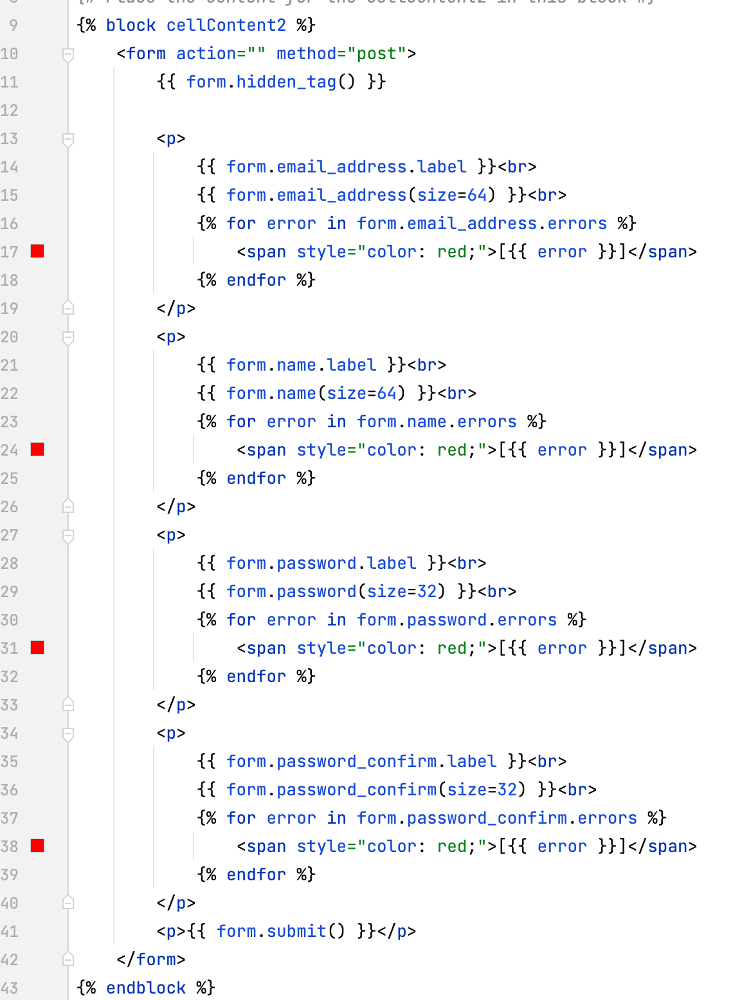

```python
<form action="" method="post">
	{{ form.hidden_tag() }}

	<p>
		{{ form.email_address.label }}<br>
		{{ form.email_address(size=64) }}<br>
		
			<span style="color: red;">[{{ error }}]</span>
		
	</p>
	<p>
		{{ form.name.label }}<br>
		{{ form.name(size=64) }}<br>
		
			<span style="color: red;">[{{ error }}]</span>
		
	</p>
	<p>
		{{ form.password.label }}<br>
		{{ form.password(size=32) }}<br>
		
			<span style="color: red;">[{{ error }}]</span>
		
	</p>
	<p>
		{{ form.password_confirm.label }}<br>
		{{ form.password_confirm(size=32) }}<br>
		
			<span style="color: red;">[{{ error }}]</span>
		
	</p>
	<p>{{ form.submit() }}</p>
</form>
```

# Registration Route

The final step is to link all the parts together in the registration route.

Open `app.py` and update the forms import statement to include the the User model and RegistrationForm created.

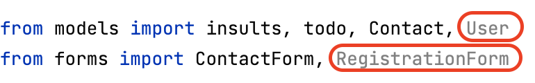

Update the flask import statement to also import `url_for`.

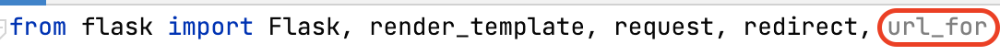

Create the new Route.

This route will create the RegistrationForm in memory and pass it to the `registration.html` template.

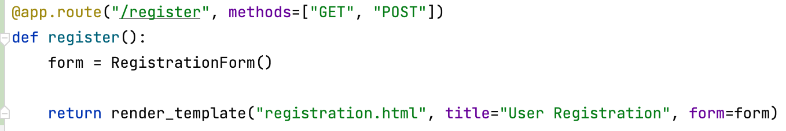

```python
@app.route("/register", methods=["GET", "POST"])
def register():
	form = RegistrationForm()

	return render_template("registration.html", title="User Registration", form=form)
```

Add the user to the database.

When the user presses the submit button, the code block in `form.validate_on_submit()` is run. This creates the new user in memory first, then sets the password (hashing it in the process by using the `set_password` helper function) and the writes it to the database.

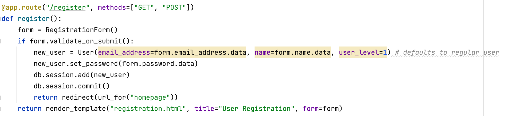

```python
if form.validate_on_submit():
	new_user = User(email_address=form.email_address.data, name=form.name.data, user_level=1) # defaults to regular user
	new_user.set_password(form.password.data)
	db.session.add(new_user)
	db.session.commit()
	return redirect(url_for("homepage"))
```

## Test Registration.

Run the project and visit [http://127.0.0.1:5000/register](http://127.0.0.1:5000/register).

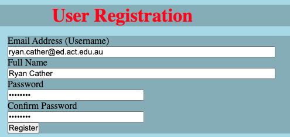

Register a user and then view the database (you may need to refresh the view). The new user should appear similar to this.

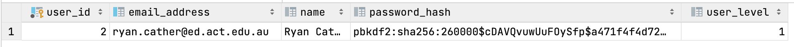

- User Login


<aside>
‼️ Prerequisite: the [User Registration](https://www.notion.so/User-Registration-67db42f42a8e46e4ade2191d89dc1064?pvs=21) process being complete. Ensure users can register accounts before progressing.

</aside>

The User Registration development process does much of the work for setting up the database and model, meaning this process is shorter.

# Update User Model

In order to perform the complex process of user login, we’re going to use the `flask_login` library.

One of the requirements of the flask_login system is a helper function to load the user information, specifically the ID of the currently logged in user.

Open `models.py`, and update the import statement to include login from app.

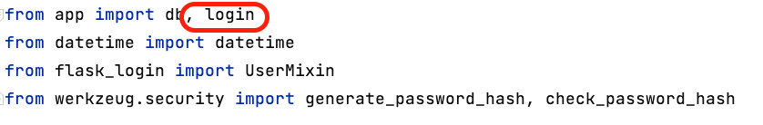

Add the following code to the bottom of the `models.py` file.


```python
@login.user_loader
def load_user(id):
	return User.query.get(int(id))
```

# Login Form

<aside>
‼️ These instructions are made assuming that there is only a need for a `email address` and a `password` in order to log in.

</aside>

Open [forms.py](http://forms.py) and create a new class - `LoginForm`.

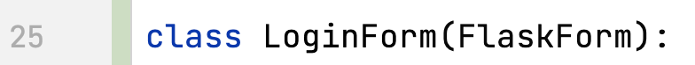

Define the variables and fields that are required for the form. In this case, there should be a `email address` field and a `password` field. The password field is similar to a normal `StringField` except that it won’t display the letters entered, but hides the password when typing it in.

The submit entry will show as a button, similar to the Register button in the Registration process.

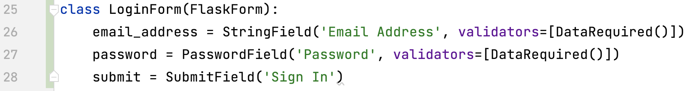

```python
class LoginForm(FlaskForm):
	email_address = StringField('Email Address', validators=[DataRequired()])
	password = PasswordField('Password', validators=[DataRequired()])
	submit = SubmitField('Sign In')
```

# Login Page

Create a new HTML page in the templates folder called `login.html`.  This login page will structured similarly to the registration page, but won’t need to display as many fields. As discussed earlier, only two fields are needed.

Copy the contents of `registration.html` and remove the code to display the fields that aren’t required - `name` and `password_confirm`. For example, remove this block of code: 

```python
<p>
	{{ form.password_confirm.label }}<br>
	{{ form.password_confirm(size=32) }}<br>
	
		<span style="color: red;">[{{ error }}]</span>
	
</p>
```

The code to the login page will be similar to this:

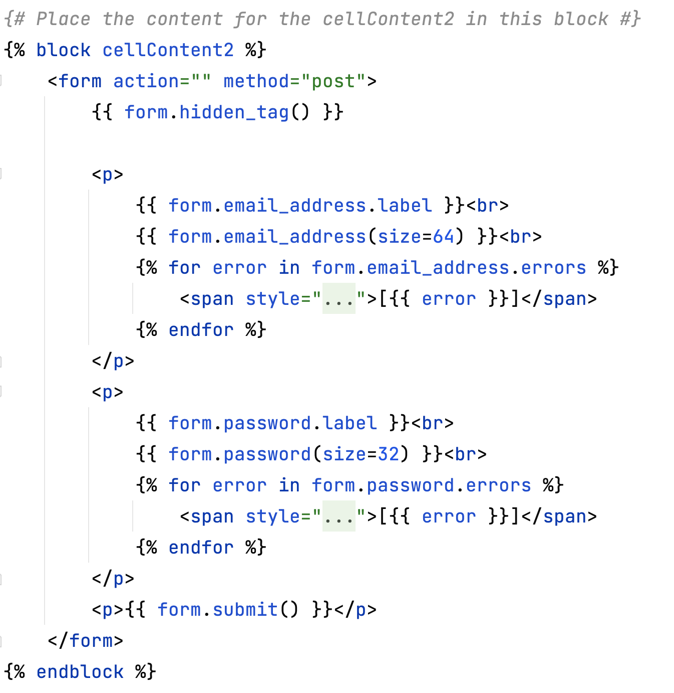

You can modify the login page to display however you would like.

# Route

Open [`app.py`](http://app.py).

Import the new `LoginForm` at the top of the file, extending the code which already imports the `RegistrationForm` (amongst others).


Import the necessary libraries from `flask_login`. 

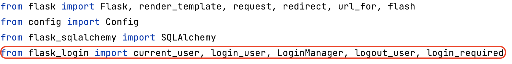

```python
from flask_login import current_user, login_user, LoginManager, logout_user, login_required
```

Configure the login manager to use the new login system that is being designed.

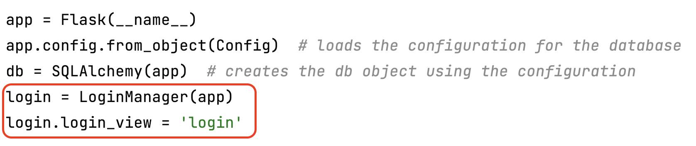

```python
login = LoginManager(app)
login.login_view = 'login'
```

Create a new route for `/login`. 

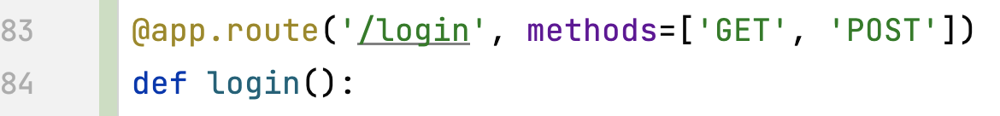

Load the `LoginForm` and store it in a variable named `form`.

You’ll notice that the structure of these routes so far is fairly similar, especially when loading a form. This will assist you when creating your own additional functionality

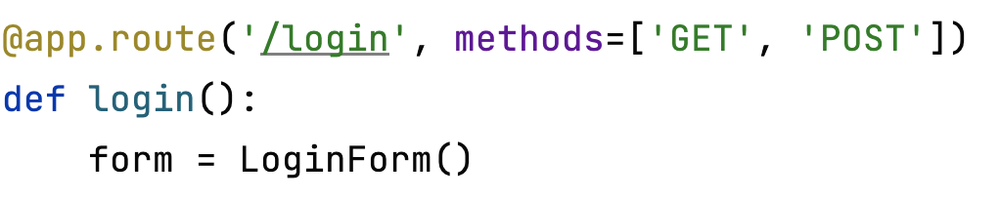

Check if the form has been submitted.

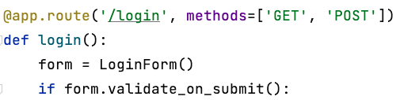

If the form has been submitted (i.e. the user has entered an email address and password) the process should then attempt to load the user record from the database that has that email address.

This code uses the User model, and loads the first entry in the database where the email address stored in the table matches the email address entered in the form.

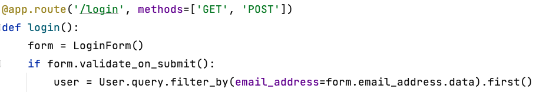

```python
user = User.query.filter_by(email_address=form.email_address.data).first()
```

<aside>
‼️ There are three possible cases that need to be addressed:

1. The User is **not** found in the database.
2. The User is found in the database and the password **does not** match.
3. The User is found in the database and the password matches.

The code needs to cater for all three cases.

</aside>

The code can easily check if the user is not found in the database (i.e. no match on the email address) by checking if the `user` variable is empty.

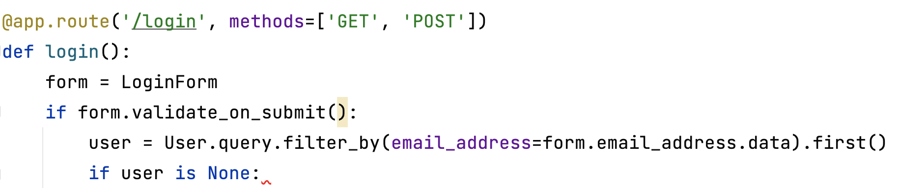

At this stage, you, the developer, need to determine what is to occur to users who enter incorrect details. There are a number of possibilities, however at this stage, the code can simply reload the login page to prompt them again.

<aside>
‼️ This caters for Case #1 listed above.

</aside>

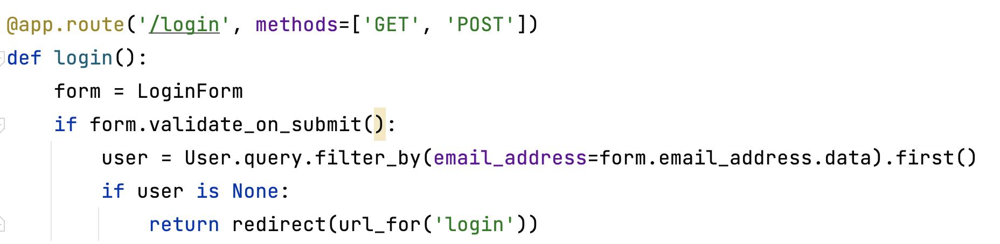

Turning to Case #2, if the user enters an email address that is found in the database, but an incorrect password, the same outcome is wanted as Case #1 - the login page is reloaded. The `if user is None:` statement can be extended to check if the password is incorrect. This extra check will run the `check_password` function written in the User model. 

<aside>
‼️ Notice that at no stage is the password stored in the code, in the clear. The password is taken from the form and then passed through the check_password function which runs the hash function to check against the database.

</aside>

<aside>
‼️ This caters for Case #2 listed above.

</aside>

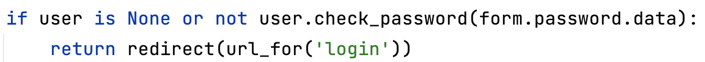

Finally, the last case (Case #3) is if the email address and password are correct. If this is the case, you can utilise the pre-written function to log the user in. If the user successfully logs in, they will be redirected to the homepage *at this stage*.

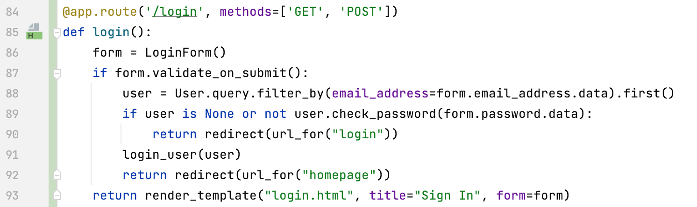

# Template Updates

The login page has been created, but is not accessible through the website. Update the navbar in templates/template.html to include the link to the newly created login page.

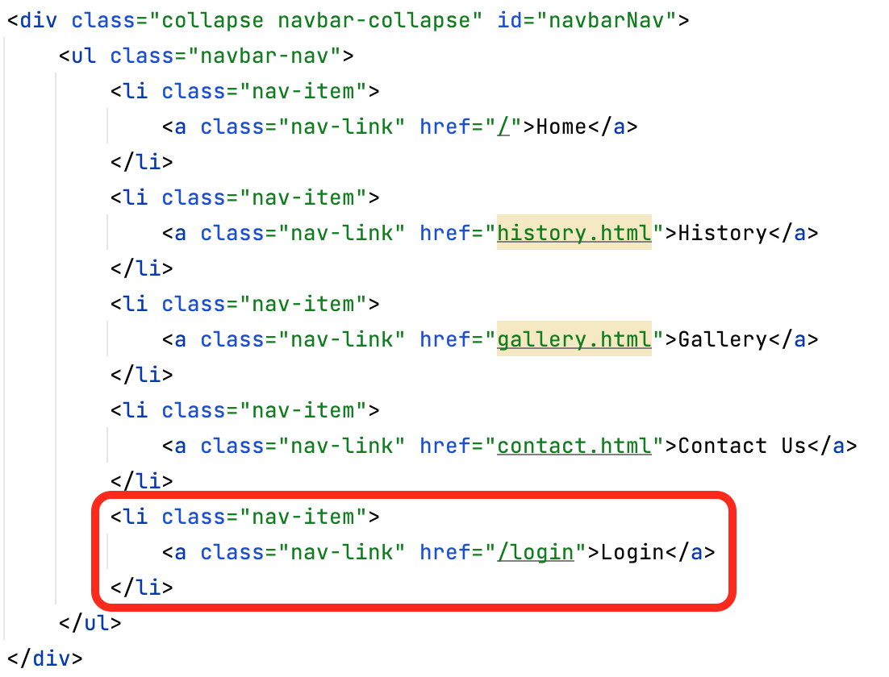

One of the additional features that can be easily included is the ability to dynamically load information regarding the user who is currently logged in, such as their name.

As an example, open `templates/index.html` and in the main block, include the following code.

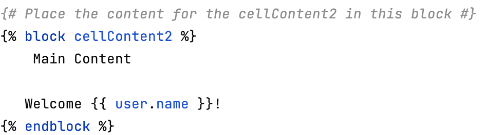

```python
Welcome {{ user.name }}!
```

Save the file.

Open `app.py` and update the `return` statement to include the `current_user` variable to indicate the user who is currently logged in (if any).

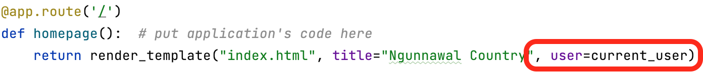

Log into the site and when the home page is loaded, the users name should appear.

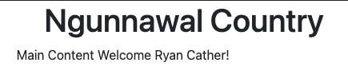

Now that this is proven to work, this `{{ user.name }}` can be added to the template, so it appears alongside the navbar. This means that the users name can be shown on any page they access.

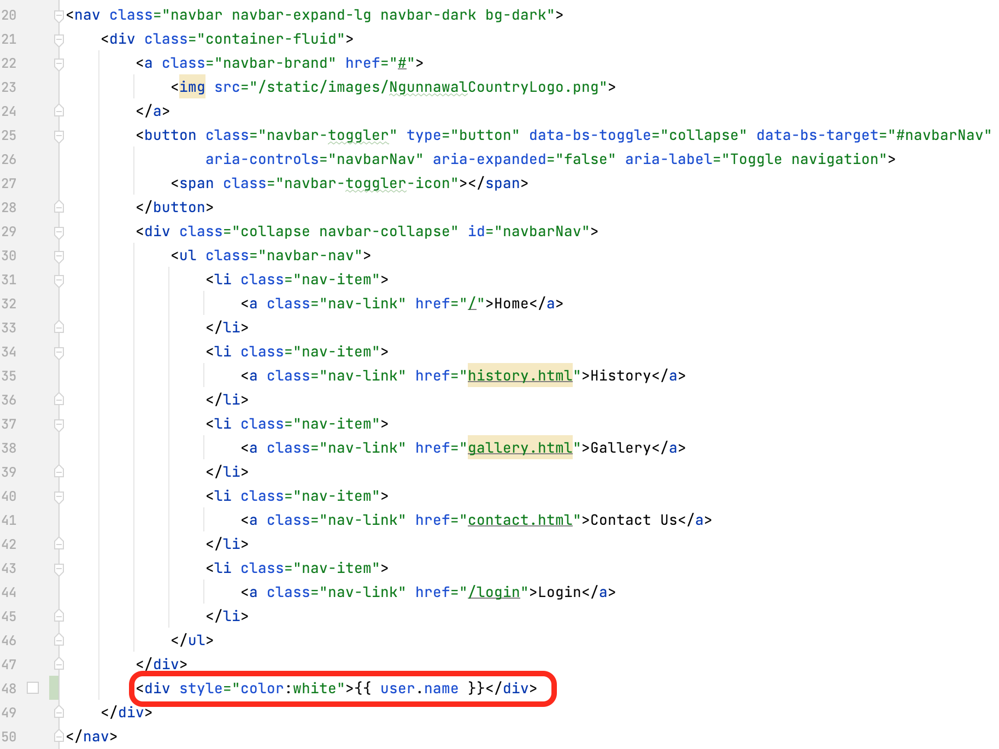

```html
<div style="color:white">{{ user.name }}</div>
```

As it is part of the template for all pages, all the other routes in `app.py` will need to also be updated to include the `user=current_user`, similar to the homepage.

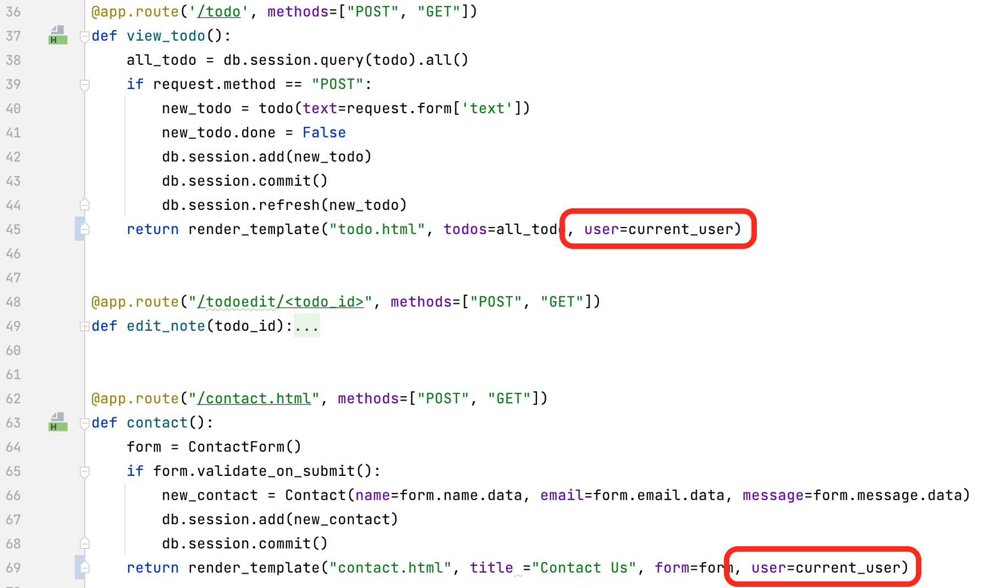

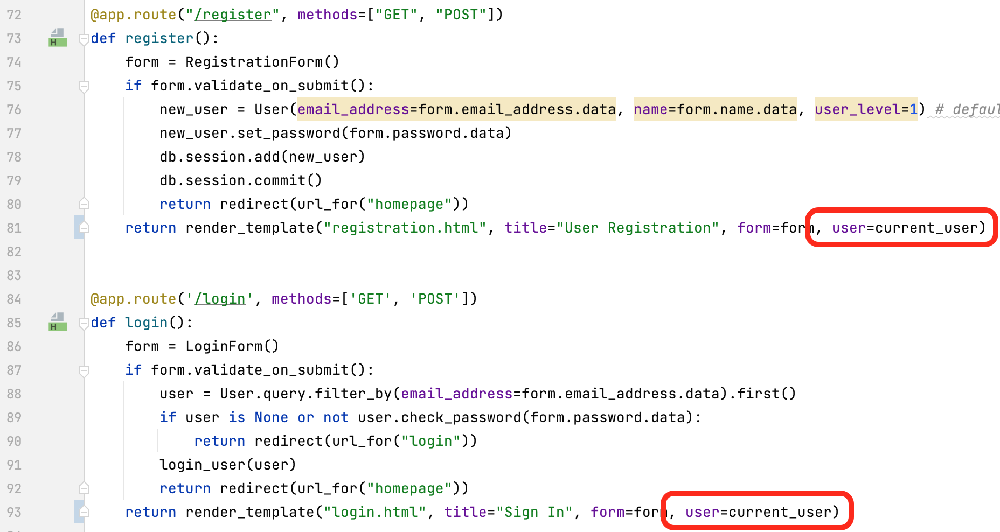

- User Logout


Providing the functionality for logging out is relatively simple as the bulk of the hard work has already been done in the flask_login library.

# Logout User

In `app.py`, update the flask-login import line to include `logout_user`.

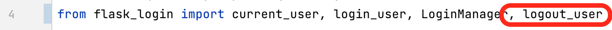

Add a new Route for `/logout`. This route only needs to run the logout_user() function and then redirect the user to the homepage.

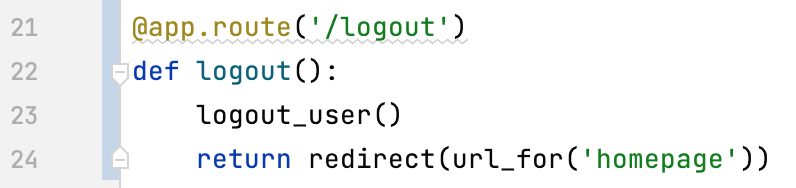

```python
@app.route('/logout')
def logout():
	logout_user()
	return redirect(url_for('homepage'))
```

# Template Updates

Update the navbar in `templates/template.html` to include a link to the new `/logout` route

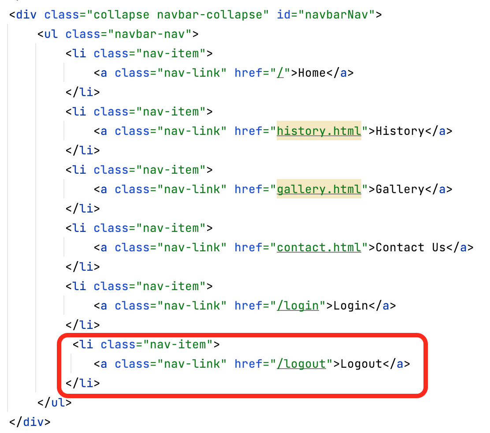

Test it out!

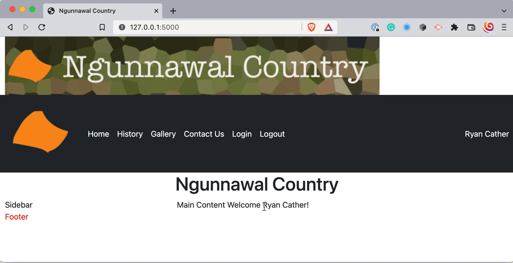

# Dynamic Navbar Updates

One of the issues at this stage is the navbar shows both Login and Logout regardless of whether the user is logged in or not. It is possible, with some coding, to only display the option that is valid for the user status. For instance :

- If the user is not logged in (anonymous), then only show the **login** link.
- If the user is logged in, only show the **logout** link.

Open `templates/template.html`. 

Add an `if` check in the navbar and check to see if the user is anonymous or not.

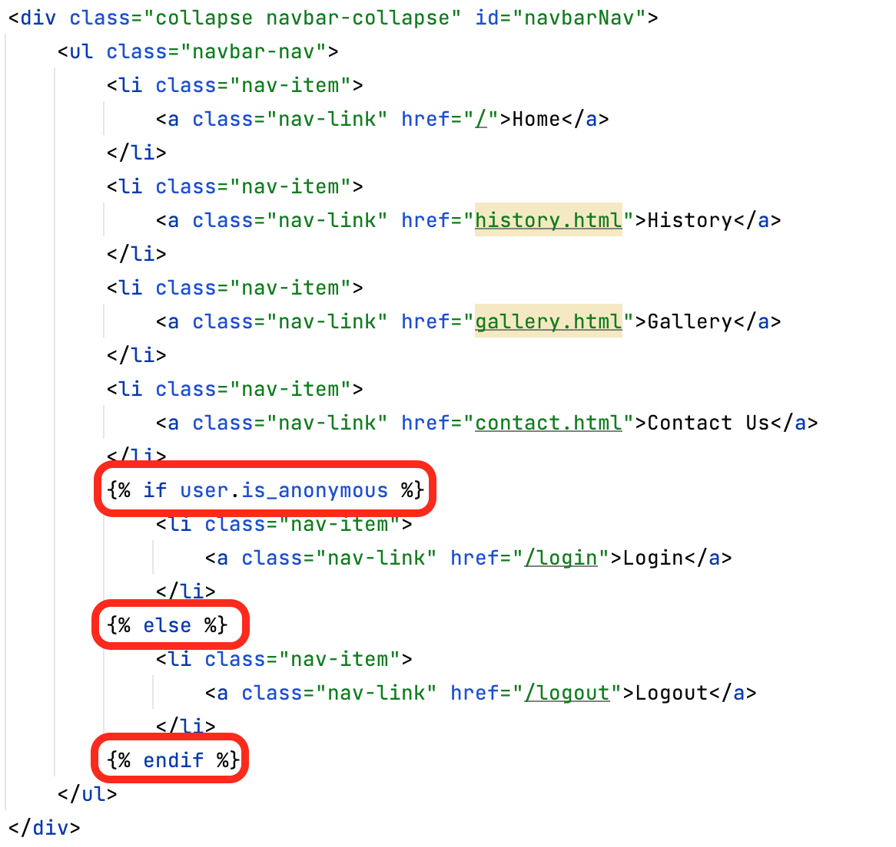

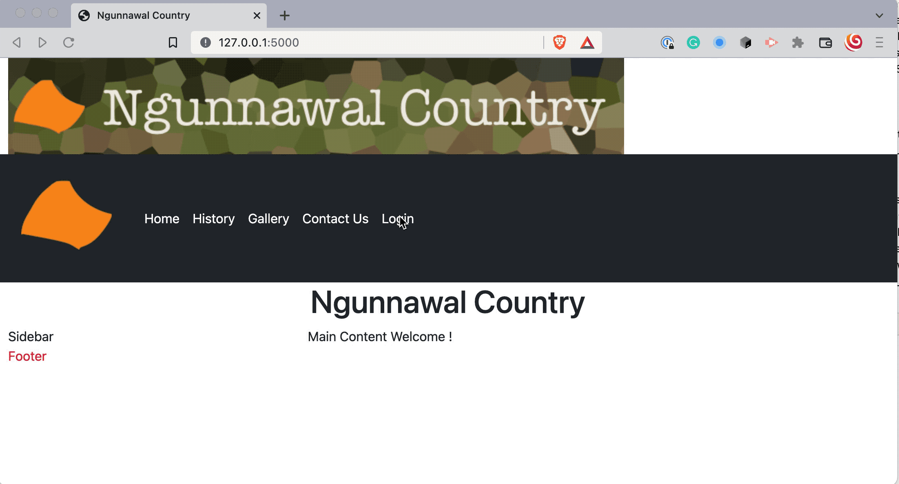

- Password Reset


The Password Reset form is relatively easy compared to other parts of the website. Registered Users can reset their passwords once they’re logged in. 

Apart from the usual steps to create the form class, the HTML page etc, there is a small addition to this process, which is the requirement that users **must** be logged in before they can access the page/route. If the users are not logged in, it will automatically redirect them.

<aside>
‼️ This is not a “forgot password” function. That would require access to an email server, which is difficult in a school environment.

</aside>

# Password Reset Form

The form to reset the password is relatively simple, as it only requires a single input and a submit button.

Open `forms.py` and add a new class:

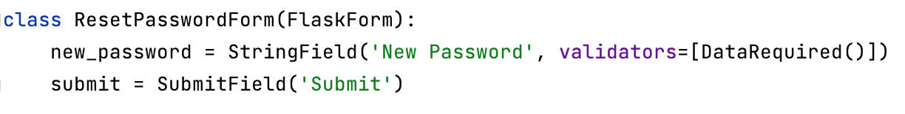

```python
class ResetPasswordForm(FlaskForm):
	new_password = StringField('New Password', validators=[DataRequired()])
	submit = SubmitField('Submit')
```

That’s all there is to it at this stage!

# Password Reset HTML

As this is a simple form, the HTML file is relatively simple as well.

Create a new html file in the templates folder and name it `passwordreset.html`. Enter the contents.

You’ll notice that the code is extremely similar to the login and registration forms in structure. 

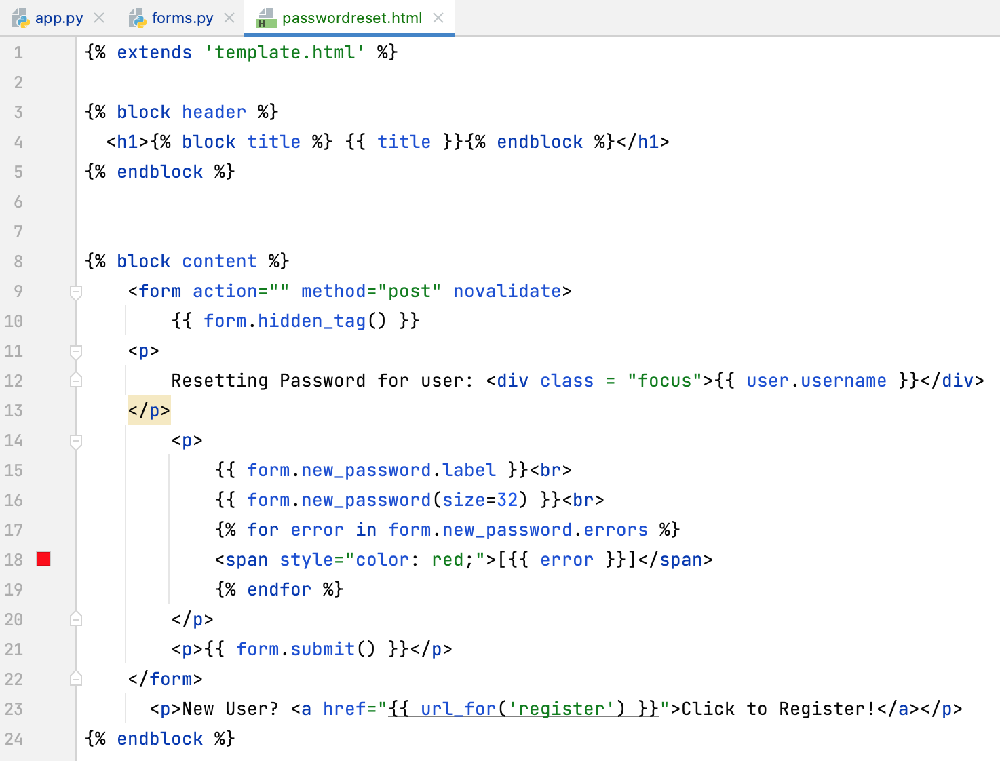

```python



  <h1> {{ title }}</h1>



	<form action="" method="post" novalidate>
		{{ form.hidden_tag() }}
	<p>
		Resetting Password for user: <div class = "focus">{{ user.email_address }}</div>
	</p>
		<p>
			{{ form.new_password.label }}<br>
			{{ form.new_password(size=32) }}<br>
			
			<span style="color: red;">[{{ error }}]</span>
			
		</p>
		<p>{{ form.submit() }}</p>
	</form>

```

# Password Reset Route

Open `app.py` and as done previously before creating the route, import the new password reset form near the top of the file.

Look for the `from forms...` line of code and add `ResetPasswordForm` to the end.

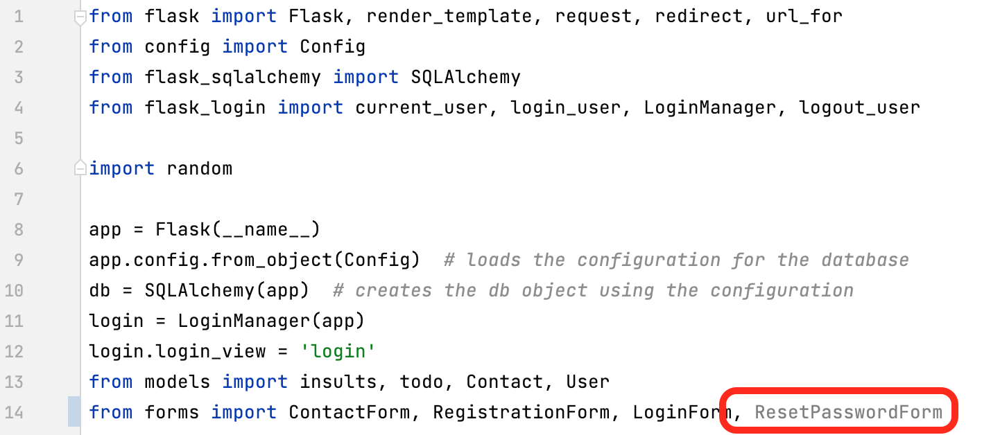

Create the new route to load the form and return the HTML file just created.

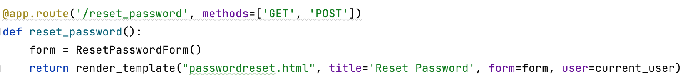

```python
@app.route('/reset_password', methods=['GET', 'POST'])
def reset_password():
	form = ResetPasswordForm()
	return render_template("passwordreset.html", title='Reset Password', form=form, user=current_user)
```

At this point, you can test the form to see if it appears by running the project and accessing the url: [http://127.0.0.1:5000/reset_password](http://127.0.0.1:5000/reset_password)

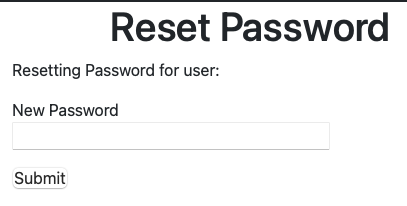

The remaining code to update the password is very similar to other code, such as register or any time data has been submitted to the database.

This code finds the user in the database (filtering by the username and comparing it to the logged in user). The code then runs the `set_password` function, passing it the password entered. 

Finally it commits the changes to the database and sends the user back to the home page.

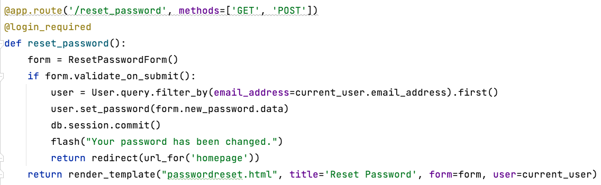

```python
if form.validate_on_submit():
	  user = User.query.filter_by(email_address=current_user.email_address).first()
	user.set_password(form.new_password.data)
	db.session.commit()
	return redirect(url_for('homepage'))
```

Test out the process. Log into the site, access the page and reset the users password. Log out and log back in again.

# Requiring Users to be logged in

Obviously, this page serves no purpose for users who are not logged into the site. Luckily Flask has a helper function for routes that require users to be logged in before the code runs. This is also useful for security.

Open `app.py` and add `login_required` to the imports for `flask_login`.

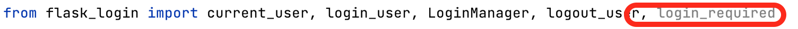

At the `reset_password` route, add the `@login_required` decorator after the `@app.route` decorator and before the function definition.

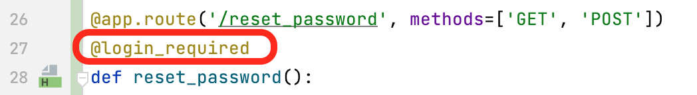

You can now test the update by attempting to access the page after logging out the current user.

You’ll notice that the site automatically redirects the user to the login page with the url [http://127.0.0.1:5000/login?next=%2Freset_password](http://127.0.0.1:5000/login?next=%2Freset_password). What does this do?

# Update Navbar

The route works and is configured correctly. The URL can now be added to the navbar.

Open `templates/template.html` and search for the navbar code. 

Add the link to the section of the navbar that only displays if the users are logged in. I.e. in the same block as the logout link.

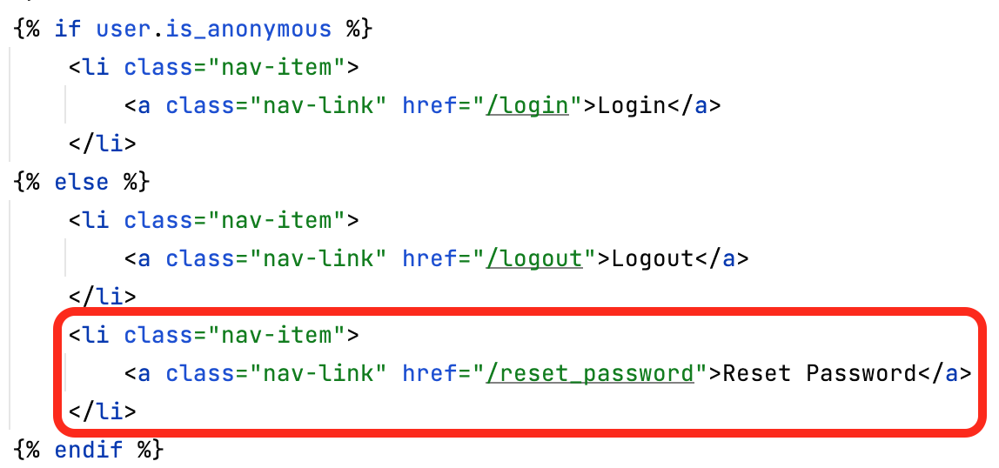

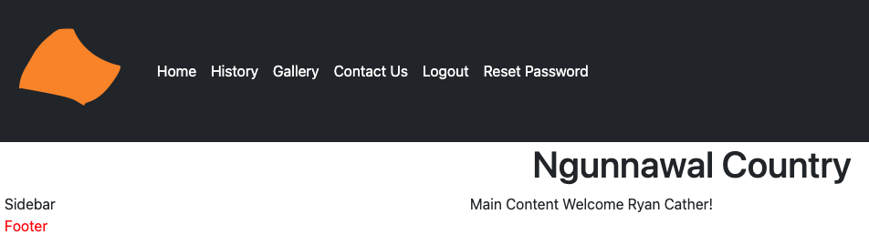

# Extension: Confirm password

Extend this functionality but requiring the user to enter the password in twice into the form before the password is changed. 

HINT: Look to the user registration process for information on how to do this.